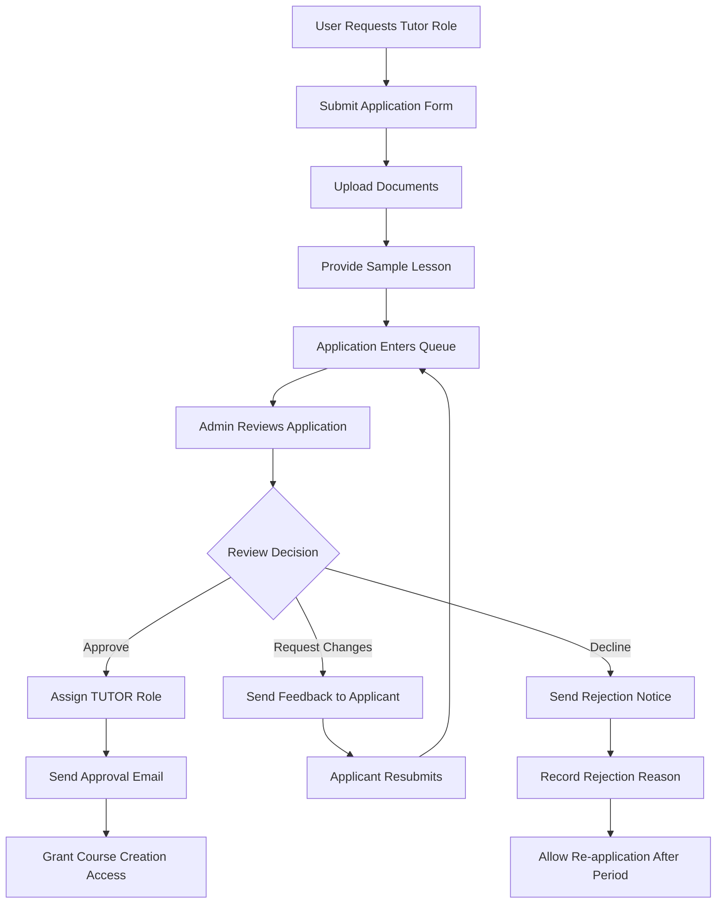
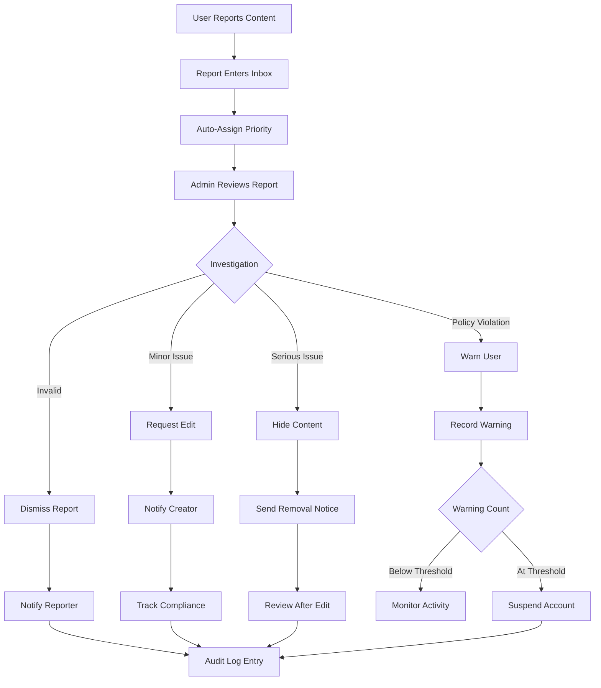
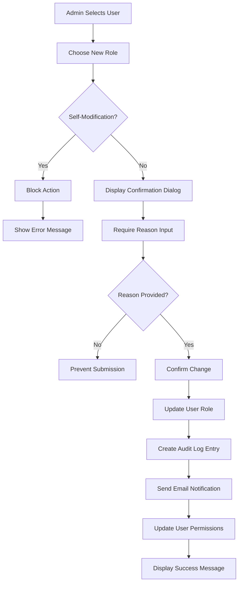

# Admin Features Overhaul - Design Document

## Overview

This design defines a comprehensive administrative system for the EduBridge learning platform, encompassing user management, tutor verification, content moderation, payment reconciliation, system configuration, and audit logging. The admin interface provides centralized control over platform operations with appropriate safety measures and transparency mechanisms.

## Objectives

- Enable administrators to efficiently manage users, roles, and account statuses
- Establish a structured tutor verification workflow with documentation review
- Provide comprehensive content moderation capabilities for courses and lessons
- Create a reporting system for handling flagged content
- Enable question bank quality control and maintenance
- Provide payment reconciliation and transaction monitoring
- Allow platform-wide configuration through feature flags and settings
- Implement broadcast messaging with appropriate rate limiting
- Maintain complete audit trail of all administrative actions

## Design Principles

- Safety First: All critical actions require confirmation and are logged
- Transparency: Every administrative decision is recorded with justification
- Separation of Concerns: Distinct workflows for different administrative functions
- Role-Based Access: Granular permissions for different admin capabilities
- Data Integrity: Soft deletes and versioning to preserve historical records
- User Privacy: Sensitive data handling with appropriate access controls

## System Architecture

### Admin Role Structure

The system distinguishes between two administrative privilege levels:

| Role       | Capabilities                                                                     | Access Scope                         |
| ---------- | -------------------------------------------------------------------------------- | ------------------------------------ |
| ADMIN      | Full platform management, user role changes, system settings, content moderation | All features                         |
| MANAGEMENT | Read-only analytics, content review, report viewing                              | Limited to observation and reporting |

## Feature Specifications

### 1. User Management

#### User Discovery and Filtering

The user management interface provides comprehensive search and filtering capabilities:

**Search Criteria:**

- Email address matching
- Name matching
- User ID lookup

**Filter Options:**

- Role: STUDENT, TUTOR, ADMIN, MANAGEMENT
- Status: ACTIVE, SUSPENDED, BANNED
- Date range: Registration date, last login date
- Activity level: Based on login frequency and engagement

**Display Information:**

- User identifier and contact details
- Current role and status
- Registration date and last activity timestamp
- Total points and engagement metrics
- Account flags or warnings

#### User Actions

**Role Change:**

- Modify user role between STUDENT, TUTOR, ADMIN, MANAGEMENT
- Require confirmation dialog with reason input
- Validate role transitions (e.g., TUTOR requires verification completion)
- Automatic privilege adjustment upon role change
- Email notification sent to affected user

**Password Reset:**

- Generate time-limited password reset token
- Send reset link via email
- Track reset request in audit log
- Token expires after 24 hours

**Account Status Management:**

- Suspend: Temporarily disable account access with reason
- Unsuspend: Restore account to ACTIVE status
- Ban: Permanently disable account for policy violations
- Soft Delete: Mark account as deleted without removing data

**Safety Measures:**

- Cannot modify own admin role
- Require reason field for suspend/ban/delete actions
- Two-step confirmation for irreversible actions
- Automatic notification to affected user

#### Audit Trail for Role Changes

Every role modification is recorded with:

- Administrator who made the change
- Timestamp of the change
- Previous role and new role
- Justification or reason provided
- IP address of the administrator
- Related ticket or support case reference (optional)

### 2. Tutor Verification System

#### Application Queue

Tutors who request verification are placed in a review queue displaying:

**Application Information:**

- Applicant identity and contact information
- Submitted profile details (bio, qualifications, expertise areas)
- Uploaded verification documents (ID, certifications, credentials)
- Subject areas and education levels they wish to teach
- Sample lesson content or teaching portfolio
- Application submission timestamp
- Current verification status

**Queue Organization:**

- Sorted by submission date (oldest first)
- Filter by subject category
- Flag priority applications
- Track average review time

#### Verification Review Process

**Review Actions:**

1. **Approve:**

   - Automatically assign TUTOR role to user
   - Grant access to course creation and session scheduling features
   - Send approval notification email with next steps
   - Record approval decision and reviewer identity

2. **Request Changes:**

   - Specify required modifications or additional documentation
   - Send feedback email to applicant
   - Return application to pending state
   - Set follow-up deadline

3. **Decline:**
   - Record rejection reason
   - Send notification with explanation
   - Allow re-application after specified period
   - Store decision for future reference

**Document Verification:**

- Display uploaded documents in secure viewer
- Support common formats (PDF, images)
- Allow side-by-side comparison of multiple documents
- Option to download for detailed review
- Mark documents as verified or flagged

**Sample Lesson Evaluation:**

- View submitted teaching materials
- Assess content quality and presentation
- Check alignment with platform standards
- Evaluate pedagogical approach

### 3. Course and Lesson Moderation

#### Course Overview Dashboard

**Display Attributes:**

- Course title and identifier
- Instructor name and contact
- Current status (DRAFT, PENDING_APPROVAL, PUBLISHED, ARCHIVED)
- Last update timestamp
- Enrollment count
- Flag count from user reports
- Content completeness score

**Filtering and Sorting:**

- Status filter (all, draft, published, flagged)
- Instructor filter
- Subject category filter
- Date range selection
- Sort by flags, enrollments, or update date

#### Moderation Actions

**Publication Control:**

- Publish: Change status from PENDING_APPROVAL to PUBLISHED
- Unpublish: Revert PUBLISHED course to DRAFT
- Archive: Move inactive courses to ARCHIVED status
- Lock Editing: Prevent instructor modifications during review

**Content Review:**

- Request Fixes: Send detailed feedback to instructor with required changes
- Revert to Prior Version: Restore from course version history
- Flag for Further Review: Mark for senior admin attention

**Version Management:**

- View complete version history
- Compare differences between versions
- Restore specific version as current
- Track who published each version

#### Content Quality Checks

**Accessibility Checklist:**

- Video captions present: Verify captionsEnabled flag
- Alt text provided: Check altTextProvided for images
- Transcript availability: Confirm transcriptUrl exists
- Readable font sizes: Review content formatting

**Content Integrity:**

- Plagiarism flag: Manual review checkbox for suspected plagiarism
- Copyright compliance: Verify media rights and attributions
- Appropriate content: Check for policy violations
- Completeness: Ensure learning objectives and materials are present

**Automated Warnings:**

- Missing captions on video lessons
- Images without alt text
- Lessons without learning objectives
- Empty or placeholder content

### 4. Reported Content Management

#### Report Inbox

**Report Types:**

- Lesson content reports (inappropriate, inaccurate, offensive)
- Quiz question issues (incorrect answers, misleading)
- User messages (harassment, spam)
- Course-level complaints

**Report Information:**

- Reporter identity and contact
- Reported item type and identifier
- Report category and description
- Timestamp of report
- Priority level (auto-assigned based on category)
- Current status (NEW, UNDER_REVIEW, RESOLVED, DISMISSED)

#### Report Resolution Actions

**Available Actions:**

1. **Dismiss:**

   - Mark report as unfounded
   - Record dismissal reason
   - Notify reporter of decision (optional)

2. **Require Edit:**

   - Send notification to content creator
   - Specify required changes
   - Set deadline for corrections
   - Track compliance

3. **Hide Content:**

   - Immediately remove content from public view
   - Mark as under review
   - Notify creator of temporary removal
   - Restore after review completion or modification

4. **Warn User/Tutor:**
   - Send formal warning notification
   - Record warning in user record
   - Track warning count
   - Escalate after threshold (e.g., 3 warnings)

**Evidence and Documentation:**

- Report notes field for detailed description
- Decision log capturing resolution process
- Supporting evidence attachments
- Communication history with reporter and content creator

### 5. Quiz and Question Bank Management

#### Quality Monitoring

**Low Performance Detection:**

- Identify questions with correct rate below threshold (e.g., 30%)
- Flag questions with unusually high correct rate (potential errors)
- Track questions with high skip rate
- Monitor time-to-answer metrics

**Question Review Interface:**

- Display question text and all answer options
- Show correct answer indicator
- Present performance statistics (attempts, correct rate, average time)
- View student feedback or flags
- Compare with similar questions in bank

#### Question Actions

**Edit:**

- Modify question text or answer options
- Update correct answer designation
- Adjust point value
- Add or edit explanation
- Update cognitive level classification

**Archive:**

- Remove from active rotation
- Preserve historical data
- Mark as deprecated
- Store reason for archival

**Restore:**

- Return archived question to active bank
- Reset usage statistics (optional)
- Re-validate correctness

**Propagation:**

- Push "Republish" to affected courses
- Notify course instructors of question updates
- Track courses requiring republication
- Schedule batch updates to minimize disruption

### 6. Payment Management

#### Transaction Overview

**Read-Only Transaction List:**

- Transaction identifier and type
- User associated with transaction
- Amount and currency
- Payment method used
- Transaction status (PENDING, COMPLETED, FAILED, REFUNDED)
- Timestamp of transaction
- Payment gateway reference ID

**Filtering Capabilities:**

- Date range selection
- Status filter
- Transaction type filter
- User or course filter
- Amount range

#### Stripe Integration

**Webhook Event History:**

- Event type (payment_intent.succeeded, charge.failed, etc.)
- Event timestamp
- Processing status (success, failed, pending)
- Retry count for failed webhooks
- Event payload (secure view)

**Reconciliation Features:**

- Match Stripe events to internal transactions
- Identify unmatched or missing events
- Flag discrepancies for investigation
- Export reconciliation reports

#### Refund Processing

**Manual Refund Workflow:**

- Generate refund link to Stripe Dashboard
- Open pre-filled refund form in new tab
- Provide transaction context
- Record refund initiation in system
- Manual status update upon Stripe confirmation

**Dispute Management:**

- View dispute notifications from Stripe
- Add internal notes to dispute record
- Track dispute status
- Link related transactions
- Store resolution outcome

### 7. System Settings

#### Feature Flags

**Configurable Features:**

| Feature             | Description                        | Default State |
| ------------------- | ---------------------------------- | ------------- |
| Gamification        | Enable points, badges, and streaks | Enabled       |
| Tutor Bookings      | Allow live session scheduling      | Enabled       |
| Public Signup       | Open registration without approval | Enabled       |
| Course Reviews      | Enable student course ratings      | Enabled       |
| Payment Processing  | Accept paid courses and sessions   | Disabled      |
| Email Notifications | Send automated emails              | Enabled       |

**Toggle Interface:**

- Simple on/off switches
- Require confirmation for critical flags
- Display dependent features (e.g., disabling gamification affects badges)
- Record who changed each flag and when

#### Gamification Configuration

**Points System:**

- Point values for activities (quiz completion, streak maintenance, course completion)
- Daily point caps
- Bonus multipliers for achievements

**Badge Thresholds:**

- Define criteria for badge awards
- Set point requirements
- Configure streak milestones
- Specify course completion counts

**Configuration Storage:**

- Store as JSON in system settings table
- Validate ranges and relationships
- Provide default values
- Support rollback to previous configuration

#### Email Templates

**Editable Templates:**

- Welcome email (new user registration)
- Approval notification (tutor verification)
- Reminder emails (session, deadline)
- System announcements
- Password reset
- Subscription notifications

**Template Variables:**

- User name and contact information
- Course or session details
- Action links (reset password, confirm booking)
- Platform branding elements

**Template Editor:**

- Rich text editing interface
- Variable insertion dropdown
- Preview with sample data
- Version history
- Restore default template option

### 8. Notifications and Messaging

#### Broadcast System

**Target Audiences:**

- All students
- All tutors
- All users (students + tutors)
- Specific role (ADMIN, MANAGEMENT)
- Active users only (exclude suspended/banned)

**Message Composition:**

- Subject line
- Message body (rich text supported)
- Priority level (low, normal, high, urgent)
- Delivery schedule (immediate or scheduled)
- Expiration date (optional)

**Rate Limiting:**

- Maximum broadcasts per day (e.g., 5)
- Minimum interval between broadcasts (e.g., 2 hours)
- Override capability for urgent system announcements
- Warning when approaching limits

#### Message Templates

**Pre-defined Templates:**

| Template           | Purpose                         | Variables                              |
| ------------------ | ------------------------------- | -------------------------------------- |
| Maintenance Notice | Scheduled downtime announcement | start_time, end_time, reason           |
| New Feature        | Feature launch announcement     | feature_name, description, launch_date |
| Promotional        | Course promotions, events       | offer_details, expiry_date             |
| Policy Update      | Terms or policy changes         | policy_name, effective_date            |

**Template Management:**

- Create new templates
- Edit existing templates
- Set default values
- Archive unused templates

### 9. Audit Log System

#### Logged Actions

**User Management Events:**

- Role changes (from, to, reason)
- Status changes (suspend, unsuspend, ban)
- Password resets initiated
- Account deletions

**Content Moderation Events:**

- Course publications, unpublications
- Content edits or locks
- Report resolutions
- Version reversions

**System Configuration Events:**

- Feature flag toggles
- Settings modifications
- Email template changes

**Payment Events:**

- Refund initiations
- Dispute notes added
- Manual transaction adjustments

#### Audit Record Structure

Each audit entry contains:

- Unique audit identifier
- Administrator user ID and name
- Action type (category and specific action)
- Target resource (user, course, setting, etc.)
- Target resource identifier
- Timestamp (precise to millisecond)
- Previous state (before action)
- New state (after action)
- Reason or justification
- IP address of administrator
- Additional context (JSON field for flexible data)

#### Audit Query Interface

**Search Capabilities:**

- Filter by administrator
- Filter by action type
- Filter by target resource
- Date range selection
- Text search in reason field

**Export Options:**

- CSV format for spreadsheet analysis
- JSON format for programmatic processing
- PDF format for archival
- Include or exclude sensitive fields

**Retention Policy:**

- Retain all audit logs for minimum 7 years
- No deletion capability (compliance requirement)
- Periodic archival to cold storage

## Data Models

### TutorVerificationApplication

| Field           | Type     | Description                                                  |
| --------------- | -------- | ------------------------------------------------------------ |
| id              | UUID     | Unique identifier                                            |
| userId          | UUID     | Applicant user reference                                     |
| documents       | JSON     | Array of document URLs and metadata                          |
| subjects        | JSON     | Array of subject areas and levels                            |
| sampleLessonUrl | String   | Link to sample content                                       |
| status          | Enum     | PENDING, UNDER_REVIEW, APPROVED, DECLINED, CHANGES_REQUESTED |
| reviewerId      | UUID     | Admin who reviewed (nullable)                                |
| reviewNotes     | Text     | Feedback or decision notes                                   |
| submittedAt     | DateTime | Application timestamp                                        |
| reviewedAt      | DateTime | Decision timestamp                                           |

### ContentReport

| Field            | Type     | Description                                            |
| ---------------- | -------- | ------------------------------------------------------ |
| id               | UUID     | Unique identifier                                      |
| reporterId       | UUID     | User who reported                                      |
| reportedItemType | Enum     | LESSON, QUIZ, QUESTION, MESSAGE                        |
| reportedItemId   | UUID     | Target content reference                               |
| category         | Enum     | INAPPROPRIATE, INACCURATE, OFFENSIVE, COPYRIGHT, OTHER |
| description      | Text     | Detailed report                                        |
| priority         | Enum     | LOW, NORMAL, HIGH, CRITICAL                            |
| status           | Enum     | NEW, UNDER_REVIEW, RESOLVED, DISMISSED                 |
| resolverId       | UUID     | Admin who handled (nullable)                           |
| resolution       | Text     | Decision and actions taken                             |
| evidenceUrls     | JSON     | Supporting materials                                   |
| createdAt        | DateTime | Report timestamp                                       |
| resolvedAt       | DateTime | Resolution timestamp                                   |

### SystemSetting

| Field          | Type     | Description                                         |
| -------------- | -------- | --------------------------------------------------- |
| id             | UUID     | Unique identifier                                   |
| settingKey     | String   | Unique setting name                                 |
| settingValue   | JSON     | Configuration value                                 |
| valueType      | Enum     | BOOLEAN, INTEGER, STRING, JSON, ARRAY               |
| category       | Enum     | FEATURE_FLAG, GAMIFICATION, EMAIL, PAYMENT, GENERAL |
| description    | Text     | Human-readable explanation                          |
| lastModifiedBy | UUID     | Admin who changed                                   |
| lastModifiedAt | DateTime | Change timestamp                                    |

### EmailTemplate

| Field        | Type     | Description                                       |
| ------------ | -------- | ------------------------------------------------- |
| id           | UUID     | Unique identifier                                 |
| templateKey  | String   | Unique template identifier                        |
| templateName | String   | Display name                                      |
| subject      | String   | Email subject line                                |
| bodyHtml     | Text     | HTML email body                                   |
| bodyPlain    | Text     | Plain text version                                |
| variables    | JSON     | Available variables list                          |
| category     | Enum     | WELCOME, APPROVAL, REMINDER, ANNOUNCEMENT, SYSTEM |
| isActive     | Boolean  | Current use status                                |
| version      | Integer  | Template version number                           |
| createdAt    | DateTime | Creation timestamp                                |
| updatedAt    | DateTime | Last modification                                 |

### BroadcastMessage

| Field          | Type     | Description                                        |
| -------------- | -------- | -------------------------------------------------- |
| id             | UUID     | Unique identifier                                  |
| createdBy      | UUID     | Admin who created                                  |
| targetAudience | Enum     | ALL_STUDENTS, ALL_TUTORS, ALL_USERS, SPECIFIC_ROLE |
| targetRole     | Enum     | Role if SPECIFIC_ROLE selected (nullable)          |
| subject        | String   | Message subject                                    |
| body           | Text     | Message content                                    |
| priority       | Enum     | LOW, NORMAL, HIGH, URGENT                          |
| scheduledFor   | DateTime | Delivery time (nullable for immediate)             |
| expiresAt      | DateTime | Message expiration (nullable)                      |
| sentCount      | Integer  | Number of recipients                               |
| status         | Enum     | DRAFT, SCHEDULED, SENT, CANCELLED                  |
| sentAt         | DateTime | Actual send timestamp                              |
| createdAt      | DateTime | Creation timestamp                                 |

### AuditLog

| Field              | Type     | Description             |
| ------------------ | -------- | ----------------------- |
| id                 | UUID     | Unique identifier       |
| adminId            | UUID     | Administrator reference |
| actionType         | String   | Category and action     |
| targetResourceType | String   | Resource type affected  |
| targetResourceId   | UUID     | Resource identifier     |
| previousState      | JSON     | State before action     |
| newState           | JSON     | State after action      |
| reason             | Text     | Justification           |
| ipAddress          | String   | Admin IP address        |
| additionalContext  | JSON     | Extra metadata          |
| timestamp          | DateTime | Action timestamp        |

### QuestionPerformance

Materialized view or computed table for question analytics:

| Field              | Type     | Description           |
| ------------------ | -------- | --------------------- |
| questionId         | UUID     | Question reference    |
| totalAttempts      | Integer  | Total answer attempts |
| correctAttempts    | Integer  | Successful attempts   |
| correctRate        | Decimal  | Percentage correct    |
| averageTimeSeconds | Integer  | Mean time to answer   |
| skipCount          | Integer  | Times skipped         |
| lastCalculated     | DateTime | Metrics update time   |

## Workflow Diagrams

### Tutor Verification Workflow

### Content Report Resolution Workflow

### Role Change Safety Workflow

## User Interface Considerations

### User Management Dashboard

**Layout:**

- Search and filter panel at top
- User table with sortable columns
- Action buttons on each row
- Bulk action toolbar for multiple selections
- Pagination controls at bottom

**User Detail Modal:**

- User profile summary
- Activity timeline
- Role change history
- Recent logins
- Action buttons (change role, reset password, suspend, delete)

### Tutor Verification Review Panel

**Split View:**

- Left: Application details and documents
- Right: Review form with approval/decline/request changes options
- Document viewer with zoom and navigation controls
- Notes section for internal comments

### Course Moderation Interface

**Course List:**

- Tabbed view by status (All, Published, Pending, Flagged, Archived)
- Thumbnail preview
- Quick stats (enrollments, flags, last update)
- Inline actions (publish, unpublish, view, moderate)

**Course Detail View:**

- Content quality checklist
- Version history timeline
- Flag and report summary
- Moderation action panel

### Audit Log Viewer

**Filter Panel:**

- Date range picker
- Administrator selector
- Action type multi-select
- Target resource filter
- Text search box

**Log Table:**

- Timestamp (sortable)
- Admin name
- Action description
- Target resource link
- Expand button for detailed view

**Detail Panel:**

- Full audit record
- Before/after state comparison
- Related logs
- Export single record option

## Security Considerations

### Authentication and Authorization

- All admin endpoints require authentication
- Role-based access control enforced at API level
- Session timeout for inactive admins (30 minutes)
- Multi-factor authentication recommended for admin accounts

### Data Protection

- Sensitive user data (passwords, payment info) never displayed in audit logs
- Document uploads scanned for malware
- Rate limiting on admin API endpoints to prevent abuse
- IP whitelisting option for admin access

### Action Validation

- Two-step confirmation for destructive actions
- Reason field required for sensitive operations
- Cannot delete or modify own admin account
- Automatic lockout after failed action attempts

### Audit Integrity

- Audit logs are append-only (no deletion or modification)
- Cryptographic signatures on audit entries (optional enhancement)
- Periodic backup to immutable storage
- Tamper detection mechanisms

## Performance Considerations

### Database Optimization

- Indexes on frequently queried fields (status, role, createdAt)
- Materialized views for question performance metrics
- Partition audit logs by date for faster queries
- Caching for system settings and email templates

### Pagination and Lazy Loading

- Limit result sets to 50 items per page by default
- Lazy load user details on demand
- Infinite scroll for audit log (load as scrolling)
- Background job for heavy report generation

### Search Efficiency

- Full-text search indexes on user names, emails, course titles
- Debounce search input to reduce database load
- Filter results client-side when dataset is small
- Use database-specific search features (PostgreSQL full-text search)

## Integration Points

### Email Service

- Integrate with transactional email provider (e.g., SendGrid, AWS SES)
- Template rendering engine for variable substitution
- Delivery tracking and webhook handling
- Bounce and complaint management

### Payment Gateway

- Read-only access to Stripe Dashboard
- Webhook endpoint for payment events
- Signature verification for webhooks
- Event replay mechanism for missed events

### Notification Service

- In-app notification delivery
- Push notification capability (future enhancement)
- Email fallback for critical notifications
- User preference management

### Analytics Platform

- Export audit logs to analytics system
- Track admin action frequency and patterns
- Monitor system health metrics
- Generate compliance reports

## Rollout Strategy

### Phase 1: Foundation (Weeks 1-2)

- Database schema updates for new models
- Audit log system implementation
- Admin authentication and authorization
- Basic user management interface

### Phase 2: Core Features (Weeks 3-5)

- Tutor verification workflow
- Content report management
- System settings management
- Email template system

### Phase 3: Advanced Features (Weeks 6-8)

- Course moderation tools
- Question bank management
- Payment reconciliation
- Broadcast messaging

### Phase 4: Polish and Testing (Weeks 9-10)

- UI refinements based on feedback
- Performance optimization
- Security hardening
- Integration testing
- Documentation completion

## Success Metrics

### Operational Efficiency

- Average time to review tutor applications
- Report resolution time
- Admin task completion rate
- Number of actions per admin session

### System Health

- Audit log coverage (percentage of actions logged)
- Failed action rate
- System uptime during admin operations
- API response times for admin endpoints

### User Impact

- Tutor approval rate
- Content quality scores
- User satisfaction with support resolution
- Time to role change or account recovery

## Risk Mitigation

| Risk                          | Impact | Likelihood | Mitigation                                                            |
| ----------------------------- | ------ | ---------- | --------------------------------------------------------------------- |
| Accidental data deletion      | High   | Medium     | Soft deletes, confirmation dialogs, audit trail                       |
| Unauthorized role escalation  | High   | Low        | Self-modification prevention, two-admin approval for critical changes |
| Audit log tampering           | Medium | Low        | Append-only design, cryptographic signatures                          |
| Performance degradation       | Medium | Medium     | Pagination, caching, database optimization                            |
| Email delivery failures       | Medium | Medium     | Retry mechanism, fallback delivery methods, monitoring                |
| Payment reconciliation errors | High   | Low        | Manual verification step, clear discrepancy reporting                 |

## Future Enhancements

- Automated content quality scoring using AI
- Batch operations for multiple user/course management
- Advanced analytics dashboards for admin actions
- Automated tutor verification using document OCR and validation
- Integration with external identity verification services
- Customizable admin role permissions (granular RBAC)
- Scheduled system maintenance announcements
- Multi-language support for email templates
- Advanced fraud detection for payment transactions
- Real-time collaboration for multiple admins reviewing same content
