# Admin User Management Enhancement

## Overview

This design enhances the existing Admin User Management system with two key capabilities:

1. Comprehensive user profile details detection and display for all registered users
2. Multi-language support for the entire platform interface across three languages: English, Simplified Chinese, and Traditional Chinese

## Business Context

### Current State

The system currently provides basic user management with:

- User listing with search and filters by role and status
- User operations: role changes, status changes, password resets, and soft deletion
- Basic user information display: name, email, role, status, points, and join date
- Audit logging for all administrative actions
- English-only interface

### Enhancement Goals

- Provide administrators with complete visibility into user profiles and activities
- Enable platform-wide internationalization to support diverse user bases
- Ensure language preferences persist across user sessions
- Maintain consistency of language settings across all roles

## Feature Requirements

### 1. Enhanced User Details Detection and Display

#### 1.1 Comprehensive User Profile View

**Purpose**: Enable administrators to view complete user profiles including personal information, preferences, activity statistics, and role-specific data.

**Detailed User Information Categories**:

| Category                | Fields                                                                                                          | Description                            |
| ----------------------- | --------------------------------------------------------------------------------------------------------------- | -------------------------------------- |
| Basic Information       | ID, Email, First Name, Last Name, Profile Picture, Date of Birth, Phone Number, Bio                             | Core identity and contact details      |
| Account Status          | Status, Email Verified, Login Attempts, Last Login, Created At, Updated At                                      | Account health and security indicators |
| User Preferences        | Preferred Language, Theme Preference, Font Size, Timezone                                                       | Personalization settings               |
| Gamification Data       | Total Points, Current Streak, Longest Streak, Last Activity Date, Streak Freezes Available, Streak Freezes Used | Engagement metrics                     |
| Role-Based Counts       | Enrollments Count, Created Courses Count, Session Bookings Count                                                | Activity summary by role               |
| Badges and Achievements | List of earned badges with dates                                                                                | Recognition and milestones             |
| Warnings History        | List of warnings received with severity, reason, and issuer                                                     | Compliance and moderation history      |

#### 1.2 User Detail Modal/Page

**Interaction Flow**:

1. Administrator clicks on a user row or "View Details" action
2. System opens detailed view (modal or dedicated page)
3. Information is organized in tabs or sections for easy navigation
4. Administrator can perform actions directly from detail view

**Section Organization**:


#### 1.3 Enhanced User Table

**Additional Columns for Quick Reference**:

| Column             | Data Type     | Purpose                     |
| ------------------ | ------------- | --------------------------- |
| Email Verified     | Boolean Badge | Quick security status check |
| Last Login         | DateTime      | Activity recency indicator  |
| Warnings Count     | Number Badge  | Compliance alert            |
| Preferred Language | Language Code | User's language preference  |
| Activity Streak    | Number        | Engagement indicator        |

**Conditional Display Rules**:

- Columns can be toggled by administrator preference
- Default visible columns: User, Role, Status, Points, Joined, Actions
- Additional columns available via column selector

#### 1.4 Advanced Search and Filtering

**Extended Filter Options**:

| Filter Type         | Options                                               | Purpose               |
| ------------------- | ----------------------------------------------------- | --------------------- |
| Email Verification  | Verified, Unverified, All                             | Security focus        |
| Activity Status     | Active Today, Last 7 Days, Last 30 Days, Inactive     | Engagement analysis   |
| Language Preference | English, Simplified Chinese, Traditional Chinese, All | Language segmentation |
| Has Warnings        | Yes, No, All                                          | Compliance tracking   |
| Gamification Level  | By point ranges                                       | Engagement tiers      |

**Search Enhancement**:

- Current search fields: Email, First Name, Last Name, ID
- Search behavior: Case-insensitive, partial matching
- Search result highlighting for matched terms

### 2. Multi-Language Platform Support

#### 2.1 Supported Languages

| Language            | Code  | Display Name | Character Set   |
| ------------------- | ----- | ------------ | --------------- |
| English             | en    | English      | Latin           |
| Simplified Chinese  | zh-CN | 简体中文     | Simplified Han  |
| Traditional Chinese | zh-TW | 繁體中文     | Traditional Han |

#### 2.2 Language System Architecture

**Data Model Extension**:

The User model already contains a `preferredLanguage` field with default value "en". This field will be utilized for:

- Storing user language preference
- Determining interface language on login
- Driving email notification language
- Influencing content presentation where applicable

**Language Preference Storage**:

| Storage Location                  | Purpose                        | Persistence   |
| --------------------------------- | ------------------------------ | ------------- |
| Database (User.preferredLanguage) | Source of truth                | Permanent     |
| Frontend State (authStore)        | Active session language        | Session-based |
| Browser LocalStorage              | Quick retrieval on page reload | Until cleared |

**Language Selection Flow**:


#### 2.3 Translation Implementation Strategy

**Translation File Structure**:

Organize translations by feature modules for maintainability:

```
client/src/i18n/
├── locales/
│   ├── en/
│   │   ├── common.json          # Shared terms (Save, Cancel, etc.)
│   │   ├── auth.json            # Authentication pages
│   │   ├── admin.json           # Admin-specific content
│   │   ├── student.json         # Student-specific content
│   │   ├── tutor.json           # Tutor-specific content
│   │   ├── courses.json         # Course-related content
│   │   ├── sessions.json        # Session-related content
│   │   └── errors.json          # Error messages
│   ├── zh-CN/
│   │   └── [same structure]
│   └── zh-TW/
│       └── [same structure]
├── config.js                    # i18n configuration
└── index.js                     # i18n initialization
```

**Translation Key Naming Convention**:

| Pattern                | Example                                | Usage                |
| ---------------------- | -------------------------------------- | -------------------- |
| module.section.element | admin.userManagement.searchPlaceholder | Specific UI elements |
| module.action.verb     | common.action.save                     | Action buttons       |
| module.label.field     | auth.label.email                       | Form labels          |
| module.message.type    | errors.validation.required             | System messages      |
| module.enum.value      | common.role.student                    | Enumeration values   |

**Translation Coverage**:

| Component Type | Translation Scope                         | Examples                                |
| -------------- | ----------------------------------------- | --------------------------------------- |
| Static Text    | All hardcoded strings                     | Page titles, labels, instructions       |
| Form Elements  | Labels, placeholders, validation messages | Input fields, dropdowns, checkboxes     |
| Buttons        | Action labels                             | Submit, Cancel, Delete, Save            |
| Navigation     | Menu items, breadcrumbs                   | Dashboard, Courses, Settings            |
| Notifications  | Success, error, info messages             | "User updated successfully"             |
| Tables         | Column headers, empty states              | User, Role, Status, "No data available" |
| Modals         | Titles, body content, actions             | Confirmation dialogs, detail views      |
| Role Names     | User roles                                | Student, Tutor, Admin, Management       |
| Status Values  | Account, course, session statuses         | Active, Suspended, Pending              |

#### 2.4 Language Switcher Component

**Placement Strategy**:

| Location            | Role Access | Visibility                    |
| ------------------- | ----------- | ----------------------------- |
| Top Navigation Bar  | All Roles   | Always visible when logged in |
| Login/Register Page | Guest       | Top-right corner              |
| Settings Page       | All Roles   | Under "Preferences" section   |

**Switcher Interaction Design**:

```mermaid
stateDiagram-v2
    [*] --> DisplayCurrentLanguage
    DisplayCurrentLanguage --> LanguageMenu : Click
    LanguageMenu --> English : Select English
    LanguageMenu --> SimplifiedChinese : Select 简体中文
    LanguageMenu --> TraditionalChinese : Select 繁體中文

    English --> UpdatePreference
    SimplifiedChinese --> UpdatePreference
    TraditionalChinese --> UpdatePreference

    UpdatePreference --> SaveToDatabase : If Authenticated
    UpdatePreference --> SaveToLocalStorage : If Guest

    SaveToDatabase --> RefreshUI
    SaveToLocalStorage --> RefreshUI

    RefreshUI --> DisplayCurrentLanguage
    DisplayCurrentLanguage --> [*]
```



**Display Format**:

| Format Type               | Example    | Use Case                         |
| ------------------------- | ---------- | -------------------------------- |
| Flag Icon + Language Name | 🇬🇧 English | Top navigation (space available) |
| Language Code Only        | EN         | Mobile view (space constrained)  |
| Native Language Name      | 简体中文   | Dropdown options                 |

#### 2.5 Dynamic Content Translation

**User-Generated Content**:

User-generated content (course titles, descriptions, etc.) is stored in the original language and NOT automatically translated. However, the interface around this content is translated.

| Content Type              | Translation Approach                              | Rationale                             |
| ------------------------- | ------------------------------------------------- | ------------------------------------- |
| Course Titles             | Display as-is                                     | Creator's original language preserved |
| Course Descriptions       | Display as-is                                     | Maintains author's intent             |
| User Bio                  | Display as-is                                     | Personal expression                   |
| System-Generated Messages | Translated                                        | Interface consistency                 |
| Email Notifications       | Translated based on recipient's preferredLanguage | User preference                       |

**Date and Time Formatting**:

| Language | Date Format         | Time Format     | Timezone                   |
| -------- | ------------------- | --------------- | -------------------------- |
| en       | MM/DD/YYYY          | 12-hour (AM/PM) | User's timezone preference |
| zh-CN    | YYYY 年 MM 月 DD 日 | 24-hour         | User's timezone preference |
| zh-TW    | YYYY 年 MM 月 DD 日 | 24-hour         | User's timezone preference |

**Number and Currency Formatting**:

| Language | Number Format | Currency Symbol  |
| -------- | ------------- | ---------------- |
| en       | 1,234.56      | $ (USD default)  |
| zh-CN    | 1,234.56      | ¥ (CNY option)   |
| zh-TW    | 1,234.56      | NT$ (TWD option) |

#### 2.6 Role-Specific Translation Requirements

**Admin Interface**:

All administrative pages must be fully translated:

- User Management
- Course Approval
- Analytics Dashboard
- Audit Logs
- System Settings
- Tutor Verification
- Content Reports
- Broadcast Messages

**Student Interface**:

Student-facing pages with complete translation:

- Dashboard
- Course Catalog
- My Courses
- Course Lessons
- Live Sessions
- My Progress
- Profile and Settings

**Tutor Interface**:

Tutor-specific pages with complete translation:

- Tutor Dashboard
- Course Builder
- Course Editor
- Lesson Builder
- Session Management
- Analytics
- Profile and Settings

**Shared Components**:

Common components used across roles:

- Navigation menus
- Authentication pages (Login, Register, Forgot Password)
- Profile page
- Settings page
- Notifications panel

## Technical Specifications

### API Enhancements

#### New Endpoint: Get Detailed User Information

**Endpoint**: `GET /api/admin/users/:id/details`

**Purpose**: Retrieve comprehensive user information including related entities

**Request Parameters**:

| Parameter | Type          | Required | Description |
| --------- | ------------- | -------- | ----------- |
| id        | String (UUID) | Yes      | User ID     |

**Response Structure**:

```
{
  success: Boolean,
  user: {
    // Basic Information
    id: String,
    email: String,
    firstName: String,
    lastName: String,
    profilePictureUrl: String,
    dateOfBirth: Date,
    phoneNumber: String,
    bio: String,

    // Account Status
    role: Enum,
    status: Enum,
    emailVerified: Boolean,
    loginAttempts: Number,
    lastLogin: DateTime,
    createdAt: DateTime,
    updatedAt: DateTime,

    // Preferences
    preferredLanguage: String,
    themePreference: Enum,
    fontSize: Enum,
    timezone: String,

    // Gamification
    totalPoints: Number,
    currentStreak: Number,
    longestStreak: Number,
    lastActivityDate: Date,
    streakFreezesAvailable: Number,
    streakFreezesUsed: Number,

    // Relationship Counts
    enrollmentsCount: Number,
    createdCoursesCount: Number,
    sessionBookingsCount: Number,

    // Related Entities (with pagination options)
    enrollments: Array<Enrollment>,
    createdCourses: Array<Course>,
    sessionBookings: Array<SessionBooking>,
    userBadges: Array<UserBadge>,
    warningsReceived: Array<UserWarning>,

    // Activity Summary
    recentLogins: Array<DateTime>,
    pointsTransactions: Array<PointsTransaction>
  }
}
```

**Authorization**: Admin or Management role required

#### Enhanced Endpoint: Get Users List

**Endpoint**: `GET /api/admin/users`

**Purpose**: Add support for new filter parameters

**New Query Parameters**:

| Parameter     | Type    | Options          | Description                         |
| ------------- | ------- | ---------------- | ----------------------------------- |
| emailVerified | Boolean | true, false      | Filter by email verification status |
| language      | String  | en, zh-CN, zh-TW | Filter by preferred language        |
| hasWarnings   | Boolean | true, false      | Filter users with warnings          |
| activityDays  | Number  | 1, 7, 30         | Filter by last activity within days |
| minPoints     | Number  | -                | Minimum total points                |
| maxPoints     | Number  | -                | Maximum total points                |

**Response Enhancement**:

Include aggregated statistics in response:

```
{
  success: Boolean,
  users: Array<User>,
  pagination: {
    total: Number,
    page: Number,
    limit: Number,
    totalPages: Number
  },
  statistics: {
    totalUsers: Number,
    byRole: {
      STUDENT: Number,
      TUTOR: Number,
      ADMIN: Number,
      MANAGEMENT: Number
    },
    byStatus: {
      ACTIVE: Number,
      SUSPENDED: Number,
      BANNED: Number
    },
    byLanguage: {
      en: Number,
      zh-CN: Number,
      zh-TW: Number
    },
    emailVerified: Number,
    withWarnings: Number
  }
}
```

#### New Endpoint: Update User Language Preference

**Endpoint**: `PATCH /api/users/preferences/language`

**Purpose**: Allow users to update their language preference

**Request Body**:

| Field    | Type   | Required | Validation                       |
| -------- | ------ | -------- | -------------------------------- |
| language | String | Yes      | Must be one of: en, zh-CN, zh-TW |

**Response**:

```
{
  success: Boolean,
  message: String,
  user: {
    preferredLanguage: String
  }
}
```

**Authorization**: Authenticated user (updates their own preference)

#### Enhanced Endpoint: User Authentication Response

**Endpoints**:

- `POST /api/auth/login`
- `POST /api/auth/register`
- `GET /api/auth/me`

**Purpose**: Include preferredLanguage in authentication responses

**Response Enhancement**:

Ensure all authentication endpoints return the user's `preferredLanguage` field for immediate UI language application.

### Database Considerations

#### No Schema Changes Required

The current schema already supports all required fields:

- `User.preferredLanguage` exists with default "en"
- All user profile fields are available
- Related entity tables have proper foreign key relationships

#### Data Migration

**Update Existing Users**:

For users created before language support implementation:

```
Migration Purpose: Set preferredLanguage to "en" for existing users
Target: All users where preferredLanguage is NULL or empty
Action: Update preferredLanguage to default "en"
Validation: Ensure all users have a valid language code
```

#### Indexes

**Recommended Indexes for Performance**:

| Table | Column            | Purpose                       |
| ----- | ----------------- | ----------------------------- |
| users | preferredLanguage | Language filter queries       |
| users | lastLogin         | Activity-based filtering      |
| users | emailVerified     | Verification status filtering |

Indexes on `role` and `status` already exist.

### Frontend Implementation

#### State Management

**Language State Extension**:

Extend the existing Zustand authStore to manage language:

```
authStore state additions:
- preferredLanguage: String (default from user or "en")
- setLanguage: Function (updates language and persists)
```

**Language Change Workflow**:

1. User selects language from switcher
2. Frontend state updates immediately (optimistic UI)
3. API call to update user preference in database
4. On success: confirmation message
5. On failure: revert state and show error
6. Re-render all components with new language

#### Component Architecture

**LanguageSwitcher Component**:

Responsibilities:

- Display current language
- Provide language selection menu
- Handle language change events
- Update user preference via API
- Update local state

**i18n Provider/Context**:

Responsibilities:

- Load translation files based on current language
- Provide translation function to components
- Handle missing translations (fallback to English)
- Support dynamic language switching
- Cache loaded translations

**Translation Hook**:

Provide a custom hook for components to access translations:

```
Usage Pattern:
const { t } = useTranslation();
<button>{t('common.action.save')}</button>
```

#### User Detail View Component

**Component Structure**:

```
UserDetailView Component:
├── Header Section
│   ├── Profile Picture
│   ├── Name
│   ├── Role Badge
│   └── Status Badge
├── Tab Navigation
│   ├── Overview Tab
│   ├── Activity Tab
│   ├── Courses Tab
│   ├── Sessions Tab
│   ├── Warnings Tab
│   └── Audit History Tab
└── Action Buttons
    ├── Edit Role
    ├── Change Status
    ├── Reset Password
    └── Delete User
```

**Data Fetching Strategy**:

| Data Category | Fetch Timing                 | Purpose                  |
| ------------- | ---------------------------- | ------------------------ |
| Basic Profile | On component mount           | Immediate display        |
| Activity Data | On "Activity" tab click      | Performance optimization |
| Course Data   | On "Courses" tab click       | Lazy loading             |
| Session Data  | On "Sessions" tab click      | Lazy loading             |
| Warnings Data | On "Warnings" tab click      | Lazy loading             |
| Audit History | On "Audit History" tab click | Lazy loading             |

**Performance Considerations**:

- Implement tab-based lazy loading
- Cache fetched data during component lifecycle
- Use pagination for lists within tabs
- Implement skeleton loaders for better UX

### Translation Management

#### Translation File Generation

**Initial Translation Workflow**:

1. Identify all UI strings in English
2. Organize by module and context
3. Create translation keys following naming convention
4. Generate template files for zh-CN and zh-TW
5. Professional translation or machine translation + review
6. Quality assurance review by native speakers

#### Translation Updates

**Ongoing Translation Process**:

| Step                       | Responsibility | Action                                    |
| -------------------------- | -------------- | ----------------------------------------- |
| 1. New Feature Development | Developer      | Add English strings with translation keys |
| 2. Extract New Keys        | Developer      | Update translation template files         |
| 3. Translation             | Translator     | Provide zh-CN and zh-TW translations      |
| 4. Integration             | Developer      | Add translations to locale files          |
| 5. Testing                 | QA             | Verify all languages display correctly    |

#### Translation Coverage Validation

**Automated Checks**:

- Script to detect missing translation keys
- Compare key presence across all language files
- Report untranslated strings
- Verify no hardcoded strings in components

## User Experience Design

### User Detail View UX Flow


### Language Switching UX Flow


### Accessibility Considerations

**Language-Specific Accessibility**:

| Aspect         | English                       | Chinese (Simplified/Traditional)                                       |
| -------------- | ----------------------------- | ---------------------------------------------------------------------- |
| Font Family    | Sans-serif (Arial, Helvetica) | Sans-serif with Han character support (Microsoft YaHei, Noto Sans CJK) |
| Base Font Size | 16px                          | 16px (same)                                                            |
| Line Height    | 1.5                           | 1.6 (better readability for Han characters)                            |
| Letter Spacing | Normal                        | Slightly increased for better character separation                     |
| Text Direction | LTR (Left-to-Right)           | LTR (Left-to-Right)                                                    |

**Screen Reader Support**:

- Ensure lang attribute is set on HTML element based on current language
- Provide translated ARIA labels
- Support language-specific screen reader conventions

## Validation and Business Rules

### Language Preference Validation

| Rule                | Validation                                     | Error Handling                      |
| ------------------- | ---------------------------------------------- | ----------------------------------- |
| Valid Language Code | Must be one of: en, zh-CN, zh-TW               | Return 400 error with valid options |
| User Exists         | User ID must exist in database                 | Return 404 error                    |
| Authorization       | User can only update own preference (or admin) | Return 403 error                    |

### User Detail Access Control

| Role       | Access Level                        | Restrictions                              |
| ---------- | ----------------------------------- | ----------------------------------------- |
| Admin      | Full access to all users            | Can view all details, perform all actions |
| Management | Full access to all users            | Same as Admin                             |
| Tutor      | Cannot access admin user management | Redirected to tutor dashboard             |
| Student    | Cannot access admin user management | Redirected to student dashboard           |

### Translation Fallback Strategy

**Missing Translation Handling**:


**Fallback Priority**:

1. Current selected language (zh-CN or zh-TW)
2. English (en) - universal fallback
3. Translation key itself (developer can identify missing translation)

## Testing Strategy

### User Details Feature Testing

**Unit Tests**:

| Component             | Test Cases                                            |
| --------------------- | ----------------------------------------------------- |
| User Detail API       | Successful fetch, user not found, unauthorized access |
| User Detail Component | Renders all tabs, lazy loads data, handles errors     |
| Enhanced Filters      | Applies filters correctly, combines multiple filters  |

**Integration Tests**:

| Scenario                        | Expected Behavior                       |
| ------------------------------- | --------------------------------------- |
| View user details               | All user information displays correctly |
| Navigate between tabs           | Data loads correctly for each tab       |
| Perform action from detail view | Action executes and detail view updates |
| Filter users by language        | Correct subset of users returned        |

### Multi-Language Testing

**Translation Coverage Tests**:

| Test Type                     | Coverage                                 |
| ----------------------------- | ---------------------------------------- |
| Translation File Validation   | All language files have same keys        |
| Missing Translation Detection | No undefined translations in production  |
| Hardcoded String Detection    | No untranslated strings in UI components |

**Functional Tests**:

| Test Scenario                      | Steps                                        | Expected Result                                |
| ---------------------------------- | -------------------------------------------- | ---------------------------------------------- |
| Language Switching (Authenticated) | Login → Change language → Logout → Login     | Language persists across sessions              |
| Language Switching (Guest)         | Select language → Navigate pages             | Language persists during session               |
| Language Fallback                  | Select language with incomplete translations | Untranslated strings show in English           |
| Date/Time Formatting               | View dates in different languages            | Dates format according to language conventions |

**Cross-Browser and Device Testing**:

| Test Area           | Browsers                      | Devices                                |
| ------------------- | ----------------------------- | -------------------------------------- |
| Character Rendering | Chrome, Firefox, Safari, Edge | Desktop, Tablet, Mobile                |
| Font Display        | Same                          | Same                                   |
| Layout Adaptation   | Same                          | Responsive design for all screen sizes |

**Localization QA**:

| Language                    | Review By              | Focus Areas                                  |
| --------------------------- | ---------------------- | -------------------------------------------- |
| English (en)                | Native English speaker | Grammar, clarity, tone consistency           |
| Simplified Chinese (zh-CN)  | Native zh-CN speaker   | Character accuracy, cultural appropriateness |
| Traditional Chinese (zh-TW) | Native zh-TW speaker   | Character accuracy, regional terminology     |

## Success Metrics

### User Details Feature

| Metric             | Measurement                                    | Target        |
| ------------------ | ---------------------------------------------- | ------------- |
| Admin Efficiency   | Time to find user information                  | Reduce by 50% |
| Detail View Usage  | Percentage of admin sessions using detail view | >80%          |
| Filter Utilization | Percentage of searches using advanced filters  | >40%          |
| Admin Satisfaction | Survey rating for user management tools        | >4.5/5.0      |

### Multi-Language Adoption

| Metric                        | Measurement                        | Target                     |
| ----------------------------- | ---------------------------------- | -------------------------- |
| Language Distribution         | Percentage of users per language   | Track baseline and growth  |
| Language Switching Rate       | Users changing language preference | Monitor user behavior      |
| Translation Coverage          | Percentage of UI translated        | 100% for critical paths    |
| User Satisfaction by Language | Survey rating per language group   | >4.0/5.0 for all languages |

## Implementation Phases

### Phase 1: Enhanced User Details (Priority: High)

**Tasks**:

1. Backend: Implement detailed user information API endpoint
2. Backend: Enhance user list API with new filters
3. Frontend: Create User Detail View component with tab navigation
4. Frontend: Integrate detail view into User Management page
5. Frontend: Implement advanced filters UI
6. Testing: Unit and integration tests
7. Documentation: Update admin user guide

**Estimated Effort**: 2-3 weeks

### Phase 2: Multi-Language Infrastructure (Priority: High)

**Tasks**:

1. Backend: Implement language preference update API
2. Backend: Modify auth responses to include preferredLanguage
3. Frontend: Set up i18n library and configuration
4. Frontend: Create language switcher component
5. Frontend: Implement language state management
6. Testing: Language switching functionality tests

**Estimated Effort**: 1-2 weeks

### Phase 3: Translation Implementation (Priority: Medium)

**Tasks**:

1. Content: Extract all UI strings and create translation keys
2. Content: Organize translation files by module
3. Content: Translate to Simplified Chinese (zh-CN)
4. Content: Translate to Traditional Chinese (zh-TW)
5. Frontend: Replace all hardcoded strings with translation keys
6. QA: Native speaker review for each language
7. Testing: Translation coverage validation

**Estimated Effort**: 3-4 weeks

### Phase 4: Localization Refinement (Priority: Medium)

**Tasks**:

1. Frontend: Implement date/time formatting per language
2. Frontend: Implement number/currency formatting per language
3. Frontend: Optimize font rendering for Chinese characters
4. Frontend: Adjust layouts for different text lengths
5. Testing: Cross-browser and device testing
6. Documentation: User guide for language switching

**Estimated Effort**: 1-2 weeks

## Security and Privacy Considerations

### User Data Access

| Principle                 | Implementation                                                 |
| ------------------------- | -------------------------------------------------------------- |
| Least Privilege           | Only Admin and Management roles can access user details        |
| Audit Logging             | All user detail views logged in audit trail                    |
| Data Minimization         | Only display necessary information for administrative purposes |
| Sensitive Data Protection | Password hashes never returned in API responses                |

### Language Preference Privacy

| Aspect               | Consideration                                                     |
| -------------------- | ----------------------------------------------------------------- |
| Personal Preference  | Language choice is stored per user                                |
| No Automatic Sharing | Language preference not shared with other users                   |
| Optional Setting     | Users can change language at any time                             |
| Default Behavior     | New users default to English unless specified during registration |

## Risks and Mitigation

### Risk: Incomplete Translations

**Impact**: Poor user experience for non-English users

**Mitigation**:

- Implement fallback to English for missing translations
- Set up automated translation coverage checks
- Conduct thorough QA with native speakers
- Prioritize translation of critical user paths first

### Risk: Performance Impact from Large User Details

**Impact**: Slow loading of user detail views with many related entities

**Mitigation**:

- Implement tab-based lazy loading
- Use pagination for large lists within tabs
- Implement data caching on frontend
- Optimize database queries with proper indexing

### Risk: Language Switcher State Inconsistency

**Impact**: UI language not matching user preference after page reload

**Mitigation**:

- Persist language preference in database for authenticated users
- Use localStorage as backup for guest users
- Validate language on every page load
- Implement comprehensive state management

### Risk: Translation Quality Issues

**Impact**: Confusing or incorrect translations damaging user trust

**Mitigation**:

- Use professional translators or verified translation services
- Conduct native speaker review before production deployment
- Implement user feedback mechanism for translation issues
- Maintain translation style guide for consistency

## Future Enhancements

### Potential Expansions

| Enhancement               | Description                             | Benefit                                           |
| ------------------------- | --------------------------------------- | ------------------------------------------------- |
| Additional Languages      | Support for Malay, Tamil, etc.          | Broader market reach in Malaysia/Singapore        |
| RTL Language Support      | Add Arabic, Hebrew                      | Global expansion capability                       |
| User Activity Timeline    | Visual timeline of user actions         | Better admin insight                              |
| Bulk User Operations      | Select multiple users for batch actions | Admin efficiency                                  |
| User Export Functionality | Export filtered user lists to CSV/Excel | Reporting and analysis                            |
| Custom User Fields        | Admin-defined additional user fields    | Flexibility for institution-specific needs        |
| Translation Management UI | Admin interface to edit translations    | Rapid translation updates without code deployment |

### Integration Opportunities

| Integration                                     | Purpose                                      |
| ----------------------------------------------- | -------------------------------------------- |
| Translation Management Platform (e.g., Crowdin) | Professional translation workflow            |
| Analytics Platform                              | Track user behavior by language preference   |
| Email Marketing Service                         | Send localized email campaigns               |
| Help Desk System                                | Provide support in user's preferred language |

## Conclusion

This design enhances the admin user management system with comprehensive user profile visibility and multi-language platform support. The enhanced user details feature empowers administrators with complete insights into user profiles, activities, and behavior, enabling more informed decision-making. The multi-language support expands platform accessibility to diverse user bases, with initial support for English, Simplified Chinese, and Traditional Chinese.

The implementation follows a phased approach, prioritizing backend API enhancements and frontend infrastructure before extensive translation work. This strategy allows for iterative delivery and early validation of core functionality.

Key success factors include:

- Maintaining performance with large datasets through lazy loading and caching
- Ensuring translation quality through professional translation and native speaker review
- Providing seamless language switching experience with proper state management
- Protecting user privacy with appropriate access controls and audit logging

The design is built on the existing robust foundation of the EduBridge platform, leveraging existing data models and authentication systems while adding strategic enhancements for improved administrative capabilities and global reach.
