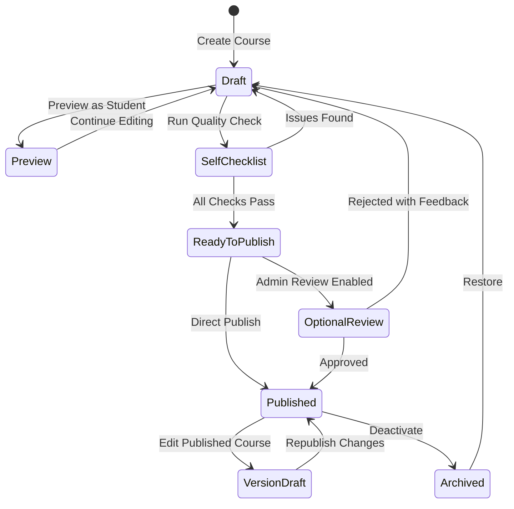
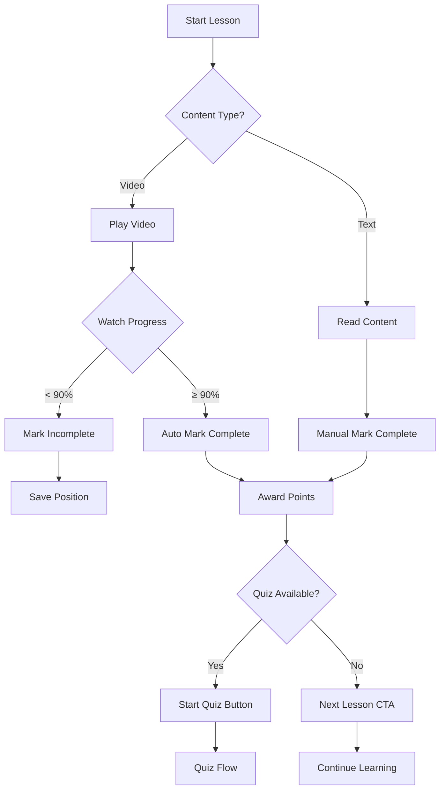
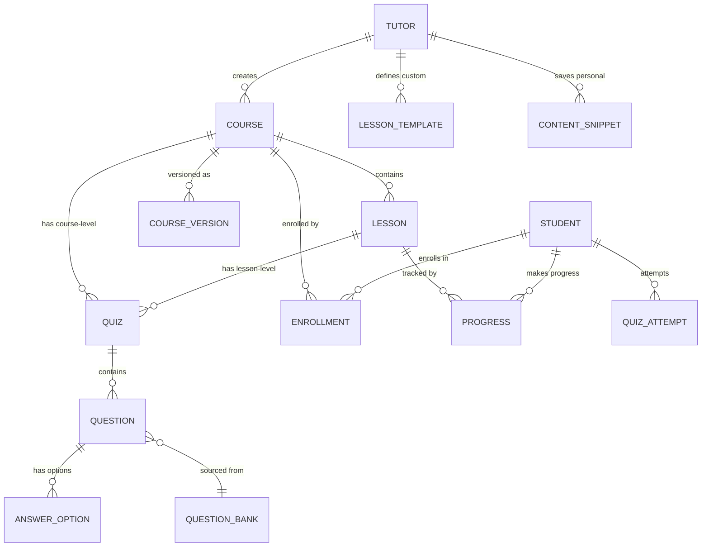

# Course Management System - Enhanced Design

## Document Control

| Field         | Value                                        |
| ------------- | -------------------------------------------- |
| Design Owner  | Technical Design Team                        |
| Last Updated  | 2025-12-07                                   |
| Status        | Draft                                        |
| Target System | EduConnect Platform - Tutor Course Builder   |
| Dependencies  | Existing Course, Lesson, Quiz infrastructure |

## Strategic Overview

### Purpose

Enhance the existing course creation workflow to provide tutors with a comprehensive, intuitive, and quality-focused system for building professional educational courses. The design focuses on reducing cognitive load while maintaining pedagogical rigor through structured workflows, templates, and guardrails.

### Design Principles

- Simplicity over complexity - minimize steps to publish quality content
- Quality by default - built-in guardrails prevent poor course design
- Progressive disclosure - show complexity only when needed
- Speed through reusability - templates, snippets, and question banks
- Student-centric - every design decision optimizes learner experience

### Success Metrics

- Average time to create first lesson: under 10 minutes
- Course completion readiness: at least 80% of courses meet quality checklist before first publish
- Tutor satisfaction: positive feedback on workflow intuitiveness
- Student engagement: improved lesson completion rates from better-structured content

## Domain Model

### Core Entities

#### Course Object

The central content container representing a complete learning pathway.

| Field            | Type    | Purpose                       | Constraints                                           |
| ---------------- | ------- | ----------------------------- | ----------------------------------------------------- |
| title            | String  | Primary course identifier     | 5-200 characters, unique per tutor                    |
| subtitle         | String  | One-line value proposition    | Max 120 characters, displayed in catalog              |
| description      | Text    | Detailed course overview      | Min 50 characters, supports rich formatting           |
| educationLevel   | Enum    | Target academic stage         | PRIMARY, SECONDARY, UNIVERSITY                        |
| subjectCategory  | String  | Academic discipline           | Required, used for categorization                     |
| tags             | Array   | Searchability keywords        | 3-10 tags, lowercase, hyphen-separated                |
| difficulty       | Enum    | Learner expertise requirement | BEGINNER, INTERMEDIATE, ADVANCED                      |
| estimatedHours   | Integer | Total learning time           | Auto-calculated from lessons, manual override allowed |
| learningOutcomes | Array   | Goal statements               | 3-5 bullets, "By the end, students can..." format     |
| prerequisites    | Text    | Required prior knowledge      | Optional, clear statements                            |
| coverImageUrl    | String  | Visual thumbnail              | Required, 16:9 ratio recommended                      |
| introVideoUrl    | String  | Course trailer                | Optional, 30-60 seconds, auto-play on detail page     |
| targetAudience   | Text    | Ideal learner description     | Who benefits most from this course                    |
| priceCents       | Integer | Monetization value            | 0 for free courses                                    |
| pricingModel     | Enum    | Access strategy               | FREE, ONE_TIME, SUBSCRIPTION                          |
| published        | Boolean | Visibility control            | Draft vs live state                                   |
| slug             | String  | SEO-friendly URL              | Auto-generated from title, editable                   |
| metaDescription  | String  | Search preview text           | Max 160 characters                                    |
| thumbnailAltText | String  | Accessibility descriptor      | Required for images                                   |
| language         | String  | Primary instruction language  | ISO code, default 'en'                                |
| status           | Enum    | Workflow state                | DRAFT, PUBLISHED, ARCHIVED                            |

#### Lesson Object

Focused learning module that teaches one specific outcome.

| Field                 | Type       | Purpose                            | Constraints                                  |
| --------------------- | ---------- | ---------------------------------- | -------------------------------------------- |
| title                 | String     | Outcome-focused identifier         | 5-150 characters, matches learning objective |
| courseId              | UUID       | Parent relationship                | Foreign key                                  |
| sequenceOrder         | Integer    | Playback position                  | Auto-assigned, manually reorderable          |
| duration              | Integer    | Expected completion time (minutes) | 5-8 minutes recommended for video            |
| learningObjective     | String     | Single goal statement              | One outcome per lesson                       |
| contentType           | Enum       | Primary delivery method            | VIDEO, TEXT, MIXED                           |
| videoUrl              | String     | Hosted video link                  | External or platform-hosted                  |
| videoFileUrl          | String     | Direct upload reference            | Alternative to videoUrl                      |
| notesContent          | Text       | Written explanation                | MDX/Rich text, 800-1200 words for text-based |
| attachments           | JSON Array | Supporting resources               | PDF, PNG, external links with metadata       |
| transcriptUrl         | String     | Accessibility requirement          | Auto-generated or uploaded                   |
| captionsEnabled       | Boolean    | Subtitle availability              | Required before publish                      |
| keyTerms              | JSON Array | Glossary entries                   | Term + definition pairs                      |
| exampleProblem        | Text       | Demonstration case                 | Optional, strengthens understanding          |
| practiceTask          | Text       | "Try it" micro-activity            | Optional, encourages active learning         |
| altTextProvided       | Boolean    | Image accessibility flag           | Validation check                             |
| published             | Boolean    | Lesson visibility                  | Can draft within published course            |
| autoCompleteThreshold | Integer    | Video watch percentage             | Default 90%                                  |

#### Quiz Object

Assessment mechanism linked to lesson or module.

| Field              | Type    | Purpose                    | Constraints                   |
| ------------------ | ------- | -------------------------- | ----------------------------- |
| title              | String  | Assessment identifier      | 5-100 characters              |
| lessonId           | UUID    | Lesson-level attachment    | Optional, nullable            |
| courseId           | UUID    | Course-level attachment    | Optional, nullable            |
| instructions       | Text    | Student guidance           | Clarifies expectations        |
| timeLimitMinutes   | Integer | Completion constraint      | Optional, null means untimed  |
| passingPercentage  | Integer | Success threshold          | Default 70%, range 0-100      |
| maxAttempts        | Integer | Retry allowance            | Null means unlimited          |
| shuffleQuestions   | Boolean | Randomize order            | Reduces cheating              |
| shuffleAnswers     | Boolean | Randomize options          | Reduces pattern matching      |
| immediateFeedback  | Boolean | Show correctness instantly | Default true                  |
| showCorrectAnswers | Boolean | Reveal solutions after     | Default true, can disable     |
| pointsOnPass       | Integer | Gamification reward        | Integrates with points system |
| badgeEligible      | Boolean | Unlock achievement         | If score meets criteria       |

#### Question Object

Individual assessment item within quiz.

| Field            | Type     | Purpose                 | Constraints                                              |
| ---------------- | -------- | ----------------------- | -------------------------------------------------------- |
| quizId           | UUID     | Parent quiz             | Foreign key                                              |
| questionType     | Enum     | Answer format           | MCQ_SINGLE, MCQ_MULTI, TRUE_FALSE, SHORT_ANSWER, NUMERIC |
| questionText     | Text     | Problem statement       | Clear, unambiguous                                       |
| questionImageUrl | String   | Visual component        | Optional supporting graphic                              |
| points           | Integer  | Scoring weight          | Default 10, customizable                                 |
| explanation      | Text     | Feedback content        | Why correct/incorrect, pedagogical value                 |
| sequenceOrder    | Integer  | Display position        | Reorderable                                              |
| answerOptions    | Relation | MCQ choices             | 2-6 options for MCQ types                                |
| correctAnswer    | String   | Expected response       | For short answer/numeric types                           |
| caseSensitive    | Boolean  | Exact match requirement | For text answers                                         |
| acceptableRange  | Float    | Numeric tolerance       | For numeric answers (± value)                            |
| cognitiveLevel   | Enum     | Bloom's taxonomy        | RECALL, APPLICATION, ANALYSIS (quality signal)           |

#### Answer Option Object

Multiple choice response candidate.

| Field         | Type    | Purpose         | Constraints                     |
| ------------- | ------- | --------------- | ------------------------------- |
| questionId    | UUID    | Parent question | Foreign key                     |
| optionText    | Text    | Choice content  | Supports markdown               |
| isCorrect     | Boolean | Solution marker | At least one must be true       |
| sequenceOrder | Integer | Display order   | Randomizable if shuffle enabled |

### Workflow States

#### Course Publishing Workflow



#### Lesson Completion Flow (Student Perspective)



## Functional Capabilities

### Tutor Course Editor Workflow

#### Tab Structure

The course editor presents a multi-tab interface for managing different aspects of course content.

**Overview Tab**

- Purpose: Manage course-wide metadata and marketing content
- Fields Exposed:
  - Basic Information: title, subtitle, education level, subject, tags
  - Learning Outcomes: 3-5 bullet editor with character guidance
  - Course Structure Summary: total lessons, estimated hours (auto-calculated), difficulty
  - Visual Assets: cover image uploader with preview, intro video URL input
  - Audience Definition: target audience description, prerequisites list
  - Pricing Configuration: model selector, price input (conditional), publish toggle
  - SEO Controls: slug editor with uniqueness validation, meta description counter, thumbnail alt text
- Actions: Save Draft, Preview, Publish (conditional on validation)

**Curriculum Tab**

- Purpose: Build and organize lesson sequence
- Interface Elements:
  - Lesson List: drag-drop reorderable cards
  - Lesson Card Display: title, duration, video/text indicator, quiz count, published status
  - Section Headers: grouping mechanism for thematic organization (e.g., "Module 1: Introduction")
  - Add Lesson Button: opens inline lesson creator or navigates to lesson builder
  - Bulk Actions: publish multiple, delete multiple, duplicate
- Validation Indicators: warnings for lessons without quizzes, incomplete content flags

**Quizzes Tab**

- Purpose: Manage assessments at course or lesson level
- Display: Table view of all quizzes with columns for title, attachment (lesson/course-level), question count, pass rate
- Actions: Create Quiz, Edit Quiz (opens question bank interface), Attach to Lesson, Preview Quiz
- Question Bank Integration: access to reusable questions across courses

**Resources Tab**

- Purpose: Centralized file and link management
- Content Types:
  - Uploaded Files: PDFs, images, templates with metadata (title, description, lesson association)
  - External Links: curated resources with titles and descriptions
  - Templates: downloadable worksheets, study guides
- Usage Tracking: shows which lessons reference each resource

**Students Tab**

- Purpose: Monitor enrolled learners and their progress
- Information Displayed:
  - Enrollment List: student name, enrollment date, progress percentage, last active date
  - Risk Indicators: flag students with no activity in 7+ days or pass rate < 50%
  - Engagement Metrics: average lesson completion time, quiz attempts distribution
- Actions: Send message (future), view individual progress detail

**Schedule Tab**

- Purpose: Link course to live tutoring availability (integration with session system)
- Functionality:
  - Calendar view of available time slots
  - Link session to course for context-aware bookings
  - Show upcoming workshops related to course

**Settings Tab**

- Purpose: Advanced configuration and course lifecycle management
- Options:
  - SEO Settings: advanced slug options, canonical URL
  - Visibility: public, unlisted, private
  - Language: primary instruction language
  - Course Actions: duplicate course (create copy with new title), archive course, delete course (with confirmation)

### Lesson Building Interface

#### Lesson Templates

Pre-structured content blocks that accelerate lesson creation while maintaining pedagogical consistency.

**Standard Lesson Template Structure**

1. Introduction Block: hook statement, learning objective preview
2. Concept Explanation Block: main teaching content (video or text)
3. Example Block: worked demonstration
4. Practice Block: student try-it activity
5. Recap Block: summary of key points

**Template Application**

- Tutors select template when creating new lesson
- Each block becomes editable section with guidance prompts
- Blocks can be reordered, removed, or duplicated
- Template serves as scaffold, not rigid constraint

#### Content Editor Features

**Rich Text Capabilities** (for notesContent)

- Markdown support with live preview
- Heading hierarchy (H2-H4)
- Inline code formatting
- Blockquotes for tips/warnings
- Ordered and unordered lists
- Image embedding with alt text requirement
- Link insertion with accessibility check

**Video Integration**

- Option 1: External URL (YouTube, Vimeo) with automatic embed detection
- Option 2: Direct file upload with progress indicator
- Thumbnail auto-extraction or manual upload
- Duration auto-detection
- Transcript upload requirement before publish

**Attachments Management**

- Drag-drop file upload zone
- Supported formats: PDF, PNG, JPEG, external links
- Per-attachment metadata: title, description, file size display
- Preview capability for images and PDFs
- Delete and reorder functionality

**Accessibility Enforcement**

- Image alt text validation (blocks save if missing)
- Video transcript requirement (warning if absent)
- Color contrast checker for text overlays
- Keyboard navigation testing reminder

#### Quick Insert Snippets

Pre-formatted content blocks for common instructional patterns.

| Snippet Type | Structure                                  | Use Case                   |
| ------------ | ------------------------------------------ | -------------------------- |
| Definition   | Term + Explanation with highlight box      | Introduce new vocabulary   |
| Formula      | Math expression + variable legend          | Present equations          |
| Tip          | Icon + short advice statement              | Provide helpful hints      |
| Warning      | Icon + caution message                     | Highlight common mistakes  |
| Example Box  | Label + code or text sample                | Show practical application |
| Summary List | Bullet points with "Key Takeaways" heading | Lesson conclusion          |

### Quiz Builder System

#### Question Bank Architecture

Centralized repository of reusable assessment items.

**Question Organization**

- Questions stored independently from specific quizzes
- Tagging system: subject, difficulty, cognitive level, topic
- Search and filter by tags
- Usage tracking: shows which quizzes use each question
- Version history: edits create new version, preserving original

**Creation Workflow**

1. Create question in bank with full metadata
2. Add to current quiz from bank (reference, not copy)
3. Reuse same question across multiple quizzes
4. Bulk import questions from CSV template

#### Quiz Configuration Interface

**Basic Settings Panel**

- Title and instructions fields
- Time limit toggle with minute input
- Passing percentage slider (0-100%)
- Max attempts selector (1-5 or unlimited)
- Shuffle toggles (questions and answers separately)

**Feedback Settings Panel**

- Immediate feedback toggle (show correctness instantly)
- Show correct answers toggle (reveal after submission)
- Explanation display mode (always, on wrong answer, never)
- Points award amount on pass

**Question Management Panel**

- Question list with type icons, point values, sequence numbers
- Add from bank button (opens searchable modal)
- Create new question inline
- Edit question (opens question editor drawer)
- Delete question (confirms if used elsewhere)
- Reorder via drag-drop
- Preview entire quiz button

#### Question Type Implementations

**Multiple Choice (Single Answer)**

- Question text editor
- 2-6 answer options (add/remove dynamically)
- Radio button selection for correct answer
- Explanation field per option (optional) or per question

**Multiple Choice (Multiple Correct)**

- Same as single but checkboxes
- Minimum 1 correct answer required
- Partial credit option: award points proportionally

**True/False**

- Question text editor
- Radio toggle for correct answer
- Explanation field for why true or why false

**Short Answer (Exact Match)**

- Question text editor
- Expected answer input
- Case sensitivity toggle
- Alternative acceptable answers (comma-separated)
- Character limit setting

**Numeric Answer**

- Question text editor
- Correct numeric value input
- Acceptable range (± tolerance)
- Unit specification (optional, e.g., "meters")
- Decimal place requirements

### Reusability Mechanisms

#### Course Cloning

- Duplicate entire course structure under new title
- Options during clone:
  - Include lessons (copies content)
  - Include quizzes (references same questions from bank)
  - Include resources (copies or references)
- Use cases: adapt course for different education level, create language variant, semester updates

#### Lesson Cloning

- Duplicate lesson within same course or across courses
- Preserves all content, attachments, metadata
- Sequence order auto-assigned
- Use case: similar lesson structure for different topics

#### Question Bank Import/Export

- Export questions as CSV for backup or transfer
- Import questions from CSV template
- Mapping tool for field alignment
- Validation on import (duplicate detection)

### Quality Guardrails

#### Pre-Publish Validation Checklist

Automated checks before course can transition from Draft to Published.

| Check Category      | Validation Rule                                     | Error Type |
| ------------------- | --------------------------------------------------- | ---------- |
| Course Metadata     | Title, description, education level, subject filled | Blocking   |
| Learning Outcomes   | Minimum 3 outcomes provided                         | Blocking   |
| Cover Image         | Image uploaded or URL provided                      | Blocking   |
| Lesson Minimum      | At least 1 published lesson exists                  | Blocking   |
| Lesson Structure    | Each lesson has title and learning objective        | Blocking   |
| Video Accessibility | Videos have transcript or captions                  | Warning    |
| Quiz Coverage       | At least 3 questions per lesson quiz                | Warning    |
| Assessment Quality  | At least 1 application-level question per quiz      | Warning    |
| Image Accessibility | All images have alt text                            | Blocking   |
| Lesson Length       | Lessons within 5-8 min video or 800-1200 words      | Warning    |

**Warning vs Blocking**

- Blocking: prevents publish button activation, displays error count
- Warning: allows publish but displays notice, encourages best practice

#### Content Quality Rules

**Lesson Length Guidelines**

- Video Lessons: 5-8 minutes recommended, 3-12 acceptable, >12 triggers warning
- Text Lessons: 800-1200 words recommended, displays word count
- Rationale: maintains engagement, supports mobile consumption

**One Outcome Per Lesson Principle**

- Lesson title should reflect specific learning objective
- Validation: check that learning objective is singular statement
- Multi-objective lessons flagged for splitting suggestion

**Assessment Cognitive Balance**

- Quizzes should test application, not just recall
- Question bank tags questions by cognitive level (Bloom's taxonomy)
- Validation: warns if all questions are "recall" level
- Suggested distribution: 40% recall, 40% application, 20% analysis

**Media Quality Standards**

- Diagrams preferred over dense text screenshots
- Color contrast checker for accessibility (WCAG AA compliance)
- Image resolution minimum: 1280x720 for course covers
- Video resolution minimum: 720p

### Publishing and Versioning

#### Draft vs Published State

- Draft courses: visible only to tutor, editable without restrictions
- Published courses: visible to students, editable but creates version draft

#### Version Draft System

When editing published course:

1. Create version draft (shadow copy of current published state)
2. All edits apply to draft version
3. Published version remains live and unchanged
4. "Republish" button applies draft changes to published version
5. Change log auto-generates (e.g., "Edited Lesson 3 notes; added 2 quiz items")

#### Change Log Tracking

Automatic activity recording for transparency.

| Event                  | Log Entry Format                            |
| ---------------------- | ------------------------------------------- |
| Lesson Added           | "Added lesson: [title]"                     |
| Lesson Edited          | "Edited lesson [number]: [changed fields]"  |
| Lesson Deleted         | "Removed lesson: [title]"                   |
| Quiz Added             | "Added quiz to [lesson/course]: [title]"    |
| Quiz Questions Updated | "Updated [count] questions in [quiz title]" |
| Metadata Changed       | "Updated course [field names]"              |
| Publish Event          | "Course published on [date]"                |
| Unpublish Event        | "Course unpublished on [date]"              |

Change log visible in Settings tab, filterable by date range.

### Student-Facing Experience Impact

#### Progress Tracking Integration

- Progress bar calculation: (completed lessons / total lessons) × 100
- Lesson completion criteria: video ≥90% watched OR manual mark complete
- "Next Lesson" CTA appears at lesson end, navigates to next in sequence
- Quiz completion adds bonus progress (optional, configured per course)

#### Inline Quiz Presentation

- Quiz displayed as card at end of lesson content
- "Start Quiz" button with attempt counter ("Attempt 1 of 3")
- Quiz interface: one question per screen, progress indicator, timer (if enabled)
- Results screen: score percentage, pass/fail, point award, review answers button

#### Help Integration

- "Need Help?" persistent button on lesson page
- Links to tutor's available session slots filtered by course context
- Quick booking flow without leaving lesson

#### Gamification Triggers

- Lesson completion: award points (configurable per course, default 10)
- Quiz pass: award points based on quiz configuration
- Badge evaluation: check criteria after each quiz pass (e.g., "Quiz Whiz: ≥80% on 5 quizzes")
- Streak reminder: display if daily activity maintains streak

### Tutor Analytics Dashboard

#### Enrollment Metrics

- Total enrollments (all-time)
- Active learners this week (at least 1 lesson accessed)
- New enrollments graph (daily for last 30 days)
- Enrollment conversion rate (course views → enrollments)

#### Engagement Analysis

- Average watch time per lesson (identifies most/least engaging content)
- Lesson drop-off points (where students stop progressing)
- Quiz difficulty heatmap: correct rate per question (flag <50% correct rate)
- Time spent per lesson (actual vs estimated)

#### At-Risk Learner Identification

Flags students who may need intervention.

| Risk Signal    | Definition                                       | Action Suggestion          |
| -------------- | ------------------------------------------------ | -------------------------- |
| Inactive       | No activity in 7+ days                           | Send reminder message      |
| Low Pass Rate  | <50% quiz average                                | Offer tutoring session     |
| Stuck          | Same lesson accessed 5+ times without completion | Check lesson clarity       |
| Rapid Skipping | Lessons marked complete in <50% estimated time   | Review completion criteria |

#### Review and Rating Management

- Course rating average (1-5 stars)
- Recent reviews list with text feedback
- Quick reply interface (tutor can respond to reviews)
- Sentiment trend graph (positive/neutral/negative over time)

### Admin Oversight and Safety

#### Content Moderation Queue

Lightweight approval workflow for quality control.

**Reported Content**

- Students or admins can flag lessons/quizzes as inappropriate or inaccurate
- Flagged items appear in admin queue with reporter reason
- Admin actions: approve (dismiss flag), request tutor revision, hide content

**Tutor Profile Verification**

- Status: Unverified, Pending, Verified
- Verified badge appears on tutor profile and courses
- Criteria: identity check, credentials upload, sample course review

**Content Quality Checklist** (Admin View)

- Accessibility compliance: captions present, alt text complete
- Plagiarism flags: integration with text similarity checker (future)
- Copyright review: ensure media usage rights

## Data Model Enhancements

### Required Schema Additions

The existing Prisma schema already supports most requirements. Recommended additions:

#### Course Model Extensions

```
Add fields:
- subtitle (String, max 120 chars)
- slug (String, unique, indexed)
- metaDescription (String, max 160 chars)
- thumbnailAltText (String)
- learningOutcomes (JSON array)
- targetAudience (String)
- tags (JSON array)
- introVideoUrl (String, nullable)
- changeLog (JSON array, timestamped entries)
```

#### Lesson Model Extensions

```
Add fields:
- contentType (Enum: VIDEO, TEXT, MIXED)
- transcriptUrl (String, nullable)
- captionsEnabled (Boolean, default false)
- keyTerms (JSON array of {term, definition})
- exampleProblem (Text, nullable)
- practiceTask (Text, nullable)
- altTextProvided (Boolean, default false)
- autoCompleteThreshold (Integer, default 90)
- wordCount (Integer, auto-calculated for text lessons)
```

#### Question Model Extensions

```
Add fields:
- cognitiveLevel (Enum: RECALL, APPLICATION, ANALYSIS)
- tags (JSON array)
- usageCount (Integer, tracks reuse)
- caseSensitive (Boolean, for short answer)
- acceptableRange (Float, for numeric)
- acceptableAlternatives (JSON array, for short answer)
- isInQuestionBank (Boolean, distinguishes bank vs inline questions)
```

#### New Model: LessonTemplate

```
Fields:
- id (UUID)
- name (String)
- description (Text)
- structure (JSON array of block definitions)
- isPublic (Boolean, shareable across tutors)
- createdBy (UUID, tutor reference)
- usageCount (Integer)
- createdAt (DateTime)
```

#### New Model: ContentSnippet

```
Fields:
- id (UUID)
- name (String)
- type (Enum: DEFINITION, FORMULA, TIP, WARNING, EXAMPLE, SUMMARY)
- template (Text, markdown with placeholders)
- isPublic (Boolean)
- createdBy (UUID, tutor reference)
- usageCount (Integer)
```

#### New Model: CourseVersion

```
Fields:
- id (UUID)
- courseId (UUID, references Course)
- versionNumber (Integer)
- changesSummary (Text, from change log)
- snapshotData (JSON, complete course state)
- publishedAt (DateTime)
```

### Data Relationships



## Interface Wireframe Concepts

### Tutor Course List View

```
┌────────────────────────────────────────────────────────────────┐
│ My Courses                                    [+ Create Course] │
├────────────────────────────────────────────────────────────────┤
│ ┌──────────────────────────────────────────────────────────┐   │
│ │ [Cover Image]  Introduction to Mathematics               │   │
│ │                                                           │   │
│ │ Status: PUBLISHED    📚 12 lessons   ❓ 8 quizzes         │   │
│ │ 45 enrollments      Last updated: Dec 5, 2025            │   │
│ │                                                           │   │
│ │ [Edit] [Manage Lessons] [Unpublish] [•••]               │   │
│ └──────────────────────────────────────────────────────────┘   │
│                                                                 │
│ ┌──────────────────────────────────────────────────────────┐   │
│ │ [Cover Image]  Biology Basics                  [DRAFT]   │   │
│ │                                                           │   │
│ │ Status: DRAFT        📚 3 lessons    ❓ 1 quiz            │   │
│ │ 0 enrollments       Last updated: Dec 6, 2025            │   │
│ │ ⚠️ Add 2 more lessons to publish                          │   │
│ │                                                           │   │
│ │ [Edit] [Manage Lessons] [Delete] [•••]                   │   │
│ └──────────────────────────────────────────────────────────┘   │
└────────────────────────────────────────────────────────────────┘
```

### Course Editor - Overview Tab

```
┌────────────────────────────────────────────────────────────────┐
│ ◀ Back to Courses                                              │
│                                                                 │
│ [Overview] [Curriculum] [Quizzes] [Resources] [Students]       │
│                                                                 │
│ Basic Information                                              │
│ ┌──────────────────────────────────────────────────────────┐   │
│ │ Title*         [Introduction to Algebra    ] 22/200      │   │
│ │ Subtitle       [Master equations step by s…] 32/120      │   │
│ │ Education      [● Primary  ○ Secondary  ○ University]    │   │
│ │ Subject*       [Mathematics ▼]                           │   │
│ │ Tags           [algebra, equations, math-basics +]       │   │
│ └──────────────────────────────────────────────────────────┘   │
│                                                                 │
│ Learning Outcomes (3-5 bullets)*                               │
│ ┌──────────────────────────────────────────────────────────┐   │
│ │ 1. By the end, students can solve linear equations       │   │
│ │ 2. [+ Add outcome]                                       │   │
│ └──────────────────────────────────────────────────────────┘   │
│                                                                 │
│ Cover & Trailer                                                │
│ ┌────────────┐  ┌────────────────────────────────────────┐    │
│ │[Cover Img] │  │ Alt Text* [Student solving equation]   │    │
│ │ [Upload]   │  │ Intro Video URL [https://...]          │    │
│ └────────────┘  └────────────────────────────────────────┘    │
│                                                                 │
│ [Save Draft] [Preview]             [Publish Course] (disabled) │
│              Publish blocked: Add 2 more lessons               │
└────────────────────────────────────────────────────────────────┘
```

### Lesson Builder Interface

```
┌────────────────────────────────────────────────────────────────┐
│ ◀ Back to Curriculum                                           │
│                                                                 │
│ Lesson 1: What are Variables?                                  │
│ ┌──────────────────────────────────────────────────────────┐   │
│ │ Template: [Standard Lesson ▼]  Duration: [7] minutes     │   │
│ │ Learning Objective*                                       │   │
│ │ [Students can define variables and identify them in…]    │   │
│ └──────────────────────────────────────────────────────────┘   │
│                                                                 │
│ Content Blocks                                                 │
│ ┌──────────────────────────────────────────────────────────┐   │
│ │ ⣿ Introduction                                            │   │
│ │   [In this lesson, we'll discover what variables are…]   │   │
│ │                                                           │   │
│ │ ⣿ Video Explanation                                       │   │
│ │   [Upload Video] or [Video URL: https://youtu.be/...]    │   │
│ │   Transcript: [📎 transcript.txt] ✓                      │   │
│ │                                                           │   │
│ │ ⣿ Example                                [+ Snippet ▼]    │   │
│ │   [If x = 5, then x + 3 = 8. Here x is…]                 │   │
│ │                                                           │   │
│ │ ⣿ Practice Task                                           │   │
│ │   [Try finding the variable in: 2y = 10]                 │   │
│ │                                                           │   │
│ │ [+ Add Block]                                             │   │
│ └──────────────────────────────────────────────────────────┘   │
│                                                                 │
│ Attachments                                                    │
│ ┌──────────────────────────────────────────────────────────┐   │
│ │ 📄 variables-worksheet.pdf (245 KB) [Delete]              │   │
│ │ [+ Add File or Link]                                      │   │
│ └──────────────────────────────────────────────────────────┘   │
│                                                                 │
│ [Save] [Save & Preview] [Delete Lesson]                        │
└────────────────────────────────────────────────────────────────┘
```

### Quiz Builder Interface

```
┌────────────────────────────────────────────────────────────────┐
│ Quiz: Lesson 1 Check                                           │
│ ┌──────────────────────────────────────────────────────────┐   │
│ │ Settings                                                  │   │
│ │ Time Limit: [○ None  ● 10 minutes]                       │   │
│ │ Passing Score: [━━━━●━━] 70%                             │   │
│ │ Max Attempts: [3 ▼]                                      │   │
│ │ ☑ Shuffle questions  ☑ Immediate feedback                │   │
│ └──────────────────────────────────────────────────────────┘   │
│                                                                 │
│ Questions                                     [+ From Bank ▼]  │
│ ┌──────────────────────────────────────────────────────────┐   │
│ │ ⣿ 1. MCQ  What is a variable?               [Edit] [Del] │   │
│ │    ○ A number                                             │   │
│ │    ● A symbol representing a value                        │   │
│ │    ○ An equation                                          │   │
│ │    Points: 10   Cognitive: RECALL                         │   │
│ │                                                           │   │
│ │ ⣿ 2. Numeric  If x = 5, what is x + 3?      [Edit] [Del] │   │
│ │    Answer: 8 (± 0)                                        │   │
│ │    Points: 10   Cognitive: APPLICATION                    │   │
│ │                                                           │   │
│ │ ⚠️ Add 1 more application-level question                  │   │
│ │                                                           │   │
│ │ [+ Create Question]                                       │   │
│ └──────────────────────────────────────────────────────────┘   │
│                                                                 │
│ Points on Pass: [50]  Badge Eligible: [☑]                      │
│                                                                 │
│ [Save Quiz] [Preview as Student]                               │
└────────────────────────────────────────────────────────────────┘
```

## First Course Implementation Checklist

Practical milestone for MVP validation.

### Course Setup

- [ ] Create course with title "Introduction to [Subject]"
- [ ] Add 3-5 learning outcomes
- [ ] Upload cover image with alt text
- [ ] Set education level and difficulty
- [ ] Write description (min 50 characters)

### Lesson Creation (6-8 lessons)

For each lesson:

- [ ] Title reflects single learning objective
- [ ] Video (5-8 min) OR text content (800-1200 words)
- [ ] Transcript/captions uploaded
- [ ] At least 1 attachment (worksheet, diagram, or link)
- [ ] Key terms defined (if applicable)
- [ ] Lessons numbered and ordered logically

### Quiz Implementation

For each lesson:

- [ ] Create quiz with 3-5 questions
- [ ] Include at least 1 application-level question
- [ ] Set passing percentage (70% recommended)
- [ ] Enable immediate feedback
- [ ] Write explanations for each question

### Gamification Integration

- [ ] Configure lesson completion points (default 10 per lesson)
- [ ] Configure quiz pass points (50 recommended)
- [ ] Create badge: "First Lesson Completed" (criteria: complete any 1 lesson)
- [ ] Create badge: "Quiz Whiz" (criteria: ≥80% score on 5 quizzes)

### Live Session Linkage

- [ ] Schedule 1 workshop/office hours slot
- [ ] Link session to course in Schedule tab
- [ ] Set max participants
- [ ] Add session description referencing course topics

### Pre-Publish Validation

- [ ] Run quality checklist (Settings tab)
- [ ] Resolve all blocking errors
- [ ] Review all warnings
- [ ] Preview course as student
- [ ] Test enrollment flow

### Launch

- [ ] Toggle publish switch
- [ ] Verify course appears in catalog
- [ ] Test enrollment and first lesson access
- [ ] Monitor analytics for first week

## Implementation Priorities

### Phase 1: Core Editor Enhancements (Weeks 1-2)

- Extend Course model with new fields (subtitle, slug, learningOutcomes, tags)
- Extend Lesson model (contentType, keyTerms, transcriptUrl)
- Build Overview tab UI with all metadata fields
- Implement slug auto-generation and uniqueness validation
- Create Curriculum tab with lesson list and drag-drop reorder
- Build basic lesson editor with template selector

### Phase 2: Quiz System Refinement (Week 3)

- Extend Question model with cognitive level and tags
- Build question bank interface (create, search, tag)
- Implement quiz builder with "add from bank" functionality
- Create question reuse tracking
- Build quiz preview mode

### Phase 3: Quality Guardrails (Week 4)

- Implement pre-publish validation checklist
- Build automated checks (lesson count, alt text, captions)
- Create warning vs blocking error system
- Add validation status indicators throughout UI
- Implement lesson length warnings

### Phase 4: Reusability Features (Week 5)

- Build course cloning functionality
- Build lesson cloning functionality
- Create content snippet library
- Implement quick insert snippets in lesson editor
- Build lesson template creator and selector

### Phase 5: Versioning and Publishing (Week 6)

- Implement version draft system for published courses
- Build change log auto-generation
- Create republish workflow with diff preview
- Add publish history view
- Implement unpublish and archive actions

### Phase 6: Tutor Analytics (Week 7)

- Build enrollment metrics dashboard
- Implement lesson engagement tracking
- Create quiz difficulty analysis
- Build at-risk learner identification
- Add review and rating management interface

### Phase 7: Student Experience Polish (Week 8)

- Integrate progress bar with new completion logic
- Build inline quiz presentation UI
- Implement "Next Lesson" smart CTA
- Add "Need Help?" quick booking link
- Create gamification trigger integration

## Technical Considerations

### Performance Optimization

- Lesson list pagination for courses with >50 lessons
- Lazy loading of quiz questions in editor
- Debounced auto-save for content editors (save every 10 seconds of inactivity)
- Optimistic UI updates for drag-drop reordering
- Image upload with compression and CDN integration

### Accessibility Requirements

- Keyboard-only navigation support for all editors
- Screen reader announcements for drag-drop operations
- Focus management in modal dialogs
- ARIA labels for all icon-only buttons
- Color contrast validation for custom styling

### Security Measures

- Course ownership verification on all edit endpoints
- Content sanitization for rich text input (prevent XSS)
- File upload validation (type, size, malware scan)
- Rate limiting on publish actions (prevent spam)
- CSRF protection on state-changing operations

### Scalability Patterns

- Question bank indexed by tags for fast search
- Course change log stored as append-only JSON array
- Version snapshots compressed and stored separately
- Analytics computed asynchronously and cached
- Enrollment metrics updated via background jobs

## Open Questions for Clarification

1. **Question Bank Scope**: Should question banks be tutor-private, institution-wide, or have both options?
2. **Video Hosting**: Will platform host videos directly or rely on third-party embeds (YouTube, Vimeo)?
3. **Transcript Generation**: Should platform integrate auto-transcription service (e.g., AWS Transcribe) or require manual upload?
4. **Admin Approval**: Should all courses require admin approval before publish, or is it optional/configurable per tutor?
5. **Badge Criteria**: Should badge criteria be configurable by tutors or predefined by platform?
6. **Session Integration**: Should live sessions be required per course, optional, or completely independent?
7. **Pricing Tiers**: Are there platform fees or revenue sharing on paid courses that affect pricing display?
8. **Language Support**: Should course content support multiple language variants (i18n) or one language per course?

## Risk Assessment

| Risk                                                    | Impact | Mitigation                                                               |
| ------------------------------------------------------- | ------ | ------------------------------------------------------------------------ |
| Feature complexity overwhelms tutors                    | High   | Progressive disclosure, hide advanced features behind "Advanced" toggles |
| Quality guardrails too strict, block legitimate courses | Medium | Make most guardrails warnings, not blockers; allow admin override        |
| Version drafting confuses tutors                        | Medium | Clear UI indicators, preview diff before republish                       |
| Question bank becomes disorganized                      | Medium | Enforce tagging on creation, provide cleanup tools                       |
| Video transcription bottleneck                          | High   | Auto-transcription integration, allow publish with warning               |
| Performance degradation with large courses              | Medium | Implement pagination, lazy loading, optimize queries                     |

## Success Criteria

### Quantitative Metrics

- 80% of tutors create first course within 2 weeks of training
- Average time to first lesson creation: <10 minutes
- 90% of courses pass pre-publish checklist on first attempt after 1 month of use
- Quiz completion rate improves by 15% due to inline presentation
- At-risk learner identification reduces dropout by 10%

### Qualitative Goals

- Tutors report workflow as "intuitive" in user feedback surveys
- Students rate course organization and clarity higher than before redesign
- Admin moderation queue manageable with <2 hours/week review time
- Platform positioned as "professional" course creation tool in market
