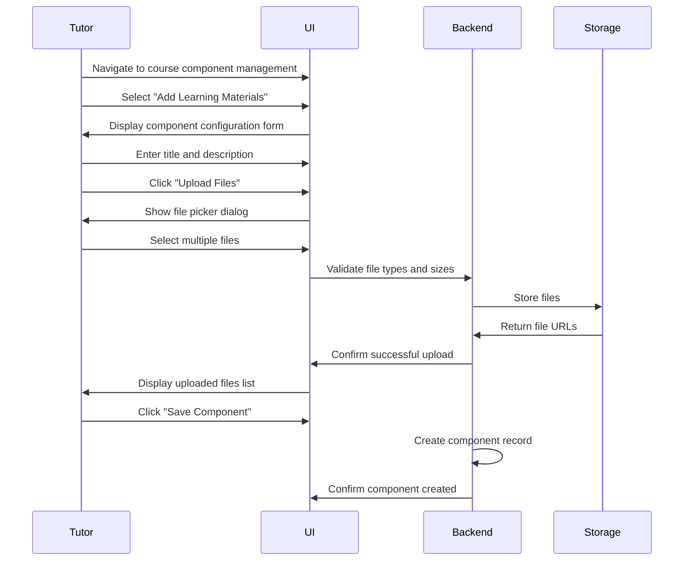
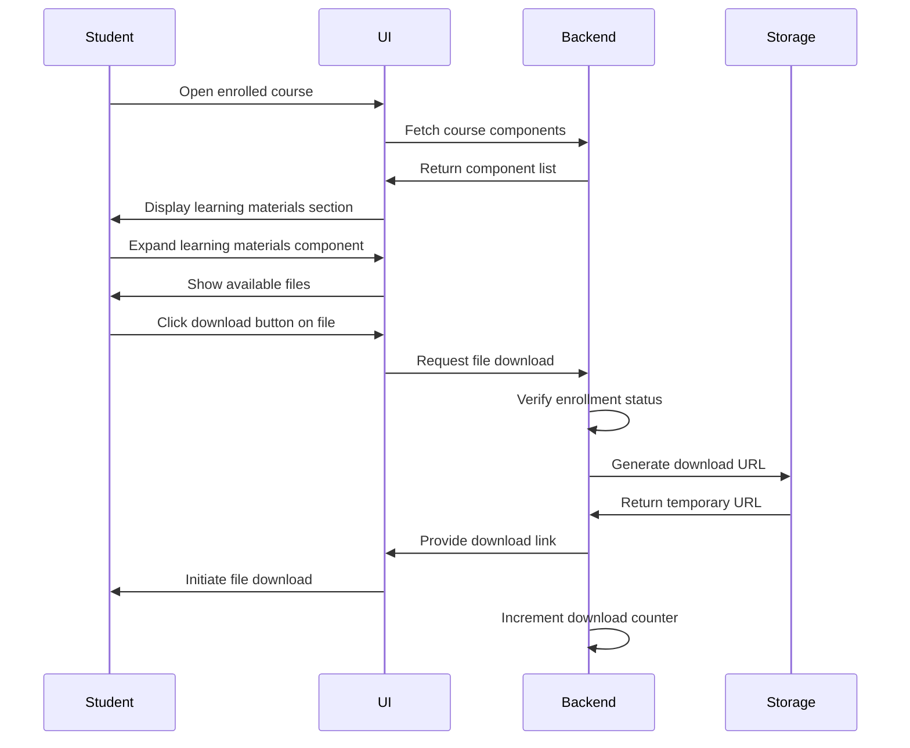
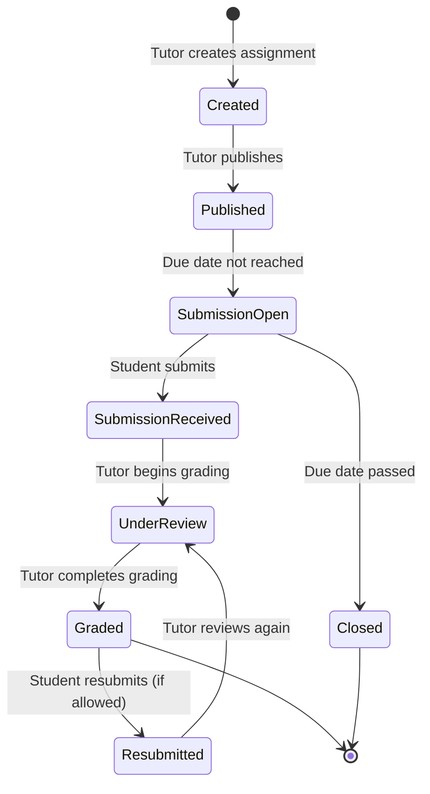
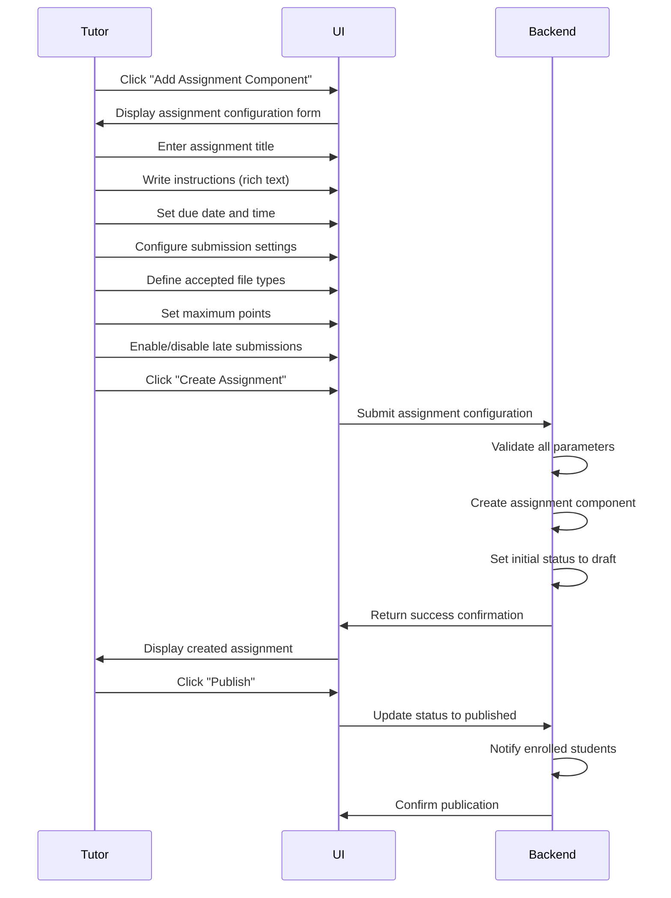
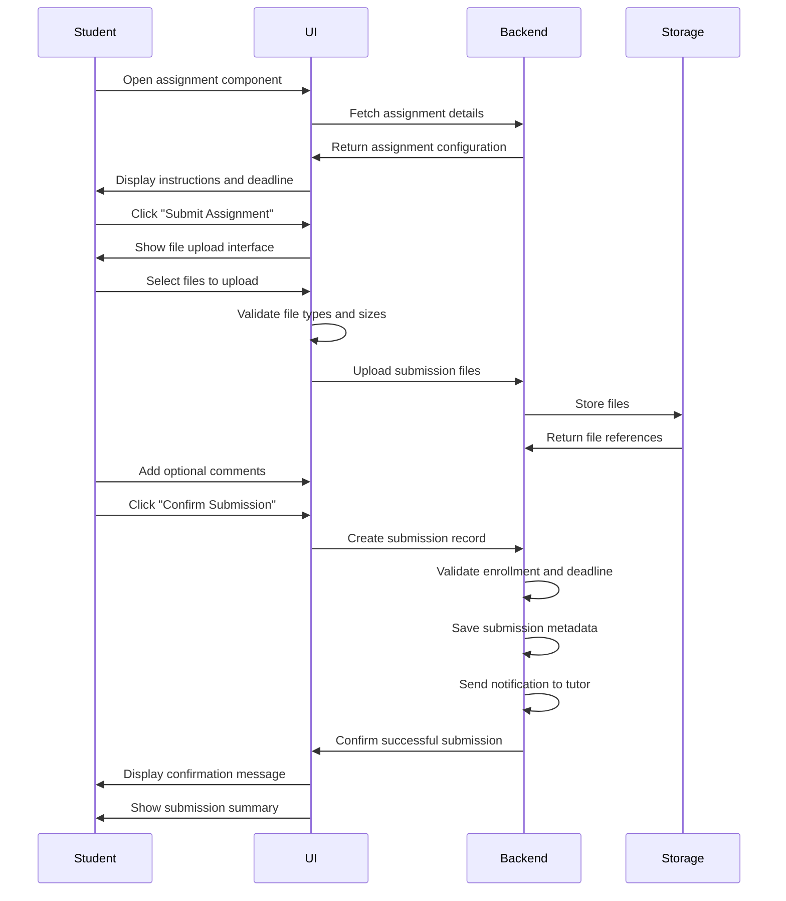

# Course Page Redesign with Flexible Component System

## Design Overview

This design transforms the course page from a static content display into a dynamic, component-based learning environment. Inspired by modern learning management systems, the redesign introduces flexible content containers that tutors can configure to deliver diverse learning materials, assignments, and resources.

## Strategic Intent

The redesign aims to:

- Empower tutors with flexible content organization beyond traditional video lessons
- Enable students to engage with multiple learning modalities within a single course
- Provide administrators with comprehensive course management capabilities
- Support asynchronous learning through file sharing and assignment submission
- Create a scalable foundation for future learning activities

## Core Concepts

### Component-Based Architecture

The course page transitions from a fixed lesson-based structure to a flexible component system where tutors can create various content containers, each serving a specific pedagogical purpose.

### Role-Based Interaction Model

The system adapts its interface and capabilities based on user role:

- Tutors: Full authoring and editing capabilities
- Students: Learning-focused interface with interaction features
- Admins: Oversight and intervention capabilities

## User Roles and Capabilities

### Tutor Role (Course Owner)

As the course creator and owner, tutors have comprehensive control over course structure and content.

#### Course Creation Capabilities

Tutors can create new courses with complete creative freedom. The course creation process allows definition of course metadata, learning objectives, and initial structure planning.

#### Course Editing Capabilities

After course creation, tutors maintain perpetual editing rights to:

- Modify course metadata, descriptions, and settings
- Add, remove, or reorder course components
- Update existing component content
- Manage enrollment settings
- Monitor student progress and submissions

#### Component Management

Tutors can create and configure various component types to structure course content:

**Learning Materials Component**

- Purpose: Deliver study materials in various formats
- Supported file types: Word documents, PowerPoint presentations, PDF files, images, text documents
- Capabilities: Upload multiple files, provide descriptions, organize by topics
- Student interaction: Download and view materials

**Assignment Submission Component**

- Purpose: Collect student work and submissions
- Configuration options: Due dates, submission format requirements, point values, instructions
- Capabilities: Set submission deadlines, define acceptance criteria, enable late submissions
- Student interaction: Upload assignment files, view submission status, resubmit if allowed

**Announcement Component**

- Purpose: Communicate updates and important information
- Capabilities: Post rich text announcements, schedule publication, mark as urgent
- Student interaction: Read announcements, receive notifications

**Resource Link Component**

- Purpose: Share external learning resources
- Capabilities: Add URLs with descriptions, categorize links, verify link validity
- Student interaction: Access external resources

**Discussion Component**

- Purpose: Facilitate course-related discussions
- Capabilities: Create discussion topics, moderate conversations, highlight important threads
- Student interaction: Post responses, engage with peers

### Student Role (Learner)

Students access courses with a learning-focused interface optimized for content consumption and engagement.

#### Course Discovery and Enrollment

Students can browse the course catalog and view detailed course information before enrollment.

**Course Viewing Capabilities**

- View course overview and description
- Browse component structure and learning materials preview
- See instructor information and credentials
- Review course requirements and estimated time commitment
- Read student reviews and ratings

**Enrollment Process**

- Click enrollment button on course detail page
- Automatic enrollment for free courses
- Payment processing for paid courses
- Confirmation notification upon successful enrollment

#### Enrolled Student Capabilities

After enrollment, students gain access to interactive course features:

**Learning Materials Interaction**

- Download files from learning materials components
- View materials inline when supported
- Track which materials have been accessed
- Bookmark important resources

**Assignment Submission**

- View assignment requirements and deadlines
- Upload submission files through assignment components
- Receive confirmation of successful submissions
- View submission history and status
- Download feedback when available

**Progress Tracking**

- View completion status for course components
- Track assignment submission status
- Monitor overall course progress percentage
- Access learning history

### Admin Role (Platform Supervisor)

Administrators have elevated privileges to ensure platform integrity and support course quality.

#### Course Management Authority

Admins possess all capabilities of both tutors and students, plus additional oversight functions:

**Course Oversight**

- Create courses on behalf of tutors
- Edit any course regardless of ownership
- Remove inappropriate or policy-violating courses
- Suspend or archive courses temporarily

**Enrollment Management**

- Manually enroll students or tutors into specific courses
- Override enrollment restrictions when necessary
- Bulk enrollment operations
- Enrollment reporting and analytics

**Content Moderation**

- Review reported content within courses
- Remove or flag inappropriate materials
- Enforce platform content policies
- Mediate disputes between tutors and students

## Component Type Specifications

### General Component Structure

All components share common architectural elements while supporting type-specific configurations.

#### Universal Component Properties

| Property          | Description                    | Data Type            | Required |
| ----------------- | ------------------------------ | -------------------- | -------- |
| Component ID      | Unique identifier              | UUID                 | Yes      |
| Component Type    | Category of component          | Enumeration          | Yes      |
| Title             | Display name for component     | Text (200 chars max) | Yes      |
| Description       | Detailed explanation           | Rich text            | No       |
| Sequence Order    | Position in course structure   | Integer              | Yes      |
| Visibility Status | Published or draft state       | Boolean              | Yes      |
| Created At        | Timestamp of creation          | DateTime             | Yes      |
| Updated At        | Timestamp of last modification | DateTime             | Yes      |
| Created By        | User who created component     | User reference       | Yes      |

### Learning Materials Component

Designed for delivering downloadable study resources to students.

#### Configuration Parameters

| Parameter            | Description                   | Constraints                             |
| -------------------- | ----------------------------- | --------------------------------------- |
| Allowed File Types   | Permitted upload formats      | Default: PDF, DOC, DOCX, PPT, PPTX, TXT |
| Maximum File Size    | Upload size limit per file    | Default: 50 MB                          |
| Maximum Files        | Total files allowed           | Default: 20 files                       |
| Download Restriction | Control download availability | Enrolled students only or public        |
| Organization Method  | File grouping approach        | Flat list or categorized                |

#### File Metadata Structure

Each uploaded file maintains associated metadata:

| Metadata Field | Purpose               | Example                                    |
| -------------- | --------------------- | ------------------------------------------ |
| File Name      | Original upload name  | "Week_1_Lecture_Slides.pptx"               |
| File Size      | Storage size in bytes | 2456789                                    |
| File Type      | MIME type             | "application/vnd.ms-powerpoint"            |
| Upload Date    | Timestamp             | "2024-12-12T10:30:00Z"                     |
| Uploaded By    | User reference        | Tutor user object                          |
| Description    | File explanation      | "Introductory lecture covering topics 1-3" |
| Download Count | Usage tracking        | 45                                         |

#### Tutor Interaction Flow



#### Student Interaction Flow



### Assignment Submission Component

Facilitates collection of student work with deadline management.

#### Configuration Parameters

| Parameter         | Description                      | Constraints                      |
| ----------------- | -------------------------------- | -------------------------------- |
| Assignment Title  | Name of the assignment           | 200 characters max               |
| Instructions      | Detailed submission requirements | Rich text, 5000 characters max   |
| Due Date          | Submission deadline              | DateTime, must be future date    |
| Late Submission   | Allow submissions after deadline | Boolean with grace period option |
| Maximum Points    | Grade value                      | Integer, 1-1000                  |
| Submission Format | Accepted file types              | Configurable file type list      |
| Multiple Attempts | Allow resubmissions              | Boolean with attempt limit       |

#### Submission Record Structure

| Field                   | Description                  | Data Type                       |
| ----------------------- | ---------------------------- | ------------------------------- |
| Submission ID           | Unique identifier            | UUID                            |
| Student ID              | Submitting student reference | User reference                  |
| Assignment Component ID | Parent component             | Component reference             |
| Submitted Files         | Attached documents           | File reference array            |
| Submission Timestamp    | When submitted               | DateTime                        |
| Status                  | Current state                | Enum: Pending, Graded, Returned |
| Attempt Number          | Submission iteration         | Integer                         |
| Late Submission         | Was it after deadline        | Boolean                         |
| Student Comments        | Optional note from student   | Text                            |

#### Grading and Feedback Structure

| Field        | Description                | Data Type      |
| ------------ | -------------------------- | -------------- |
| Grade        | Numeric score              | Decimal        |
| Feedback     | Tutor comments             | Rich text      |
| Graded By    | Tutor reference            | User reference |
| Graded At    | Timestamp                  | DateTime       |
| Rubric Items | Detailed scoring breakdown | JSON array     |

#### Assignment Lifecycle Flow



#### Tutor Assignment Creation Flow



#### Student Submission Flow



### Announcement Component

Enables tutors to communicate important information to enrolled students.

#### Configuration Parameters

| Parameter          | Description          | Constraints                       |
| ------------------ | -------------------- | --------------------------------- |
| Announcement Title | Brief headline       | 150 characters max                |
| Content            | Full message         | Rich text, 10000 characters max   |
| Priority Level     | Importance indicator | Enum: Normal, Important, Urgent   |
| Publish Date       | When to display      | DateTime (immediate or scheduled) |
| Expiration Date    | When to hide         | DateTime (optional)               |
| Send Notification  | Alert students       | Boolean                           |

#### Student Notification Behavior

When an announcement is published:

- Enrolled students receive in-platform notification
- Optional email notification based on student preferences
- Announcement appears at top of course page
- Urgent announcements display with visual prominence

### Resource Link Component

Provides curated external learning resources.

#### Link Entry Structure

| Field               | Description          | Example                                            |
| ------------------- | -------------------- | -------------------------------------------------- |
| Link Title          | Descriptive name     | "Khan Academy Algebra Tutorial"                    |
| URL                 | Web address          | "https://www.khanacademy.org/math/algebra"         |
| Description         | Resource explanation | "Comprehensive video series on algebraic concepts" |
| Resource Type       | Category             | Video, Article, Interactive Tool, Dataset          |
| Access Requirements | Prerequisites        | Free, Account required, Paid subscription          |

## Course Page Architecture

### Page Layout Structure

The course page employs a collapsible accordion-style layout inspired by modern learning platforms.

#### Navigation Tabs

Located at the top of the course page:

| Tab Name        | Purpose                             | Available To                      |
| --------------- | ----------------------------------- | --------------------------------- |
| Course Overview | General information and syllabus    | All users                         |
| Components      | Interactive learning sections       | Enrolled students, Tutors, Admins |
| Participants    | Enrolled students list              | Tutors, Admins                    |
| Grades          | Student performance (if applicable) | Students (own), Tutors, Admins    |
| Settings        | Course configuration                | Tutors, Admins                    |

#### Component Section Layout

The Components tab displays all course sections in expandable/collapsible format:

```
Course Title Header
├── Tab Navigation
└── Components Container
    ├── General Section (Always present, expanded by default)
    │   ├── Course Description
    │   ├── Learning Objectives
    │   └── Instructor Information
    │
    ├── Component Section 1 (Collapsible)
    │   ├── Section Header (Click to expand/collapse)
    │   ├── Section Description
    │   └── Section Content
    │       ├── Files or submission interface
    │       └── Action buttons
    │
    ├── Component Section 2 (Collapsible)
    │   └── ...
    │
    └── Add Component Button (Tutor/Admin only)
```

### Visual Interaction States

#### Collapsed State

- Shows component title and icon
- Displays minimal metadata (e.g., "3 files" or "Due: Dec 15")
- Chevron icon pointing right
- Light background color

#### Expanded State

- Shows full component content
- Displays all available actions
- Chevron icon pointing down
- Slightly darker background for emphasis

### Responsive Behavior

The course page adapts to different screen sizes:

**Desktop View (1200px+)**

- Full sidebar navigation visible
- Wide content area for components
- Multi-column layouts where appropriate

**Tablet View (768px - 1199px)**

- Collapsible sidebar
- Single column component display
- Optimized touch targets

**Mobile View (<768px)**

- Bottom navigation bar
- Stacked components
- Simplified file upload interface
- Full-screen modals for complex interactions

## Data Model Considerations

### New Database Entities Required

#### CourseComponent Table

| Column Name    | Data Type    | Constraints           | Description            |
| -------------- | ------------ | --------------------- | ---------------------- |
| id             | UUID         | Primary Key           | Unique identifier      |
| course_id      | UUID         | Foreign Key, NOT NULL | Reference to Course    |
| component_type | Enum         | NOT NULL              | Type of component      |
| title          | VARCHAR(200) | NOT NULL              | Component display name |
| description    | TEXT         | NULL                  | Rich text description  |
| configuration  | JSON         | NULL                  | Type-specific settings |
| sequence_order | INTEGER      | NOT NULL              | Display position       |
| is_published   | BOOLEAN      | DEFAULT false         | Visibility status      |
| created_by     | UUID         | Foreign Key, NOT NULL | Creator user reference |
| created_at     | TIMESTAMP    | DEFAULT NOW()         | Creation time          |
| updated_at     | TIMESTAMP    | DEFAULT NOW()         | Last update time       |

#### ComponentFile Table

| Column Name    | Data Type    | Constraints           | Description                  |
| -------------- | ------------ | --------------------- | ---------------------------- |
| id             | UUID         | Primary Key           | Unique identifier            |
| component_id   | UUID         | Foreign Key, NOT NULL | Reference to CourseComponent |
| file_name      | VARCHAR(255) | NOT NULL              | Original file name           |
| file_path      | VARCHAR(500) | NOT NULL              | Storage location             |
| file_size      | BIGINT       | NOT NULL              | Size in bytes                |
| mime_type      | VARCHAR(100) | NOT NULL              | File type                    |
| uploaded_by    | UUID         | Foreign Key, NOT NULL | Uploader user reference      |
| description    | TEXT         | NULL                  | File description             |
| download_count | INTEGER      | DEFAULT 0             | Usage tracking               |
| uploaded_at    | TIMESTAMP    | DEFAULT NOW()         | Upload time                  |

#### AssignmentSubmission Table

| Column Name      | Data Type    | Constraints           | Description                       |
| ---------------- | ------------ | --------------------- | --------------------------------- |
| id               | UUID         | Primary Key           | Unique identifier                 |
| component_id     | UUID         | Foreign Key, NOT NULL | Reference to assignment component |
| student_id       | UUID         | Foreign Key, NOT NULL | Submitting student                |
| attempt_number   | INTEGER      | NOT NULL              | Submission iteration              |
| submitted_at     | TIMESTAMP    | DEFAULT NOW()         | Submission time                   |
| is_late          | BOOLEAN      | DEFAULT false         | After deadline flag               |
| status           | Enum         | DEFAULT 'pending'     | Grading status                    |
| grade            | DECIMAL(5,2) | NULL                  | Numeric score                     |
| feedback         | TEXT         | NULL                  | Tutor comments                    |
| graded_by        | UUID         | Foreign Key, NULL     | Grading tutor                     |
| graded_at        | TIMESTAMP    | NULL                  | Grading time                      |
| student_comments | TEXT         | NULL                  | Optional note from student        |

#### SubmissionFile Table

| Column Name   | Data Type    | Constraints           | Description             |
| ------------- | ------------ | --------------------- | ----------------------- |
| id            | UUID         | Primary Key           | Unique identifier       |
| submission_id | UUID         | Foreign Key, NOT NULL | Reference to submission |
| file_name     | VARCHAR(255) | NOT NULL              | Original file name      |
| file_path     | VARCHAR(500) | NOT NULL              | Storage location        |
| file_size     | BIGINT       | NOT NULL              | Size in bytes           |
| mime_type     | VARCHAR(100) | NOT NULL              | File type               |
| uploaded_at   | TIMESTAMP    | DEFAULT NOW()         | Upload time             |

### Component Type Enumeration

Supported component types for the system:

| Enum Value         | Display Name          | Description                  |
| ------------------ | --------------------- | ---------------------------- |
| LEARNING_MATERIALS | Learning Materials    | Downloadable study resources |
| ASSIGNMENT         | Assignment Submission | Student work collection      |
| ANNOUNCEMENT       | Announcement          | Course updates and news      |
| RESOURCE_LINKS     | Resource Links        | External learning resources  |
| DISCUSSION         | Discussion Forum      | Conversation threads         |
| VIDEO_LESSON       | Video Lesson          | Embedded video content       |
| QUIZ               | Quiz                  | Assessment component         |

### Submission Status Enumeration

Assignment submission lifecycle states:

| Status Value | Description                       | Student View  | Tutor Action Required |
| ------------ | --------------------------------- | ------------- | --------------------- |
| DRAFT        | Student started but not submitted | Editable      | None                  |
| SUBMITTED    | Awaiting grading                  | Read-only     | Grade submission      |
| UNDER_REVIEW | Tutor is grading                  | Read-only     | Complete grading      |
| GRADED       | Grading complete                  | View feedback | None                  |
| RETURNED     | Needs revision                    | May resubmit  | Review resubmission   |

## Component Management Workflows

### Tutor: Creating a Component

#### User Journey

1. Tutor navigates to owned course page
2. Clicks "Add Component" button in Components tab
3. Selects component type from dropdown menu
4. Fills in component configuration form
5. For file-based components, uploads initial content
6. Previews component appearance
7. Saves component as draft or publishes immediately
8. Component appears in course structure

#### Decision Points

**Component Type Selection**

- What type of learning activity is needed?
- Does it require student interaction?
- Is it time-sensitive or evergreen content?

**Publication Timing**

- Publish immediately for enrolled students
- Save as draft for future release
- Schedule publication for specific date

### Tutor: Editing Component Content

#### User Journey

1. Tutor opens course management interface
2. Locates component to edit
3. Clicks edit icon on component header
4. Modifies title, description, or settings
5. Updates files if applicable
6. Saves changes
7. Updated component reflects immediately

#### Edit Restrictions

Certain edits may be restricted when:

- Students have already submitted assignments
- Changing configuration would invalidate existing data
- Component is referenced in grading rubrics

System displays warnings and requires confirmation for destructive edits.

### Tutor: Reordering Components

#### User Journey

1. Tutor enters edit mode for course structure
2. Drag handle appears on each component
3. Tutor drags component to new position
4. Other components automatically shift
5. Tutor saves new order
6. Component sequence updates for all students

### Student: Downloading Learning Materials

#### User Journey

1. Student opens enrolled course
2. Navigates to Components tab
3. Expands learning materials section
4. Views list of available files
5. Clicks download icon on desired file
6. File downloads to student device
7. Download count increments

#### Access Control

System verifies:

- Student is enrolled in course
- Component is published
- File is not restricted by additional conditions

### Student: Submitting an Assignment

#### User Journey

1. Student opens assignment component
2. Reads instructions and requirements
3. Checks due date and remaining time
4. Clicks "Submit Assignment" button
5. Uploads required file(s)
6. Adds optional comments
7. Reviews submission summary
8. Confirms submission
9. Receives confirmation message
10. Can view submission status

#### Validation Rules

Before accepting submission:

- Verify file types match requirements
- Check total file size within limits
- Confirm student enrollment
- Validate submission is before deadline (or late submissions allowed)
- Ensure attempt limit not exceeded

### Tutor: Grading Submissions

#### User Journey

1. Tutor navigates to assignment component
2. Views list of student submissions
3. Filters by submission status
4. Opens individual submission
5. Reviews submitted files
6. Enters grade value
7. Writes feedback comments
8. May use rubric for detailed scoring
9. Saves grade
10. Student receives notification

#### Grading Interface Elements

- Submitted file preview or download
- Grade input field with validation
- Rich text editor for feedback
- Rubric scoring matrix (if configured)
- Previous submissions view (for resubmissions)
- Batch grading options for multiple students

### Admin: Managing Any Course Component

Administrators can perform all tutor actions on any course, plus:

#### Administrative Overrides

- Edit components regardless of ownership
- Delete components with student submissions
- Restore accidentally deleted components
- View audit logs of component changes
- Bulk update component settings across courses

## File Storage and Management

### Storage Architecture Strategy

Files uploaded through course components require secure, scalable storage.

#### Storage Location Options

**Option 1: Local File System**

- Files stored on application server
- Path structure: `/uploads/courses/{courseId}/components/{componentId}/files/`
- Suitable for development and small deployments
- Limitations: Scalability, backup complexity

**Option 2: Cloud Object Storage**

- Integration with services like AWS S3, Azure Blob Storage, or Google Cloud Storage
- Files referenced by cloud URLs
- Benefits: Scalability, durability, CDN integration
- Requires cloud provider configuration

### File Upload Process

#### Security Considerations

**File Type Validation**

- Verify file extension matches expected types
- Check MIME type from file header
- Reject executable files and potentially harmful types
- Maintain whitelist of approved extensions

**File Size Limits**

- Enforce per-file size limits (e.g., 50 MB default)
- Check total component storage quota
- Prevent denial-of-service through oversized uploads

**Virus Scanning**

- Integrate antivirus scanning for uploaded files
- Quarantine suspicious files
- Notify administrators of threats

#### File Naming Strategy

To avoid conflicts and maintain organization:

- Generate unique file identifiers (UUID)
- Preserve original filename in metadata
- Use sanitized filenames for storage
- Organize by component hierarchy

Example structure:

```
/uploads/
  courses/
    {course-uuid}/
      components/
        {component-uuid}/
          {file-uuid}_{sanitized-original-name}
```

### File Access Control

#### Download Authorization

Before serving files, system must verify:

- User is authenticated
- User is enrolled in the course (for student content)
- Component is published
- File has not been deleted

#### Temporary URL Generation

For enhanced security:

- Generate time-limited download URLs
- URLs expire after single use or time period
- Prevents unauthorized sharing of direct links
- Tracks download analytics

## User Interface Specifications

### Component Display Patterns

#### Collapsed Component Card

Visual elements when component is collapsed:

**Header Area**

- Component type icon (left-aligned)
- Component title (bold, truncated if long)
- Expand/collapse chevron (right-aligned)

**Metadata Badge**

- File count for learning materials ("3 files")
- Due date for assignments ("Due Dec 15, 11:59 PM")
- Unread count for discussions ("5 new posts")
- Status indicator ("Submitted", "Graded", "Draft")

**Visual Style**

- Light background color (#f8f9fa)
- Border with subtle shadow
- Hover state: slight background darkening
- Smooth transition animations

#### Expanded Component View

Visual elements when component is expanded:

**Content Area**

- Full component description (rich text rendered)
- Detailed instructions for assignments
- File listing with download buttons
- Submission interface for assignments
- Announcement full text

**Action Buttons**

- Primary action (Download, Submit, Reply) prominently displayed
- Secondary actions (Edit, Delete) for authorized users
- Icon-based buttons for space efficiency

**Status Indicators**

- Color-coded badges for submission status
- Progress bars for multi-part assignments
- Timestamps for last updates

### File Display Components

#### File List Item

Each file in a learning materials component displays:

| Element         | Description                            | Position              |
| --------------- | -------------------------------------- | --------------------- |
| File icon       | Type-appropriate icon (PDF, DOC, etc.) | Left                  |
| File name       | Original filename, clickable           | Center-left           |
| File size       | Human-readable size (2.3 MB)           | Center-right          |
| Download button | Icon button                            | Right                 |
| Download count  | "Downloaded 45 times"                  | Below name (optional) |

#### File Upload Interface

For assignment submissions:

**Drag-and-Drop Zone**

- Dashed border rectangle
- "Drag files here or click to browse" text
- File type and size limit information
- Visual feedback on hover

**Upload Progress Indicators**

- Progress bar for each uploading file
- Percentage completion
- Cancel upload option
- Success/error messages

### Responsive Component Adaptations

#### Mobile-Specific Adjustments

**Component Cards**

- Full-width on mobile screens
- Larger touch targets for expand/collapse
- Simplified metadata display

**File Upload**

- Use native file picker instead of drag-and-drop
- Camera integration for image assignments
- Simplified upload interface

**Assignment Submission**

- Full-screen modal for submission form
- Step-by-step wizard for complex submissions
- Clear progress indicators

## Notification and Communication

### Student Notifications

Students receive notifications for course component events:

| Event               | Notification Trigger           | Delivery Method           |
| ------------------- | ------------------------------ | ------------------------- |
| New Component Added | Tutor publishes new component  | In-app, Email (optional)  |
| Assignment Graded   | Tutor completes grading        | In-app, Email             |
| Upcoming Deadline   | 24 hours before assignment due | In-app, Email             |
| Announcement Posted | Tutor publishes announcement   | In-app, Email (if urgent) |
| Submission Received | Student submits assignment     | In-app confirmation       |

### Tutor Notifications

Tutors receive notifications for student actions:

| Event                | Notification Trigger           | Delivery Method      |
| -------------------- | ------------------------------ | -------------------- |
| Assignment Submitted | Student uploads submission     | In-app, Email digest |
| Discussion Reply     | Student posts in discussion    | In-app               |
| Course Enrollment    | New student enrolls            | In-app, Email digest |
| Late Submission      | Student submits after deadline | In-app               |

### Notification Preferences

Users can configure notification settings:

- Enable/disable email notifications
- Set digest frequency (immediate, daily, weekly)
- Choose notification categories to receive
- Quiet hours for time-sensitive alerts

## Search and Filtering

### Component Search

Within a course, users can search for specific components:

**Search Functionality**

- Text search across component titles and descriptions
- Filter by component type
- Filter by publication status (tutors only)
- Sort by sequence order, date created, or title

**Search Results Display**

- Highlighted matching text
- Component type indicators
- Quick actions (expand, edit)

### Assignment Filtering (Tutor View)

Tutors can filter student submissions:

| Filter Category   | Options                    |
| ----------------- | -------------------------- |
| Submission Status | All, Pending, Graded, Late |
| Student Name      | Text search                |
| Submission Date   | Date range picker          |
| Grade Range       | Numeric range              |

## Accessibility Considerations

### Keyboard Navigation

All interactive components must be keyboard-accessible:

**Tab Order**

- Logical tab sequence through components
- Skip navigation links
- Keyboard shortcuts for common actions

**Keyboard Shortcuts**

- Expand/collapse: Enter or Space on focused component
- Download file: Enter on focused download button
- Submit assignment: Keyboard-navigable form

### Screen Reader Support

**Semantic HTML**

- Proper heading hierarchy
- ARIA labels for interactive elements
- Descriptive alt text for icons

**Announcements**

- Dynamic content updates announced
- Form validation errors clearly communicated
- File upload progress described

### Visual Accessibility

**Color Contrast**

- WCAG AA compliant contrast ratios
- Non-color-dependent status indicators
- High contrast mode support

**Text Scaling**

- Responsive text sizing
- Layout adapts to increased font sizes
- No horizontal scrolling required

## Performance Optimization

### Page Load Strategy

**Initial Load**

- Load course metadata and structure first
- Lazy load component details on expansion
- Defer non-critical resources

**Progressive Enhancement**

- Basic functionality without JavaScript
- Enhanced interactions with JavaScript enabled
- Graceful degradation for older browsers

### File Upload Optimization

**Chunked Uploads**

- Large files uploaded in chunks
- Resume capability for interrupted uploads
- Progress tracking per chunk

**Client-Side Compression**

- Compress images before upload
- Optimize file sizes when possible
- Warn users about very large files

### Caching Strategy

**Static Content**

- Cache course component structure
- Cache file metadata
- Invalidate cache on component updates

**Dynamic Content**

- Real-time submission status updates
- Polling or WebSocket for live changes
- Optimistic UI updates

## Security and Privacy

### Access Control Matrix

| Resource                    | Student (Enrolled) | Student (Not Enrolled) | Tutor (Owner) | Tutor (Other) | Admin         |
| --------------------------- | ------------------ | ---------------------- | ------------- | ------------- | ------------- |
| View Published Components   | Yes                | Preview only           | Yes           | View only     | Yes           |
| Download Learning Materials | Yes                | No                     | Yes           | View only     | Yes           |
| Submit Assignments          | Yes                | No                     | No            | No            | Yes (testing) |
| Edit Components             | No                 | No                     | Yes           | No            | Yes           |
| Delete Components           | No                 | No                     | Yes           | No            | Yes           |
| View Submissions            | Own only           | No                     | All in course | No            | All           |
| Grade Submissions           | No                 | No                     | Yes           | No            | Yes           |

### Data Privacy

**Student Submission Privacy**

- Submissions visible only to student, course tutor, and admins
- No peer viewing of submissions
- Anonymous grading option (tutor sees ID only after grading)

**Download Tracking**

- Aggregate download statistics
- No personally identifiable information exposed
- GDPR-compliant data handling

### File Storage Security

**Encryption**

- Files encrypted at rest
- Secure file transfer (HTTPS)
- Database field encryption for sensitive metadata

**Access Logs**

- Audit trail for file access
- Suspicious activity detection
- Retention policy compliance

## Error Handling and Edge Cases

### File Upload Errors

| Error Condition        | User Message                                                     | System Action                 |
| ---------------------- | ---------------------------------------------------------------- | ----------------------------- |
| File too large         | "File exceeds 50 MB limit. Please compress or split the file."   | Reject upload                 |
| Invalid file type      | "This file type is not allowed. Accepted formats: PDF, DOC, PPT" | Reject upload                 |
| Storage quota exceeded | "Course storage limit reached. Contact instructor."              | Notify tutor, reject upload   |
| Network interruption   | "Upload interrupted. Click retry to resume."                     | Allow resume                  |
| Virus detected         | "File failed security scan. Upload blocked for safety."          | Quarantine file, notify admin |

### Assignment Submission Edge Cases

**Deadline Scenarios**

- Submission exactly at deadline: Accepted as on-time
- Clock skew between client and server: Use server time as authoritative
- Timezone handling: All deadlines stored in UTC, displayed in user timezone

**Duplicate Submissions**

- Multiple submissions allowed: Track as separate attempts
- Single submission mode: Confirm before overwriting previous submission
- Grace period for accidental submissions: Allow deletion within 5 minutes

**Late Submission Handling**

- If late submissions allowed: Mark with late flag, apply late penalty if configured
- If late submissions disabled: Show clear rejection message with deadline information
- Special accommodation: Tutors can extend deadline for individual students

### Component Deletion Scenarios

**Component with Student Submissions**

- Warning: "This assignment has 12 student submissions. Deletion is permanent."
- Require confirmation with typed course name
- Create backup of submissions before deletion
- Notify affected students

**Component with Dependencies**

- Check if component is prerequisite for others
- Warn about broken dependencies
- Suggest reordering or reassignment

## Integration Points

### Integration with Existing Lesson System

The new component system coexists with the existing lesson-based structure:

**Migration Strategy**

- Existing lessons remain as video lesson components
- Tutors can mix traditional lessons with new components
- Gradual transition supported
- Export lessons to new component format (optional)

**Unified Progress Tracking**

- Progress encompasses both lessons and components
- Completion criteria: Mark component as complete after interaction
- Overall course percentage includes all elements

### Integration with Quiz System

Quiz components leverage existing quiz infrastructure:

**Quiz Component Configuration**

- References existing Quiz model
- Displays quiz within component framework
- Inherits quiz attempt tracking
- Shows results in component context

### Integration with Grading System

Assignment grades contribute to overall course grade:

**Grade Calculation**

- Assignment components have configurable point values
- Total course grade aggregates all graded components
- Weight distribution configured by tutor
- Grade book view shows all submissions and scores

## Future Enhancement Opportunities

While this design focuses on core component functionality, several enhancements could be considered for future iterations:

### Advanced Component Types

**Interactive Simulations**

- Embed interactive learning tools
- Track student interactions
- Provide feedback based on simulation results

**Peer Review Components**

- Students review each other's submissions
- Rubric-guided peer feedback
- Anonymized review process

**Collaborative Projects**

- Group-based assignments
- Shared file repositories
- Team member contribution tracking

### Analytics and Insights

**Tutor Analytics**

- Component engagement metrics
- Time spent on each component
- Download and submission patterns
- Student difficulty identification

**Student Analytics**

- Personal learning pace tracking
- Comparison to course averages
- Strength and weakness identification
- Study recommendation engine

### Automation Features

**Auto-Grading**

- Automated grading for objective submissions
- Plagiarism detection integration
- Rubric-based automated scoring

**Scheduled Release**

- Time-based component publication
- Sequential unlocking based on prerequisites
- Adaptive release based on student progress

## Success Metrics

### Adoption Metrics

| Metric                             | Target                  | Measurement Method            |
| ---------------------------------- | ----------------------- | ----------------------------- |
| Tutors using component system      | 80% within 3 months     | Component creation tracking   |
| Average components per course      | 5+                      | Database aggregation          |
| Student engagement with components | 70% interaction rate    | Click and download tracking   |
| Assignment submission rate         | 85% on-time submissions | Submission timestamp analysis |

### Quality Metrics

| Metric                   | Target     | Measurement Method                  |
| ------------------------ | ---------- | ----------------------------------- |
| File upload success rate | >98%       | Upload completion vs. attempt ratio |
| Page load time           | <3 seconds | Performance monitoring              |
| Mobile usability score   | >90        | Google Lighthouse audit             |
| Accessibility compliance | WCAG AA    | Automated accessibility testing     |

### User Satisfaction

| Metric                   | Target                     | Measurement Method          |
| ------------------------ | -------------------------- | --------------------------- |
| Tutor satisfaction       | 4.5/5                      | Post-course creation survey |
| Student satisfaction     | 4.3/5                      | End-of-course survey        |
| Feature utilization      | 60% use 3+ component types | Usage analytics             |
| Support ticket reduction | 30% decrease               | Ticket volume comparison    |

## Implementation Phases

### Phase 1: Foundation (Weeks 1-2)

**Database Schema**

- Create CourseComponent table
- Create ComponentFile table
- Create AssignmentSubmission table
- Create SubmissionFile table
- Define enumerations and constraints

**Backend APIs**

- Component CRUD endpoints
- File upload and download endpoints
- Submission management endpoints
- Access control middleware

### Phase 2: Learning Materials (Weeks 3-4)

**Frontend Components**

- Component list view
- Learning materials component
- File upload interface
- File download functionality

**Backend Services**

- File storage integration
- Download tracking
- File validation and security

### Phase 3: Assignment System (Weeks 5-6)

**Frontend Components**

- Assignment creation form
- Student submission interface
- Tutor grading interface
- Submission status tracking

**Backend Services**

- Submission processing
- Deadline validation
- Grading workflow
- Notification system

### Phase 4: Additional Components (Weeks 7-8)

**Frontend Components**

- Announcement component
- Resource link component
- Component reordering interface

**Backend Services**

- Announcement notifications
- Link validation
- Component sequencing

### Phase 5: Polish and Testing (Weeks 9-10)

**Quality Assurance**

- Cross-browser testing
- Mobile responsiveness verification
- Accessibility audit
- Performance optimization

**User Acceptance**

- Tutor beta testing
- Student preview testing
- Feedback collection and iteration
- Documentation creation

## Migration and Rollout Strategy

### Existing Course Compatibility

**Backward Compatibility**

- Existing courses continue to function
- Lessons automatically converted to video lesson components (optional)
- Tutors opt-in to new component system
- Gradual feature adoption supported

### User Training and Onboarding

**Tutor Onboarding**

- Video tutorials for component creation
- Template library with example components
- Interactive tour of new features
- Live Q&A sessions

**Student Orientation**

- Course overview highlighting new features
- Visual guides for file downloads and submissions
- FAQ documentation
- Support chat availability

### Rollout Plan

**Stage 1: Internal Testing**

- Test with small group of volunteer tutors
- Collect feedback and refine features
- Document common issues and resolutions

**Stage 2: Limited Release**

- Enable for 20% of courses
- Monitor performance and usage
- Provide dedicated support
- Iterate based on real-world usage

**Stage 3: General Availability**

- Enable for all courses
- Announce new features
- Provide comprehensive documentation
- Ongoing support and enhancement

## Risk Assessment and Mitigation

### Technical Risks

| Risk                             | Impact   | Likelihood | Mitigation Strategy                          |
| -------------------------------- | -------- | ---------- | -------------------------------------------- |
| File storage scalability         | High     | Medium     | Use cloud storage, implement quotas          |
| Large file upload failures       | Medium   | High       | Implement chunked uploads and resume         |
| Database performance degradation | High     | Low        | Index optimization, query caching            |
| Security vulnerabilities         | Critical | Medium     | Regular security audits, penetration testing |

### User Experience Risks

| Risk                              | Impact | Likelihood | Mitigation Strategy                            |
| --------------------------------- | ------ | ---------- | ---------------------------------------------- |
| User confusion with new interface | Medium | High       | Comprehensive onboarding, clear documentation  |
| Low tutor adoption                | High   | Medium     | Training programs, demonstrate value           |
| Student submission errors         | Medium | Medium     | Clear error messages, validation feedback      |
| Accessibility issues              | Medium | Low        | Regular accessibility testing, WCAG compliance |

### Business Risks

| Risk                         | Impact | Likelihood | Mitigation Strategy                              |
| ---------------------------- | ------ | ---------- | ------------------------------------------------ |
| Development timeline overrun | Medium | Medium     | Phased approach, MVP focus                       |
| Increased support burden     | Medium | High       | Self-service documentation, video tutorials      |
| Storage costs exceed budget  | High   | Low        | Implement file size limits, periodic cleanup     |
| Feature abandonment          | High   | Low        | User feedback integration, iterative improvement |

## Design Rationale

### Why Component-Based Architecture?

Traditional lesson-only structures limit pedagogical flexibility. A component-based approach:

- Supports diverse teaching methodologies
- Accommodates asynchronous learning workflows
- Enables granular progress tracking
- Scales to various course structures
- Reduces technical debt from rigid schemas

### Why Collapsible Section Layout?

Inspired by the reference image, collapsible sections provide:

- Information density without overwhelming users
- Progressive disclosure of content
- Familiar interaction pattern from popular learning platforms
- Mobile-friendly navigation
- Efficient use of screen real estate

### Why File-Based Submission?

While advanced submission types could be implemented, file uploads offer:

- Universal compatibility across disciplines
- Student familiarity and comfort
- Flexibility in submission format
- Tutor freedom in assessment criteria
- Lower implementation complexity

## Conclusion

This course page redesign transforms EduBridge from a passive content delivery platform into an interactive learning environment. By introducing flexible components, the system empowers tutors to create rich, engaging courses that support diverse learning activities beyond traditional video lessons.

The component-based architecture balances flexibility with usability, providing tutors with powerful authoring tools while maintaining an intuitive interface for students. Assignment submission components create accountability and structured learning paths, while learning materials components enable resource sharing and self-paced study.

Role-based access control ensures appropriate permissions across tutors, students, and administrators, while the collapsible interface design optimizes information density and navigation efficiency. The phased implementation approach minimizes risk and allows for iterative refinement based on real-world usage.

This design establishes a scalable foundation for future enhancements, supporting the platform's growth while maintaining focus on core learning experiences.
