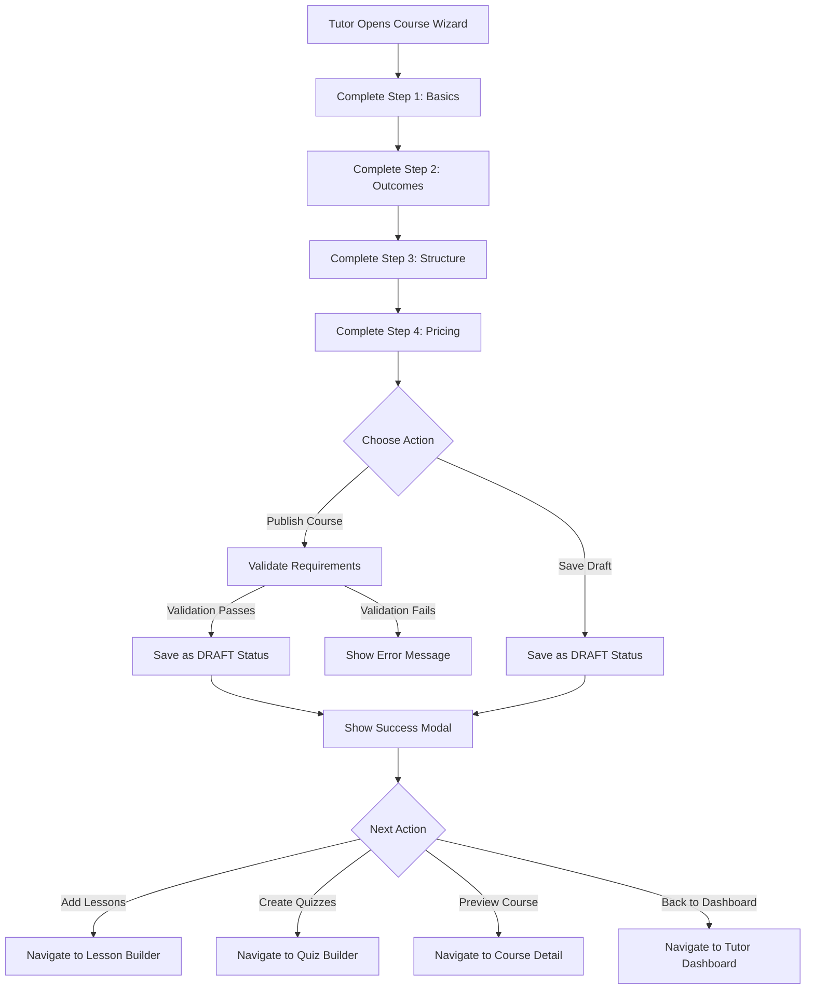
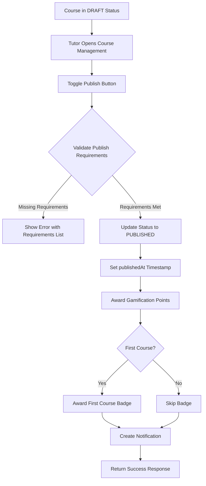

# Feature Design: Enable Instant Course Creation Without Approval

## Feature Overview

Enable tutors to instantly create and publish courses without requiring admin approval. This design modifies the course creation workflow to eliminate the PENDING_APPROVAL status transition, allowing tutors to directly save courses as DRAFT or immediately publish them as PUBLISHED. The save draft and submit for review buttons will be replaced with save draft and publish course buttons.

## Problem Statement

Currently, the course creation wizard includes a "Submit for Review" button that sets the course status to PENDING_APPROVAL, requiring admin approval before publication. This creates unnecessary workflow delays for tutors. The save draft functionality exists but has not been fully implemented with backend support. This design aims to:

- Enable instant course publication without admin intervention
- Implement functional save draft capability
- Streamline the tutor course creation experience
- Remove approval workflow bottlenecks

## Design Goals

1. Remove the PENDING_APPROVAL workflow from tutor course creation
2. Enable tutors to save courses as DRAFT for later completion
3. Allow tutors to directly publish courses without approval
4. Maintain data validation and quality checks during creation
5. Preserve course status tracking and audit capabilities
6. Ensure consistent behavior across all course creation interfaces

## User Experience Flow

### Course Creation Workflow



### Course Publishing Workflow



## System Components

### Frontend Changes

#### Course Creation Wizard Component

**Location**: client/src/pages/Tutor/CourseCreationWizard.jsx

**Modifications Required**:

| Element                    | Current Behavior                          | New Behavior                             |
| -------------------------- | ----------------------------------------- | ---------------------------------------- |
| Submit Button Label        | "Submit for Review"                       | "Publish Course"                         |
| Submit Button Status Value | PENDING_APPROVAL                          | DRAFT                                    |
| Submit Button Action       | handleSubmit with 'submit' parameter      | handleSubmit with 'draft' parameter      |
| Save Draft Button          | Calls handleSubmit with 'draft' parameter | Remains the same                         |
| Success Modal Message      | References review/approval                | References draft saved or course created |
| Admin Check                | Shows "Publish Course" for admins only    | Removed (all tutors can publish)         |

**Action Button Logic**:

When on the final step of the wizard, display two action buttons:

- Save Draft Button: Saves course with status DRAFT, allows partial completion
- Publish Course Button: Saves course with status DRAFT initially (validation happens later during toggle publish action)

**Validation Rules**:

The wizard validates form inputs but does NOT enforce publication requirements. Publication requirements are only checked when the tutor attempts to toggle the course to published status from the course management interface.

#### Course Builder Component

**Location**: client/src/pages/Tutor/CourseBuilder.jsx

**No Changes Required**:

The existing course builder already creates courses with DRAFT status. The existing toggle publish functionality in the backend handles validation and publication.

#### Course Editor Component

**Location**: client/src/pages/Tutor/CourseEditor.jsx

**No Changes Required**:

The advanced editor already creates courses with DRAFT status by default through the backend controller.

### Backend Changes

#### Course Creation Controller

**Location**: server/src/controllers/tutor.controller.js

**Function**: createCourse

**Current Logic**:

- Creates course with status DRAFT by default
- Validates all input fields
- Generates unique slug
- Creates notification for draft saved
- Returns success response with course data

**Modified Logic**:

No changes required. The controller already creates courses with DRAFT status. The status field in the request body should be ignored if provided, always defaulting to DRAFT.

**Status Handling**:

Regardless of what status value the frontend sends, the backend should always initialize courses with status DRAFT. This ensures:

- Consistent initial state for all new courses
- Publication requirements are validated before publishing
- No bypass of validation rules

#### Course Update Controller

**Location**: server/src/controllers/tutor.controller.js

**Function**: updateCourse

**No Changes Required**:

Existing update logic handles status updates through the separate togglePublishStatus function.

#### Publish Toggle Controller

**Location**: server/src/controllers/tutor.controller.js

**Function**: togglePublishStatus

**Current Behavior**:

- Validates course ownership
- Checks publication requirements (at least one lesson, required metadata)
- Toggles between PUBLISHED and DRAFT status
- Awards gamification points and badges on first publish
- Creates success notification

**Validation Requirements for Publishing**:

| Requirement        | Validation Check             | Error Message                                                |
| ------------------ | ---------------------------- | ------------------------------------------------------------ |
| Minimum Lessons    | course.\_count.lessons === 0 | Cannot publish course. Please add at least one lesson first. |
| Course Title       | !course.title                | Cannot publish course. All required metadata must be filled. |
| Course Description | !course.description          | Cannot publish course. All required metadata must be filled. |
| Subject Category   | !course.subjectCategory      | Cannot publish course. All required metadata must be filled. |

**Gamification Awards on First Publish**:

- Points Transaction: 20 points for COURSE_PUBLISHED activity
- Badge: "First Course Published" badge (rarity: COMMON) on first course
- Notification: Course published notification with link to course

**No Changes Required**:

The existing toggle publish logic already provides the instant publication capability once requirements are met. No approval workflow exists in this function.

### Database Schema

**Course Model Status Field**:

The CourseStatus enum already supports the required values:

```
enum CourseStatus {
  DRAFT
  PENDING_APPROVAL
  PUBLISHED
  ARCHIVED
}
```

**Status Transitions**:

| From Status | To Status | Trigger                 | Validation                     |
| ----------- | --------- | ----------------------- | ------------------------------ |
| None        | DRAFT     | Course creation         | Form validation only           |
| DRAFT       | PUBLISHED | Toggle publish action   | Publication requirements check |
| PUBLISHED   | DRAFT     | Toggle unpublish action | None                           |
| DRAFT       | ARCHIVED  | Archive action          | None                           |
| PUBLISHED   | ARCHIVED  | Archive action          | None                           |

**Removed Transitions**:

The following status transition will no longer be used:

- DRAFT → PENDING_APPROVAL (previously triggered by "Submit for Review")
- PENDING_APPROVAL → PUBLISHED (previously triggered by admin approval)
- PENDING_APPROVAL → DRAFT (previously triggered by admin rejection)

**No Schema Migration Required**:

The PENDING_APPROVAL status remains in the enum for backward compatibility with existing data but will not be used for new courses.

## Feature Behavior Details

### Save Draft Functionality

**Purpose**: Allow tutors to save incomplete courses for later editing

**Behavior**:

- Validates only the current wizard step before saving
- Creates course with status DRAFT
- Does NOT validate publication requirements
- Allows missing optional fields
- Creates notification confirming draft saved
- Redirects to success modal with next action options

**When Draft Can Be Saved**:

- At any step of the wizard after completing step 1 (minimum: title and subject category)
- Even if course is not ready for publication
- Multiple times during editing (updates existing draft)

### Publish Course Functionality

**Purpose**: Allow tutors to indicate their intent to publish after wizard completion

**Immediate Behavior**:

- Completes wizard validation
- Creates course with status DRAFT (not PUBLISHED)
- Shows success modal indicating course created
- Provides option to add lessons

**Actual Publication**:

- Occurs when tutor navigates to course management and clicks "Toggle Publish"
- At this point, backend validates publication requirements
- If requirements not met, shows error message listing missing requirements
- If requirements met, status changes to PUBLISHED with publishedAt timestamp

**Rationale**:
This two-step approach ensures tutors cannot accidentally publish empty courses while providing a streamlined workflow.

### Notification Messages

**On Course Creation (Draft)**:

- Type: SYSTEM_ANNOUNCEMENT
- Title: "Course Draft Saved"
- Message: "Your course '[Course Title]' has been saved as a draft. Add lessons to continue building."
- Link: /tutor/courses/[courseId]/lessons

**On Course Publication**:

- Type: COURSE_APPROVED
- Title: "Course Published"
- Message: "Your course '[Course Title]' is now live and available to students."
- Link: /tutor/courses/[courseId]

**On Publication Failure**:

- Type: Alert message (not notification)
- Message: "Cannot publish course. Please add at least one lesson first." OR "Cannot publish course. All required metadata must be filled."
- Display: Error alert with requirements list

### Success Modal Actions

After course creation, the success modal presents four action options:

| Action             | Description                          | Navigation Target                 |
| ------------------ | ------------------------------------ | --------------------------------- |
| Add Lessons        | Begin building curriculum content    | /tutor/courses/[courseId]/lessons |
| Create Quiz Bank   | Set up assessment questions          | /tutor/courses/[courseId]/quizzes |
| Preview as Student | View course from student perspective | /courses/[courseId]               |
| Back to Dashboard  | Return to tutor dashboard            | /tutor                            |

**Default Recommended Action**: Add Lessons (emphasized with primary button styling)

## Edge Cases and Error Handling

### Validation Failures

**Scenario**: Tutor tries to save draft with invalid data in current step

**Handling**:

- Display inline validation errors for affected fields
- Prevent navigation to next step or submission
- Highlight fields requiring correction
- Retain all entered data for correction

**Scenario**: Tutor tries to publish course without meeting requirements

**Handling**:

- Display error alert with specific requirements list
- Keep course in DRAFT status
- Allow tutor to navigate to add missing requirements
- Show clear path to complete requirements (e.g., "Add at least one lesson")

### Duplicate Course Titles

**Scenario**: Tutor creates course with title already used by same tutor

**Handling**:

- Backend validation catches duplicate title
- Returns 400 error: "This title is already used. Try a slightly different one."
- Frontend displays error alert
- Tutor must modify title to proceed

### Slug Generation

**Scenario**: Auto-generated slug conflicts with existing slug

**Handling**:

- Backend generateUniqueCourseSlug utility appends numeric suffix
- Ensures uniqueness across all courses
- Transparent to tutor (auto-handled)

### Network Failures

**Scenario**: Course creation request fails due to network issue

**Handling**:

- Display generic error message: "Failed to create course. Please try again."
- Retain all form data in wizard
- Allow tutor to retry submission
- No partial course created in database

### Permission Issues

**Scenario**: Non-tutor user attempts to create course

**Handling**:

- Backend auth middleware validates user role
- Returns 403 Forbidden error
- Frontend should not display course creation options to non-tutors

## Implementation Considerations

### Code Changes Summary

| File Path                                       | Change Type  | Description                                                          |
| ----------------------------------------------- | ------------ | -------------------------------------------------------------------- |
| client/src/pages/Tutor/CourseCreationWizard.jsx | Modification | Update button labels and remove PENDING_APPROVAL status transition   |
| server/src/controllers/tutor.controller.js      | No change    | Existing createCourse already creates DRAFT status                   |
| server/src/controllers/tutor.controller.js      | No change    | Existing togglePublishStatus handles instant publish with validation |

### Testing Scenarios

**Scenario 1: Save Course as Draft**

Given: Tutor completes wizard steps 1-4
When: Tutor clicks "Save Draft"
Then: Course created with status DRAFT
And: Notification created confirming draft saved
And: Success modal displayed with next action options

**Scenario 2: Publish Course Without Lessons**

Given: Tutor creates course and saves as draft
When: Tutor navigates to course management and clicks toggle publish
Then: Error displayed: "Cannot publish course. Please add at least one lesson first."
And: Course remains in DRAFT status

**Scenario 3: Publish Course With Lessons**

Given: Tutor creates course, adds at least one lesson
When: Tutor clicks toggle publish in course management
Then: Course status changes to PUBLISHED
And: publishedAt timestamp set
And: Gamification points awarded
And: First Course badge awarded if applicable
And: Notification created confirming publication

**Scenario 4: Unpublish Course**

Given: Course is in PUBLISHED status
When: Tutor clicks toggle publish
Then: Course status changes to DRAFT
And: publishedAt timestamp retained
And: Notification created confirming unpublish

**Scenario 5: Edit Draft Course**

Given: Course exists in DRAFT status
When: Tutor updates course details
Then: Course updated successfully
And: Course remains in DRAFT status
And: updatedAt timestamp updated

### Data Integrity

**Existing Courses with PENDING_APPROVAL Status**:

No migration needed. Existing courses with PENDING_APPROVAL status remain unchanged. Admins can still manually update these through the admin approval interface if it exists.

**Audit Trail**:

The changeLog field (JSON) in the Course model tracks all course modifications. Ensure the following actions are logged:

- Course created (action: CREATED)
- Course updated (action: UPDATED)
- Course published (action: PUBLISHED)
- Course unpublished (action: UNPUBLISHED)

### Performance Considerations

**Database Operations**:

Course creation involves:

- One INSERT operation for course
- One INSERT operation for notification
- One SELECT operation for duplicate title check
- One or more SELECT operations for slug uniqueness check

**Transaction Usage**:

The togglePublishStatus function uses Prisma transactions to ensure atomicity when:

- Updating course status
- Creating points transaction
- Updating user points
- Creating/awarding badge
- Creating notification

This ensures gamification rewards are not duplicated on retry.

### Security Considerations

**Authorization**:

All course creation and modification endpoints must:

- Validate JWT token authentication
- Verify user role is TUTOR or ADMIN
- Verify course ownership for update operations
- Prevent unauthorized status changes

**Input Validation**:

All input fields must be validated server-side:

- Title length: 3-80 characters
- Subtitle length: max 120 characters
- Description length: minimum 50 characters
- Learning outcomes: 3-5 items, each 10-120 characters
- Tags: max 5 items
- Meta description: max 160 characters
- Price: greater than 0 for paid courses

**SQL Injection Prevention**:

Prisma ORM provides parameterized queries by default, preventing SQL injection attacks.

## Backward Compatibility

**Existing Course Creation Interfaces**:

The platform has three course creation interfaces:

1. Course Creation Wizard (recommended)
2. Advanced Course Editor
3. Simple Course Builder

All three interfaces should create courses with DRAFT status. The wizard is being modified to update button labels, but the underlying backend behavior remains consistent.

**Admin Course Approval Interface**:

If an admin course approval interface exists, it remains functional for:

- Reviewing existing courses with PENDING_APPROVAL status
- Manually changing course status if needed
- Handling edge cases or policy violations

New courses created by tutors simply bypass this interface.

## Success Metrics

**User Experience Metrics**:

- Reduction in time from course creation to publication
- Increase in number of courses created
- Reduction in tutor support requests about course approval
- Increase in completed course wizard sessions

**System Performance Metrics**:

- Course creation API response time remains under 500ms
- Zero increase in failed course creation attempts
- Publish toggle API response time remains under 1000ms

**Business Metrics**:

- Increase in published courses per tutor
- Reduction in courses stuck in pending approval
- Increase in tutor satisfaction scores

## Confidence Assessment

**Confidence Level**: High

**Confidence Basis**:

- Clear understanding of existing codebase and workflow
- Backend already supports instant publication through toggle publish
- Minimal code changes required (primarily frontend button labels)
- Existing validation logic handles publication requirements
- No database schema changes needed
- Feature aligns with existing system architecture
