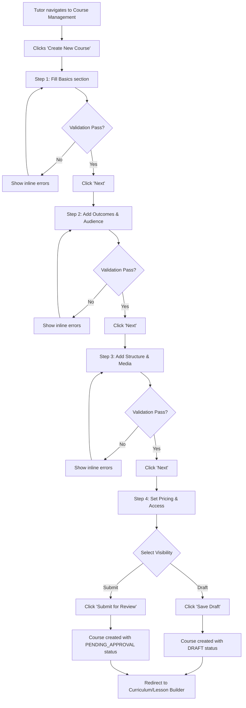
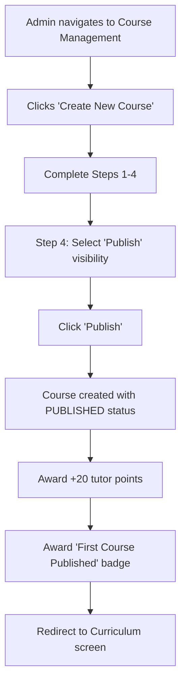
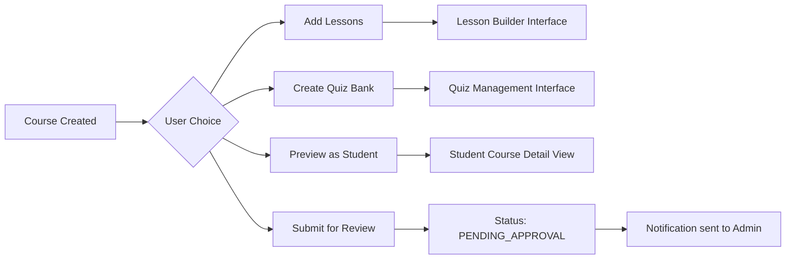
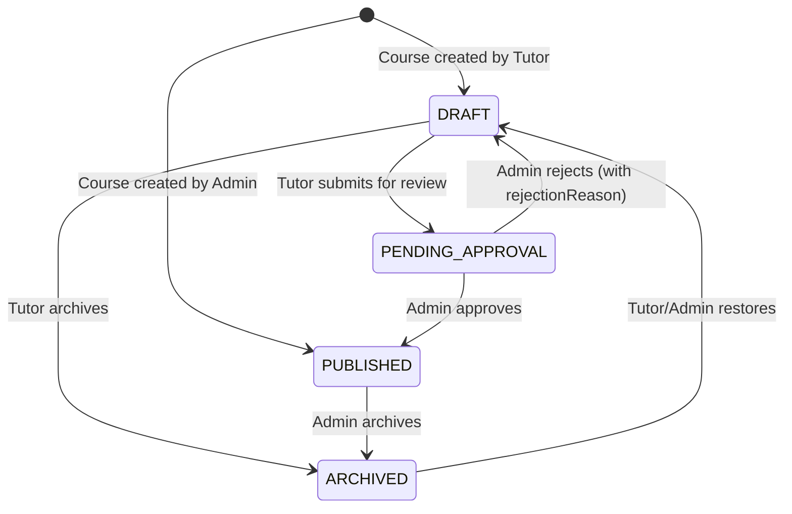

# Create Course Function - Design Document

## 1. Feature Overview

The Create Course function enables verified Tutors and Admins to design and publish educational courses through a multi-step guided form interface. This feature focuses on collecting comprehensive course metadata, managing content expectations, and establishing clear pathways from draft creation to publication readiness.

## 2. User Access Control

### Authorized Roles

| Role    | Create Permission            | Publishing Capability | Notes                                                      |
| ------- | ---------------------------- | --------------------- | ---------------------------------------------------------- |
| Tutor   | Yes (verified accounts only) | Submit for Review     | Must complete verification process before creating courses |
| Admin   | Yes                          | Direct Publish        | Can bypass review workflow and publish immediately         |
| Student | No                           | N/A                   | Read-only access to published courses                      |

### Verification Requirements

Tutors must have verified status before accessing course creation functionality. The system validates tutor verification status before rendering the create course interface.

## 3. Multi-Step Form Structure

The course creation process follows a guided four-step wizard pattern to reduce cognitive load and improve data quality.

### Step 1: Basics

This section captures fundamental course identification and categorization.

| Field Label    | Field Name      | Type  | Validation Rules                                 | Help Text                                                                                                        |
| -------------- | --------------- | ----- | ------------------------------------------------ | ---------------------------------------------------------------------------------------------------------------- |
| Course title   | title           | Text  | Required; 3–80 characters; unique per instructor | "What is the course name?" <br> Examples: "Algebra Basics", "Essay Writing for Beginners", "SPM Physics: Forces" |
| Short subtitle | subtitle        | Text  | Optional; max 120 characters                     | "One sentence promise (e.g., 'Master algebra basics in 2 weeks')."                                               |
| Level          | educationLevel  | Enum  | Required; one of: PRIMARY, SECONDARY, UNIVERSITY | "Who is this course for?"                                                                                        |
| Subject        | subjectCategory | Text  | Required                                         | "Pick the subject." <br> Examples: Math, Science, English                                                        |
| Tags           | tags            | Array | Optional; up to 5 items; comma-separated input   | "Add keywords (comma separated)."                                                                                |

### Step 2: Outcomes & Audience

This section defines learning objectives and target student profiles.

| Field Label       | Field Name       | Type  | Validation Rules                            | Help Text                                                                                                                                                                |
| ----------------- | ---------------- | ----- | ------------------------------------------- | ------------------------------------------------------------------------------------------------------------------------------------------------------------------------ |
| Learning outcomes | learningOutcomes | Array | Required; 3–5 items; each 10–120 characters | "By the end, students will be able to… (one line each)." <br> Template: "By the end, students can [action] [object] (e.g., 'Solve linear equations with one variable')." |
| Prerequisites     | prerequisites    | Text  | Optional; free-form text                    | "What should students know first?"                                                                                                                                       |
| Target audience   | targetAudience   | Text  | Optional; free-form text                    | "Who should take this course?"                                                                                                                                           |

### Step 3: Structure & Media

This section establishes course scope and visual presentation.

| Field Label                  | Field Name     | Type     | Validation Rules                                   | Help Text                                                           |
| ---------------------------- | -------------- | -------- | -------------------------------------------------- | ------------------------------------------------------------------- |
| Estimated total time (hours) | estimatedHours | Number   | Optional; positive integer                         | Time students should expect to complete the course                  |
| Difficulty                   | difficulty     | Enum     | Required; one of: BEGINNER, INTERMEDIATE, ADVANCED | Skill level expectation                                             |
| Cover image                  | thumbnailUrl   | URL/File | Required; min 1200×675 pixels                      | "Use a clean image with big shapes; avoid tiny text."               |
| Intro/trailer video URL      | introVideoUrl  | URL      | Optional                                           | "30–60 seconds, say who it's for, what they'll learn, and results." |

### Step 4: Pricing & Access

This section determines monetization and visibility settings.

| Field Label | Field Name   | Type    | Validation Rules                                     | Help Text                                            |
| ----------- | ------------ | ------- | ---------------------------------------------------- | ---------------------------------------------------- |
| Access type | pricingModel | Enum    | Required; one of: FREE, ONE_TIME, SUBSCRIPTION       | Payment model for course access                      |
| Price (MYR) | price        | Decimal | Required if pricingModel ≠ FREE; must be > 0         | Course price in Malaysian Ringgit                    |
| Visibility  | status       | Enum    | Required; one of: DRAFT, PENDING_APPROVAL, PUBLISHED | Tutors default to DRAFT; Admins can select PUBLISHED |

### Step 5: SEO & Compliance (Optional)

Advanced metadata for discoverability and policy adherence.

| Field Label      | Field Name      | Type     | Validation Rules                        | Help Text                                                         |
| ---------------- | --------------- | -------- | --------------------------------------- | ----------------------------------------------------------------- |
| Custom slug      | slug            | Text     | Optional; pattern: ^[a-z0-9-]+$; unique | Auto-generated from title if not provided                         |
| Meta description | metaDescription | Text     | Optional; max 160 characters            | Search engine preview text                                        |
| Language         | language        | Text     | Optional; default: "en"                 | Course delivery language                                          |
| Content consent  | N/A             | Checkbox | Required to submit                      | "I confirm this content is original and follows community rules." |

## 4. Comprehensive Validation Rules

### Title Validation

- Minimum length: 3 characters
- Maximum length: 80 characters
- Must be unique per instructor (tutorId + title combination)
- Error message: "This title is already used. Try a slightly different one."

### Subtitle Validation

- Maximum length: 120 characters
- Error message: "Subtitle must not exceed 120 characters."

### Required Enum Fields

- educationLevel: must match EducationLevel enum (PRIMARY | SECONDARY | UNIVERSITY)
- difficulty: must match Difficulty enum (BEGINNER | INTERMEDIATE | ADVANCED)
- pricingModel: must match PricingModel enum (FREE | ONE_TIME | SUBSCRIPTION)
- Error message: "Invalid [field name]. Please select a valid option."

### Learning Outcomes Validation

- Must be array with 3 to 5 elements
- Each element: 10–120 characters
- Error message: "Please add at least 3 learning outcomes." (if less than 3)
- Error message: "Learning outcomes cannot exceed 5 items." (if more than 5)

### Cover Image Validation

- Required field
- Recommended minimum dimensions: 1200×675 pixels
- Accepted formats: image URL or uploaded file reference
- Error message: "Cover image is required."

### Pricing Validation

- If pricingModel is ONE_TIME or SUBSCRIPTION, price must be greater than 0
- Error message: "Price must be greater than 0 for paid courses."

### Slug Validation

- Pattern: lowercase letters, numbers, and hyphens only (regex: ^[a-z0-9-]+$)
- Must be unique across all courses
- Auto-generated from title if not provided
- Error message: "Invalid slug format. Use lowercase letters, numbers, and hyphens only."

### Meta Description Validation

- Maximum length: 160 characters
- Error message: "Meta description must not exceed 160 characters."

### Tags Validation

- Maximum: 5 tags
- Stored as JSON array
- Each tag should be concise keyword

## 5. User Experience Flow

### Happy Path (Tutor)



### Happy Path (Admin)



### Post-Creation Actions

After successful course creation, users are presented with the following options:

| Action             | Description                          | Navigation Target                       |
| ------------------ | ------------------------------------ | --------------------------------------- |
| Add lessons        | Begin building curriculum content    | Lesson builder interface for the course |
| Create quiz bank   | Set up assessment questions          | Quiz creation interface                 |
| Preview as student | View course from student perspective | Student course detail view              |
| Submit for review  | Move from DRAFT to PENDING_APPROVAL  | Triggers notification to admin          |

## 6. Form Interaction Patterns

### Progressive Disclosure

- Display one step at a time to maintain focus
- Show step indicator (e.g., "Step 2 of 4")
- Enable "Previous" button on steps 2-4 to allow backward navigation
- Disable "Next" button until current step validation passes

### Inline Field Guidance

Each field displays contextual help text below the input control. Examples are rendered in lighter text to demonstrate expected format.

Example for "Learning outcome":

```
Field: [Text input for learning outcome]
Help text: "By the end, students can [action] [object] (e.g., 'Solve linear equations with one variable')."
```

### Auto-fill Behaviors

| Field            | Auto-fill Rule                                                                          |
| ---------------- | --------------------------------------------------------------------------------------- |
| slug             | Generated from title: lowercase, replace spaces with hyphens, remove special characters |
| metaDescription  | Derived from subtitle if subtitle exists and metaDescription is empty                   |
| thumbnailUrl     | Default to `/uploads/default-course.png` if not provided                                |
| language         | Default to "en"                                                                         |
| estimatedHours   | Default to 0 if not provided                                                            |
| tags             | Default to empty array []                                                               |
| learningOutcomes | Default to empty array []                                                               |

### Button Visibility Matrix

| Step | Buttons Visible                                                                     | Button Actions                                                                                                                                                       |
| ---- | ----------------------------------------------------------------------------------- | -------------------------------------------------------------------------------------------------------------------------------------------------------------------- |
| 1    | Cancel, Next                                                                        | Cancel: reset form; Next: validate & proceed                                                                                                                         |
| 2-3  | Previous, Cancel, Next                                                              | Previous: return to prior step; Cancel: reset form; Next: validate & proceed                                                                                         |
| 4    | Previous, Save Draft, Save & Continue, Submit for Review (Tutor) OR Publish (Admin) | Previous: return to step 3; Save Draft: create with DRAFT status; Save & Continue: create and navigate to curriculum; Submit/Publish: create with appropriate status |

## 7. API Contract

### Endpoint

```
POST /api/courses
```

### Authentication

Requires valid JWT token with role TUTOR or ADMIN.

### Request Payload Schema

| Field            | Type    | Required    | Default                       | Notes                                                                                   |
| ---------------- | ------- | ----------- | ----------------------------- | --------------------------------------------------------------------------------------- |
| title            | String  | Yes         | N/A                           | 3–80 chars                                                                              |
| subtitle         | String  | No          | null                          | Max 120 chars                                                                           |
| description      | String  | Yes         | N/A                           | Combined from subtitle + targetAudience in simple cases; or dedicated description field |
| subjectCategory  | String  | Yes         | N/A                           | Subject name                                                                            |
| educationLevel   | Enum    | Yes         | SECONDARY                     | PRIMARY, SECONDARY, or UNIVERSITY                                                       |
| difficulty       | Enum    | Yes         | BEGINNER                      | BEGINNER, INTERMEDIATE, or ADVANCED                                                     |
| prerequisites    | String  | No          | null                          | Free-form text                                                                          |
| learningOutcomes | Array   | Yes         | []                            | 3–5 items; each 10–120 chars                                                            |
| targetAudience   | String  | No          | null                          | Free-form text                                                                          |
| estimatedHours   | Number  | No          | 0                             | Positive integer                                                                        |
| thumbnailUrl     | String  | Yes         | `/uploads/default-course.png` | Cover image URL                                                                         |
| introVideoUrl    | String  | No          | null                          | Trailer video URL                                                                       |
| pricingModel     | Enum    | Yes         | FREE                          | FREE, ONE_TIME, or SUBSCRIPTION                                                         |
| price            | Decimal | Conditional | 0                             | Required if pricingModel ≠ FREE; stored as Decimal(10,2)                                |
| slug             | String  | No          | Auto-generated                | Unique; pattern: ^[a-z0-9-]+$                                                           |
| metaDescription  | String  | No          | null                          | Max 160 chars                                                                           |
| language         | String  | No          | "en"                          | Language code                                                                           |
| tags             | Array   | No          | []                            | Max 5 items                                                                             |
| status           | Enum    | No          | DRAFT                         | DRAFT, PENDING_APPROVAL, or PUBLISHED (Admin only)                                      |

### Request Example

```
{
  "title": "Algebra Basics",
  "subtitle": "Master variables and equations in 2 weeks",
  "description": "This course covers fundamental algebra concepts including variables, constants, equations, and order of operations. Students aged 13–16 will gain confidence in solving one-step equations and understanding algebraic principles.",
  "subjectCategory": "Mathematics",
  "educationLevel": "SECONDARY",
  "difficulty": "BEGINNER",
  "prerequisites": "Basic arithmetic",
  "learningOutcomes": [
    "Understand variables and constants",
    "Solve one-step equations",
    "Apply order of operations"
  ],
  "targetAudience": "Students aged 13–16",
  "estimatedHours": 6,
  "thumbnailUrl": "https://example.com/cover.png",
  "introVideoUrl": "https://example.com/intro.mp4",
  "pricingModel": "FREE",
  "price": 0,
  "slug": "algebra-basics",
  "metaDescription": "Learn algebra fundamentals with clear examples and practice exercises.",
  "language": "en",
  "tags": ["algebra", "equations", "beginner"],
  "status": "DRAFT"
}
```

### Response Schema (Success)

```
HTTP 201 Created

{
  "success": true,
  "message": "Course created successfully. Add lessons to get started.",
  "data": {
    "id": "[uuid]",
    "tutorId": "[uuid]",
    "title": "Algebra Basics",
    "subtitle": "Master variables and equations in 2 weeks",
    "description": "This course covers fundamental algebra concepts...",
    "subjectCategory": "Mathematics",
    "educationLevel": "SECONDARY",
    "difficulty": "BEGINNER",
    "prerequisites": "Basic arithmetic",
    "learningOutcomes": ["Understand variables and constants", "Solve one-step equations", "Apply order of operations"],
    "targetAudience": "Students aged 13–16",
    "estimatedHours": 6,
    "thumbnailUrl": "https://example.com/cover.png",
    "thumbnailAltText": null,
    "introVideoUrl": "https://example.com/intro.mp4",
    "price": 0,
    "pricingModel": "FREE",
    "slug": "algebra-basics",
    "metaDescription": "Learn algebra fundamentals with clear examples and practice exercises.",
    "language": "en",
    "tags": ["algebra", "equations", "beginner"],
    "status": "DRAFT",
    "enrollmentCount": 0,
    "averageRating": null,
    "createdAt": "2025-12-08T02:00:00.000Z",
    "updatedAt": "2025-12-08T02:00:00.000Z",
    "publishedAt": null,
    "changeLog": [
      {
        "action": "CREATED",
        "timestamp": "2025-12-08T02:00:00.000Z",
        "description": "Course created"
      }
    ]
  }
}
```

### Error Responses

| HTTP Code | Error Code       | Scenario                         | Message                                                                  |
| --------- | ---------------- | -------------------------------- | ------------------------------------------------------------------------ |
| 400       | VALIDATION_ERROR | Title length invalid             | "Title must be between 3-80 characters"                                  |
| 400       | VALIDATION_ERROR | Subtitle too long                | "Subtitle must not exceed 120 characters"                                |
| 400       | VALIDATION_ERROR | Learning outcomes count invalid  | "Please add at least 3 learning outcomes."                               |
| 400       | VALIDATION_ERROR | Cover image missing              | "Cover image is required."                                               |
| 400       | VALIDATION_ERROR | Price validation for paid course | "Price must be greater than 0 for paid courses."                         |
| 400       | DUPLICATE_TITLE  | Title already exists for tutor   | "This title is already used. Try a slightly different one."              |
| 400       | INVALID_SLUG     | Slug format invalid              | "Invalid slug format. Use lowercase letters, numbers, and hyphens only." |
| 400       | SLUG_TAKEN       | Slug already exists              | "This slug is already taken. Please choose a different one."             |
| 401       | UNAUTHORIZED     | Missing or invalid token         | "Authentication required"                                                |
| 403       | FORBIDDEN        | User is not verified tutor       | "Course creation requires tutor verification"                            |
| 500       | SERVER_ERROR     | Database or server issue         | "Failed to create course"                                                |

## 8. Database Mapping

### Prisma Course Model Fields

The existing Course model accommodates all required fields. Below is the mapping from API request to database schema:

| API Field        | Database Column  | Type           | Transformation                             |
| ---------------- | ---------------- | -------------- | ------------------------------------------ |
| title            | title            | String         | Direct mapping                             |
| subtitle         | subtitle         | String?        | Direct mapping; nullable                   |
| description      | description      | Text           | Direct mapping                             |
| subjectCategory  | subjectCategory  | String         | Direct mapping                             |
| educationLevel   | educationLevel   | EducationLevel | Enum value                                 |
| difficulty       | difficulty       | Difficulty     | Enum value                                 |
| prerequisites    | prerequisites    | Text?          | Direct mapping; nullable                   |
| learningOutcomes | learningOutcomes | Json           | JSON.stringify(array)                      |
| targetAudience   | targetAudience   | Text?          | Direct mapping; nullable                   |
| estimatedHours   | estimatedHours   | Int            | Parsed to integer                          |
| thumbnailUrl     | thumbnailUrl     | String         | Direct mapping                             |
| introVideoUrl    | introVideoUrl    | String?        | Direct mapping; nullable                   |
| pricingModel     | pricingModel     | PricingModel   | Enum value                                 |
| price            | price            | Decimal(10,2)  | Parsed to decimal                          |
| slug             | slug             | String?        | Unique constraint; auto-generated if empty |
| metaDescription  | metaDescription  | String?        | Direct mapping; nullable                   |
| language         | language         | String         | Default: "en"                              |
| tags             | tags             | Json           | JSON.stringify(array)                      |
| status           | status           | CourseStatus   | Enum value; default: DRAFT                 |

### Additional System Fields

| Field           | Value/Behavior                                                                                                 |
| --------------- | -------------------------------------------------------------------------------------------------------------- |
| id              | Auto-generated UUID                                                                                            |
| tutorId         | Extracted from authenticated user token                                                                        |
| enrollmentCount | Default: 0                                                                                                     |
| averageRating   | Default: null                                                                                                  |
| createdAt       | Current timestamp                                                                                              |
| updatedAt       | Current timestamp                                                                                              |
| publishedAt     | null (set when status becomes PUBLISHED)                                                                       |
| changeLog       | JSON array with initial entry: `[{ action: "CREATED", timestamp: ISO string, description: "Course created" }]` |

### Metadata Storage Strategy

The JSON fields (learningOutcomes, tags, changeLog) provide flexibility for schema evolution. Current structure:

- **learningOutcomes**: Array of strings, each representing one outcome

  ```
  ["Understand variables and constants", "Solve one-step equations", "Apply order of operations"]
  ```

- **tags**: Array of strings, each a keyword

  ```
  ["algebra", "equations", "beginner"]
  ```

- **changeLog**: Array of objects tracking versioning actions
  ```
  [
    { "action": "CREATED", "timestamp": "2025-12-08T02:00:00.000Z", "description": "Course created" },
    { "action": "UPDATED", "timestamp": "2025-12-09T10:00:00.000Z", "description": "Updated pricing" }
  ]
  ```

## 9. Default Values Reference

| Field            | Default Value                 | Applied When                                                  |
| ---------------- | ----------------------------- | ------------------------------------------------------------- |
| educationLevel   | SECONDARY                     | User does not select level                                    |
| difficulty       | BEGINNER                      | User does not select difficulty                               |
| pricingModel     | FREE                          | User does not select access type                              |
| status           | DRAFT                         | Tutor creates course; no explicit visibility selection        |
| language         | "en" (English)                | User does not specify language                                |
| thumbnailUrl     | `/uploads/default-course.png` | No cover image provided                                       |
| tags             | []                            | No tags entered                                               |
| learningOutcomes | []                            | No outcomes entered (validation will reject if remains empty) |
| price            | 0                             | pricingModel is FREE                                          |
| estimatedHours   | 0                             | Not provided                                                  |

## 10. User-Friendly Error Messages

| Validation Failure          | Error Message                                                            |
| --------------------------- | ------------------------------------------------------------------------ |
| Title too short or too long | "Title must be between 3-80 characters."                                 |
| Title already used by tutor | "This title is already used. Try a slightly different one."              |
| Subtitle exceeds limit      | "Subtitle must not exceed 120 characters."                               |
| Description too short       | "Description must be at least 50 characters."                            |
| Learning outcomes < 3       | "Please add at least 3 learning outcomes."                               |
| Learning outcomes > 5       | "Learning outcomes cannot exceed 5 items."                               |
| Cover image missing         | "Cover image is required."                                               |
| Price = 0 for paid course   | "Price must be greater than 0 for paid courses."                         |
| Invalid slug format         | "Invalid slug format. Use lowercase letters, numbers, and hyphens only." |
| Slug already taken          | "This slug is already taken. Please choose a different one."             |
| Meta description too long   | "Meta description must not exceed 160 characters."                       |

## 11. Post-Creation Next Steps

Upon successful course creation, the system presents the following call-to-action options:

### Primary Actions Table

| CTA Button         | Behavior                                     | Availability                                                 | Notes                                   |
| ------------------ | -------------------------------------------- | ------------------------------------------------------------ | --------------------------------------- |
| Add lessons        | Navigate to lesson builder for this course   | Always                                                       | Primary recommended action              |
| Create quiz bank   | Navigate to quiz creation interface          | Always                                                       | Allows building assessment pool         |
| Preview as student | Open student view of course detail page      | Always                                                       | Renders course as students would see it |
| Submit for review  | Change status from DRAFT to PENDING_APPROVAL | Only if status is DRAFT and all required fields are complete | Triggers notification to Admin          |

### Workflow After Creation



## 12. Gamification Hooks

The Create Course function integrates with the platform's gamification system to reward tutor engagement.

### Points Award

| Trigger Event    | Points Awarded | Recipient              | Condition                                             |
| ---------------- | -------------- | ---------------------- | ----------------------------------------------------- |
| Course published | +20            | Course creator (Tutor) | Course status changes to PUBLISHED for the first time |

### Badge Eligibility

| Badge Name             | Award Criteria                     | Rarity | Visual Representation                |
| ---------------------- | ---------------------------------- | ------ | ------------------------------------ |
| First Course Published | Tutor publishes their first course | Common | Badge icon: graduation cap with star |

### Implementation Strategy

When a course status transitions to PUBLISHED:

1. Check if this is the tutor's first published course
2. If yes:
   - Create PointsTransaction record with activityType: "COURSE_PUBLISHED", pointsAmount: 20
   - Update User.totalPoints for the tutor
   - Check if "First Course Published" badge exists; if not, seed it
   - Create UserBadge record linking tutor to badge with earnedAt timestamp
   - Send notification to tutor announcing points and badge award

## 13. Frontend Component Responsibilities

### CourseCreationWizard Component

Orchestrates the multi-step form flow.

| Responsibility           | Implementation Notes                                                  |
| ------------------------ | --------------------------------------------------------------------- |
| Step state management    | Track current step (1-4), completed steps, validation status per step |
| Data aggregation         | Collect all field inputs into single request payload                  |
| Navigation control       | Handle Previous/Next/Submit button logic                              |
| Submission orchestration | POST to `/api/courses` and handle response                            |

### Step Components

Each step is a sub-component:

- **BasicsStep**: Renders title, subtitle, level, subject, tags inputs
- **OutcomesStep**: Renders learningOutcomes, prerequisites, targetAudience inputs
- **StructureStep**: Renders estimatedHours, difficulty, cover upload, trailer URL inputs
- **PricingStep**: Renders pricingModel, price, status/visibility inputs

### Inline Validation

Each field performs client-side validation on blur:

- Character count for title, subtitle, metaDescription
- Array length for learningOutcomes, tags
- Enum selection verification
- Price > 0 if pricingModel ≠ FREE

### Error Display Pattern

Errors appear directly below the relevant input field in red text. Form submission is blocked until all errors are resolved.

## 14. Copy Blocks for UI Guidance

### Good Title Examples

"Algebra Basics"  
"Essay Writing for Beginners"  
"SPM Physics: Forces"

### Learning Outcome Template

"By the end, students can [action] [object] (e.g., 'Solve linear equations with one variable')."

### Cover Image Tip

"Use a clean image with big shapes; avoid tiny text."

### Trailer Video Tip

"30–60 seconds, say who it's for, what they'll learn, and results."

### Tags Example

"algebra, equations, beginner"

### Meta Description Example

"Learn algebra fundamentals with clear examples and practice exercises designed for secondary students."

## 15. Accessibility Considerations

| Element         | Accessibility Requirement                                               |
| --------------- | ----------------------------------------------------------------------- |
| Form labels     | All inputs must have associated `<label>` elements with `for` attribute |
| Error messages  | Must be announced to screen readers via `aria-live` regions             |
| Step indicator  | Use `aria-current="step"` for current step                              |
| Required fields | Indicate with both visual asterisk and `aria-required="true"`           |
| Image uploads   | Provide alt text input for cover images                                 |
| Enum dropdowns  | Use semantic `<select>` elements with clear option labels               |

## 16. Security & Authorization

### Role-Based Access Control

Before rendering course creation UI or processing POST request:

1. Verify user is authenticated (valid JWT)
2. Verify user role is TUTOR or ADMIN
3. For TUTOR role, verify tutor account is verified (check tutor verification status)

### Data Sanitization

All text inputs must be sanitized to prevent XSS attacks:

- Strip HTML tags from title, subtitle, description, prerequisites, targetAudience
- Validate URL formats for thumbnailUrl, introVideoUrl
- Escape special characters in learningOutcomes array items

### Slug Validation

Custom slugs must be validated server-side:

- Pattern enforcement: ^[a-z0-9-]+$
- Uniqueness check against existing slugs
- Auto-generation if not provided ensures collision avoidance

## 17. Status Transition Logic

### Status State Machine



### Status Rules

| From Status      | To Status        | Allowed Roles | Conditions                                                       |
| ---------------- | ---------------- | ------------- | ---------------------------------------------------------------- |
| N/A              | DRAFT            | Tutor, Admin  | Course creation default for Tutor                                |
| N/A              | PUBLISHED        | Admin         | Direct publish on creation                                       |
| DRAFT            | PENDING_APPROVAL | Tutor         | Course must have at least 1 lesson; all required fields complete |
| PENDING_APPROVAL | PUBLISHED        | Admin         | Approval granted                                                 |
| PENDING_APPROVAL | DRAFT            | Admin         | Rejection with rejectionReason                                   |

## 18. Notification Strategy

### Notifications Triggered by Course Creation

| Event                           | Recipient  | Notification Type   | Title                         | Message                                                                              |
| ------------------------------- | ---------- | ------------------- | ----------------------------- | ------------------------------------------------------------------------------------ |
| Course status: DRAFT            | Creator    | SYSTEM_ANNOUNCEMENT | "Course Draft Saved"          | "Your course '{title}' has been saved as a draft. Add lessons to continue building." |
| Course status: PENDING_APPROVAL | Creator    | SYSTEM_ANNOUNCEMENT | "Course Submitted for Review" | "Your course '{title}' has been submitted for admin review."                         |
| Course status: PENDING_APPROVAL | All Admins | SYSTEM_ANNOUNCEMENT | "New Course Pending Review"   | "Tutor {firstName} {lastName} submitted '{title}' for review."                       |
| Course status: PUBLISHED        | Creator    | COURSE_APPROVED     | "Course Published"            | "Your course '{title}' is now live and available to students."                       |

## 19. Changelog Tracking

Every course creation initializes a changeLog JSON array to maintain an audit trail.

### ChangeLog Entry Structure

| Field       | Type              | Description                                                  |
| ----------- | ----------------- | ------------------------------------------------------------ |
| action      | String            | Type of change (e.g., CREATED, UPDATED, PUBLISHED, REJECTED) |
| timestamp   | ISO 8601 String   | UTC timestamp of the action                                  |
| description | String            | Human-readable description of the change                     |
| performedBy | String (optional) | User ID who performed the action                             |

### Initial Entry Example

```
[
  {
    "action": "CREATED",
    "timestamp": "2025-12-08T02:00:00.000Z",
    "description": "Course created"
  }
]
```

## 20. Performance Considerations

| Concern                | Mitigation Strategy                                                                          |
| ---------------------- | -------------------------------------------------------------------------------------------- |
| Duplicate title check  | Index on (tutorId, title) for fast lookup                                                    |
| Slug uniqueness check  | Unique constraint on slug column with index                                                  |
| Large description text | Use database TEXT type; frontend textarea with character counter                             |
| Image upload handling  | Upload images to CDN/storage before form submission; store URL reference in course record    |
| Auto-slug generation   | Implement efficient slug generation utility with collision detection limit (max 10 attempts) |

## 21. Related System Components

### Lesson Builder

After course creation, tutors navigate to the lesson builder to construct curriculum. Lessons are linked to the course via courseId foreign key.

### Quiz Management

Quizzes can be created independently or attached to lessons. Quiz data references courseId and optionally lessonId.

### Admin Review Queue

Admins access a dedicated interface listing courses with status PENDING_APPROVAL. From there, they can approve (→ PUBLISHED) or reject (→ DRAFT with rejectionReason).

### Student Course Catalog

Only courses with status PUBLISHED appear in the public-facing course catalog. Filtering and search queries include status = PUBLISHED condition.

## 22. Future Enhancements

| Enhancement            | Description                                           | Priority |
| ---------------------- | ----------------------------------------------------- | -------- |
| Autosave drafts        | Periodically save form data to prevent data loss      | Medium   |
| AI-powered suggestions | Suggest learning outcomes based on title and subject  | Low      |
| Bulk course import     | Allow tutors to import course structure from CSV/JSON | Low      |
| Course templates       | Pre-configured templates for common course types      | Medium   |
| Collaborative editing  | Multiple tutors co-authoring a course                 | Low      |
| Version history UI     | Visual timeline of changeLog entries                  | Medium   |

---

**Design Document Version**: 1.0  
**Last Updated**: 2025-12-08  
**Design Owner**: Development Team**Last Updated**: 2025-12-08
