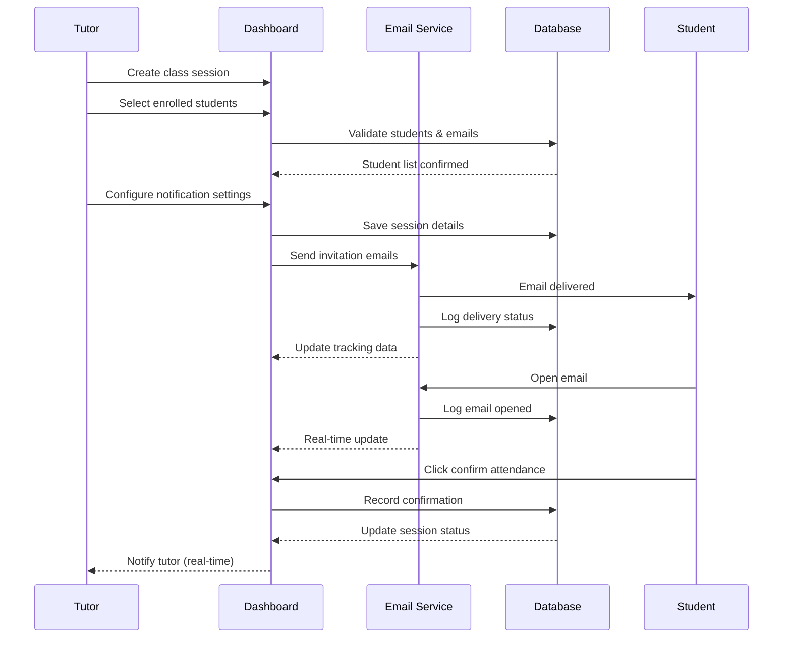

# Role-Based Dashboard Design

## Overview

This design defines the dashboard experiences for each user role in the EduConnect learning platform. The system will support four distinct roles: Student, Tutor, Administrator, and Management, each with tailored dashboard interfaces that present relevant information, actions, and analytics specific to their responsibilities.

## Business Context

The platform requires differentiated user experiences based on role-specific workflows. Each dashboard serves as the primary navigation hub and information center for users, providing quick access to their most important tasks, notifications, and performance metrics. The design emphasizes role-appropriate data visibility, action accessibility, and workflow efficiency.

## Design Principles

1. **Role Segregation**: Each role receives only the information and capabilities relevant to their responsibilities
2. **Progressive Disclosure**: Complex information is revealed gradually to avoid overwhelming users
3. **Action-Oriented Design**: Primary actions for each role are prominently displayed and easily accessible
4. **Consistent Navigation**: Common UI patterns maintained across all dashboards while allowing role-specific customization
5. **Real-Time Awareness**: Critical updates and notifications surfaced immediately within dashboard context

## User Roles Definition

### Student Role

Students are learners who enroll in courses, participate in tutoring sessions, and track their academic progress through the platform.

**Primary Goals**:

- Access enrolled courses and learning materials
- Book and attend tutoring sessions
- Monitor personal progress and achievements
- Engage with gamification features

### Tutor Role

Tutors are educators who create course content, conduct tutoring sessions, and monitor student engagement with their materials.

**Primary Goals**:

- Manage course creation and content publishing
- Schedule and conduct tutoring sessions
- Track student performance in their courses
- View earnings and session statistics

### Administrator Role

Administrators are platform moderators who ensure content quality, manage user accounts, and maintain platform integrity.

**Primary Goals**:

- Review and approve course submissions
- Manage user accounts and permissions
- Monitor platform health and user activity
- Ensure content quality and policy compliance

### Management Role

Management personnel are strategic decision-makers who analyze platform-wide trends, plan system improvements, and oversee business operations.

**Primary Goals**:

- Analyze platform-wide analytics and KPIs
- Identify learning trends and engagement patterns
- Make data-driven strategic decisions
- Plan system upgrades and feature priorities

## Dashboard Components Architecture

### Component Hierarchy

Each dashboard follows a consistent structural pattern:

1. **Header Section**: User greeting, role indicator, notification bell
2. **Quick Stats Bar**: Key performance indicators specific to role
3. **Primary Action Cards**: Most frequent tasks for the role
4. **Data Visualization Area**: Charts and graphs for metrics tracking
5. **Activity Feed**: Recent activities or updates
6. **Quick Access Links**: Navigation to frequently used pages

### Common Elements Across All Dashboards

**Authentication State**:

- All dashboards require authenticated session
- Session timeout redirects to login page
- Token refresh handled transparently

**Navigation Bar**:

- Platform logo with link to role-specific dashboard
- Role-appropriate menu items
- Profile dropdown with settings and logout
- Notification center icon with unread count

**Notification Center**:

- Real-time notification updates
- Role-specific notification types
- Mark as read functionality
- Link to detailed notification page

**Profile Quick Access**:

- View/edit profile information
- Access settings page
- Password recovery option
- Logout action

## Student Dashboard Design

### Dashboard Purpose

Provide students with a centralized view of their learning journey, upcoming commitments, progress tracking, and achievement highlights.

### Key Sections

#### Welcome Header

- Personalized greeting using student first name
- Current date and time
- Quick link to profile settings

#### Quick Stats Panel

Displays four key metrics in card format:

| Metric           | Description                               | Data Source                                  |
| ---------------- | ----------------------------------------- | -------------------------------------------- |
| Enrolled Courses | Total number of active course enrollments | Enrollment table with status ACTIVE          |
| Current Points   | Accumulated gamification points           | User totalPoints field                       |
| Active Streak    | Consecutive days of platform activity     | User currentStreak field                     |
| Completion Rate  | Percentage of enrolled courses completed  | Calculated from Enrollment completedAt field |

#### Primary Action Cards

**My Courses Card**:

- Purpose: Quick access to enrolled courses
- Display: Grid of course thumbnails with progress bars
- Actions: Continue learning, view course details
- Empty State: "Browse Course Catalog" call-to-action

**Book Tutoring Session Card**:

- Purpose: Schedule one-on-one or group tutoring
- Display: Available tutors with specializations and availability
- Actions: View tutor profiles, book session
- Filtering: By subject, education level, date/time

**Download Materials Card**:

- Purpose: Access downloadable course resources
- Display: List of recent materials from enrolled courses
- Information: Document name, course, upload date, file size
- Actions: Download, preview when supported

**Progress Tracker Card**:

- Purpose: Visualize learning progress and achievements
- Display: Progress bars for active courses, recent badges earned
- Gamification Elements: Points breakdown, streak calendar, badge showcase
- Actions: View detailed progress, achievements page

#### Upcoming Sessions Panel

- Lists next 5 booked tutoring sessions
- Information per session: Date/time, tutor name, subject, session type
- Actions: Join session when active, cancel booking, view session details

#### Recent Activity Feed

- Course enrollment confirmations
- Quiz completion results
- Badge earning notifications
- Session completion summaries
- Limit: Last 10 activities

#### Recommended Courses Section

- Personalized course suggestions based on enrolled courses and interests
- Display: Horizontal scrollable card list
- Information: Course title, tutor, rating, difficulty level
- Action: View course details, enroll

### Data Requirements

**On Dashboard Load**:

- User profile with gamification metrics
- Active enrollments with progress percentages
- Upcoming session bookings ordered by scheduled start time
- Recent notifications limited to last 10
- User badges ordered by earned date descending
- Recommended courses based on algorithm

**Real-Time Updates**:

- Notification count updates
- Session status changes when scheduled start time approaches
- Point and streak updates after activity completion

### Password Recovery Access

Students can initiate password recovery from:

- Login page "Forgot Password" link
- Profile settings page "Change Password" section

## Tutor Dashboard Design

### Dashboard Purpose

Enable tutors to manage their teaching activities, monitor student engagement, track session schedules, and view revenue information.

### Key Sections

#### Welcome Header

- Personalized greeting using tutor first name
- Today's session count
- Quick link to session management

#### Quick Stats Panel

Displays five key metrics in card format:

| Metric             | Description                                  | Data Source                                                          |
| ------------------ | -------------------------------------------- | -------------------------------------------------------------------- |
| Active Courses     | Published courses currently available        | Course table where tutorId matches and status is PUBLISHED           |
| Total Students     | Sum of enrollments across all tutor courses  | Enrollment count grouped by tutor courses                            |
| Pending Reviews    | Courses awaiting admin approval              | Course table where status is PENDING_APPROVAL                        |
| Today's Sessions   | Tutoring sessions scheduled for current date | TutoringSession filtered by scheduledStart date                      |
| This Month Revenue | Sum of completed session payments            | Transaction table filtered by type SESSION_PAYMENT and current month |

#### Primary Action Cards

**Course Management Card**:

- Purpose: Oversee all created courses
- Display: List view with course status badges
- Information per course: Title, status, enrollment count, last updated
- Actions: Edit course, add lesson, view analytics, archive course
- Quick Action: "Create New Course" prominent button

**Schedule Class Sessions Card**:

- Purpose: Schedule one-on-one or group classes with enrolled students
- Display: Calendar interface showing available time slots and booked sessions
- Student Selection:
  - Automatically populated with students enrolled in tutor's courses
  - Filter by course, enrollment date, or activity level
  - Multi-select capability for group sessions
  - Display student name, course enrolled, and enrollment status
- Session Configuration:
  - Date and time picker with timezone support
  - Duration selector (15 min, 30 min, 1 hour, 2 hours, custom)
  - Session type selector (one-on-one, small group, full class)
  - Topic/title input field
  - Learning objectives text area
  - Video meeting platform selection (Zoom, Google Meet, Microsoft Teams)
  - Auto-generate or custom meeting room link
- Email Notification Options:
  - Send immediate invitation upon session creation
  - Schedule reminder notifications (24 hours before, 1 hour before)
  - Include session details (date, time, topic, meeting link, preparation materials)
  - Track email delivery status and open rates
  - Resend invitation functionality for non-responders
- Actions:
  - Create new class session
  - Edit existing session (triggers update notification to enrolled students)
  - Cancel session (sends cancellation notification)
  - Duplicate session for different student groups
  - Create recurring session series
- Visual Indicators: Color coding for scheduled, confirmed attendance, pending response, completed, cancelled sessions
- Bulk Operations: Schedule multiple sessions at once, send bulk reminders

**Share Content Card**:

- Purpose: Upload learning materials to courses
- Display: Recent uploads with quick stats
- Supported Content Types: Videos, PDFs, presentations, documents
- Actions: Upload new material, organize by course/lesson, delete content

**Session Statistics Card**:

- Purpose: Monitor tutoring session performance
- Display: Charts showing session completion rate, student attendance, average rating
- Time Range Selector: Last 7 days, 30 days, 3 months, all time
- Actions: View detailed reports, export data

#### Today's Schedule Panel

- Chronological list of sessions for current day
- Information per session:
  - Time and duration
  - Subject/topic
  - Students invited (with count)
  - Student attendance confirmation status
  - Session type (one-on-one, group)
  - Video meeting room link
  - Email notification status (sent, delivered, opened, clicked)
- Session States: Upcoming, In Progress, Completed, Cancelled
- Actions:
  - Start session when time arrives (launches video meeting)
  - View participant list with individual confirmation status
  - Send/resend email invitation to all or specific students
  - Send reminder notification to students who haven't confirmed
  - Edit session details (automatically triggers update notification)
  - Cancel session (prompts for cancellation reason and sends notification)
  - View student attendance history
  - Download session participant report
- Notification Indicators:
  - Green checkmark: Email delivered and opened
  - Blue dot: Email delivered but not opened
  - Orange warning: Email delivery failed
  - Gray: Invitation not yet sent
  - Student response status: Accepted, Declined, No Response

#### Student Engagement Overview

- Lists top performing students in tutor's courses
- Metrics: Completion rate, quiz scores, participation level
- Purpose: Identify students needing additional support
- Actions: Message student, view detailed progress

#### Recent Course Reviews

- Displays latest student reviews and ratings for tutor's courses
- Information: Student name, rating stars, review text, course, date
- Purpose: Gather feedback for content improvement
- Limit: Last 5 reviews

### Data Requirements

**On Dashboard Load**:

- Tutor profile information
- All courses created by tutor with status and enrollment counts
- Sessions scheduled for current day
- Revenue summary for current month
- Recent student enrollments in tutor courses
- Latest course reviews
- Session statistics for selected time range

**Real-Time Updates**:

- Session status updates when scheduled time arrives
- New enrollment notifications
- Course approval status changes
- New review submissions
- Session invitation email delivery confirmations
- Student responses to session invitations (accepted/declined)
- Email open and click tracking updates
- Session reminder delivery status
- Student attendance confirmation updates

### Password Recovery Access

Tutors can initiate password recovery from:

- Login page "Forgot Password" link
- Profile settings page "Change Password" section

## Administrator Dashboard Design

### Dashboard Purpose

Provide administrators with oversight of platform operations, pending approval tasks, user management tools, and content moderation capabilities.

### Key Sections

#### Welcome Header

- Admin greeting with current date
- Pending tasks count badge
- Quick access to user management

#### Quick Stats Panel

Displays six key metrics in card format:

| Metric                   | Description                         | Data Source                                      |
| ------------------------ | ----------------------------------- | ------------------------------------------------ |
| Total Platform Users     | Count of all registered users       | User table count                                 |
| Pending Course Approvals | Courses awaiting review             | Course table where status is PENDING_APPROVAL    |
| Active Sessions Today    | Currently ongoing tutoring sessions | TutoringSession where status is IN_PROGRESS      |
| New Users This Week      | User registrations in last 7 days   | User table where createdAt is within last 7 days |
| Flagged Content          | Content reported by users           | Content moderation queue count                   |
| System Health Status     | Platform uptime and performance     | System monitoring indicators                     |

#### Primary Action Cards

**User Management Card**:

- Purpose: Control user accounts and permissions
- Display: Searchable user list with role filters
- Information per user: Name, email, role, status, registration date
- Actions: View profile, edit role, suspend account, ban user, reset password
- Bulk Actions: Export user list, send mass notifications

**Course Approval Queue Card**:

- Purpose: Review and moderate submitted courses
- Display: List of pending courses ordered by submission date
- Information per course: Title, tutor name, submission date, category
- Actions: View full course details, approve, reject with reason, request changes
- Filtering: By category, education level, tutor

**Platform Analytics Card**:

- Purpose: Monitor overall platform health and usage
- Display: Dashboard with multiple metrics visualizations
- Metrics Tracked:
  - Daily active users trend
  - Course enrollment rate
  - Session completion rate
  - User growth rate
  - Platform engagement score
- Time Range Selector: Last 7/30/90 days, custom range
- Actions: Export reports, schedule automated reports, drill into specific metrics

**Content Quality Monitoring Card**:

- Purpose: Ensure published content meets platform standards
- Display: List of recently published courses and materials
- Quality Indicators: Student ratings, completion rates, report count
- Actions: Review content, unpublish if necessary, contact tutor
- Filtering: By quality score, report count, category

#### User Activity Feed

- Real-time stream of significant platform events
- Event Types: New registrations, course publications, session completions, user reports
- Information: Event type, user involved, timestamp, relevant details
- Actions: Investigate event, take moderation action
- Limit: Last 20 events with load more option

#### System Alerts Panel

- Critical platform notifications requiring admin attention
- Alert Types: Security incidents, system errors, payment failures, abuse reports
- Priority Levels: Critical, high, medium, low
- Actions: Acknowledge alert, resolve issue, escalate
- Auto-refresh: Every 30 seconds

#### Platform Statistics Overview

Visual representation of key platform metrics:

- User distribution by role pie chart
- Course enrollment trend line graph
- Session booking rate bar chart
- Revenue growth over time
- Geographic distribution of users map view

### Data Requirements

**On Dashboard Load**:

- Platform-wide user statistics
- Pending course approvals list
- Current active sessions count
- Recent user activity logs
- System health metrics
- Flagged content queue
- Platform analytics for selected time range

**Real-Time Updates**:

- New course submission notifications
- User account status changes
- System alert generation
- Activity feed updates every 10 seconds

### Administrative Privileges

Administrators have elevated permissions including:

- View all user profiles and private information
- Modify user roles and account status
- Access all courses regardless of enrollment
- View all financial transactions
- Access system configuration settings
- Generate platform-wide reports
- Execute user account actions (suspend, ban, delete)

### Password Recovery Access

Administrators can:

- Initiate own password recovery from login page
- Reset passwords for other users from User Management interface
- Access password recovery from profile settings

## Management Dashboard Design

### Dashboard Purpose

Provide executive-level insights for strategic decision-making, platform performance analysis, trend identification, and system planning oversight.

### Key Sections

#### Executive Summary Header

- Management greeting
- Current date and reporting period selector
- Quick filters for data views (time range, metrics category)

#### Key Performance Indicators Panel

Displays eight strategic metrics in card format:

| Metric                    | Description                               | Calculation Method                                              |
| ------------------------- | ----------------------------------------- | --------------------------------------------------------------- |
| Total Platform Revenue    | Sum of all completed transactions         | Transaction table sum where status is COMPLETED                 |
| Revenue Growth Rate       | Percentage change from previous period    | Comparison between current and previous period revenue          |
| User Acquisition Rate     | New users per time period                 | User count where createdAt in period divided by period days     |
| User Retention Rate       | Percentage of users returning             | Active users in period who were also active in previous period  |
| Course Completion Rate    | Percentage of enrollments completed       | Enrollments with completedAt divided by total enrollments       |
| Average Session Rating    | Mean rating across all completed sessions | Average of SessionBooking rating field where rating is not null |
| Platform Engagement Score | Composite metric of user activity         | Weighted average of logins, course progress, session attendance |
| Content Catalog Growth    | Rate of new course publications           | Courses with status PUBLISHED in selected period                |

#### Strategic Analytics Section

**Revenue Analysis Dashboard**:

- Purpose: Track financial performance and trends
- Visualizations:
  - Monthly revenue trend line chart
  - Revenue by category breakdown pie chart
  - Revenue per user cohort bar chart
  - Refund rate trend line
- Metrics: Total revenue, average transaction value, refund rate, payment method distribution
- Time Range: Monthly, quarterly, yearly views with comparison to previous periods

**User Engagement Trends Dashboard**:

- Purpose: Understand how users interact with platform
- Visualizations:
  - Daily active users vs. monthly active users ratio
  - Session duration distribution histogram
  - Feature usage heatmap
  - User journey flow diagram
- Metrics: Engagement score, feature adoption rate, time on platform, bounce rate
- Segmentation: By user role, cohort, geography

**Learning Pattern Analysis Dashboard**:

- Purpose: Identify educational trends and content preferences
- Visualizations:
  - Popular course categories bar chart
  - Course completion funnel
  - Learning path flow diagram
  - Peak activity time heatmap
- Metrics: Course enrollment by category, average completion time, quiz performance trends, dropout points
- Insights: Most engaging content types, optimal course duration, preferred learning times

**Interaction Type Analysis Dashboard**:

- Purpose: Analyze how different features are utilized
- Metrics Tracked:
  - Self-paced learning vs. live session preference ratio
  - Individual vs. group session distribution
  - Video consumption vs. reading material preference
  - Quiz engagement rate by education level
- Visualizations:
  - Interaction type distribution stacked bar chart
  - Feature popularity timeline
  - Cross-feature usage correlation matrix

#### System Upgrade Planning Section

**Feature Request Tracker**:

- Purpose: Collect and prioritize feature requests from users
- Display: Prioritized list with voting counts
- Information: Feature description, requested by count, implementation effort estimate
- Actions: Approve for roadmap, reject with reason, merge duplicates

**System Performance Metrics**:

- Purpose: Monitor technical health for upgrade planning
- Metrics: Server response time, database query performance, storage usage, bandwidth consumption
- Visual Alerts: Red/yellow/green indicators for each metric
- Historical Trends: Performance over time to identify degradation

**Capacity Planning Dashboard**:

- Purpose: Forecast infrastructure needs
- Metrics: User growth projection, storage growth rate, compute resource utilization
- Projections: 3-month, 6-month, 12-month forecasts
- Recommendations: Infrastructure scaling suggestions based on trends

**ROI Analysis for Upgrades**:

- Purpose: Evaluate potential return on investment for system improvements
- Input Parameters: Estimated cost, expected user impact, implementation time
- Output: Projected revenue increase, user retention improvement, efficiency gains
- Comparison Tool: Side-by-side analysis of multiple upgrade options

#### Platform Health Overview

**Content Quality Metrics**:

- Average course rating across platform
- Percentage of courses with 4+ star ratings
- Content report rate
- Tutor response time to student questions

**User Satisfaction Indicators**:

- Net Promoter Score trend
- Support ticket volume and resolution time
- User feedback sentiment analysis
- Churn rate by user segment

**Operational Efficiency Metrics**:

- Course approval turnaround time
- Support response time
- Payment processing success rate
- System uptime percentage

### Data Requirements

**On Dashboard Load**:

- Aggregated platform statistics for selected time range
- Revenue data with historical comparisons
- User engagement metrics across all roles
- Learning pattern analytics
- System performance indicators
- Feature request list with priority rankings
- Capacity utilization forecasts

**Data Refresh Rate**:

- Financial metrics: Updated hourly
- User engagement metrics: Updated every 15 minutes
- System health metrics: Real-time monitoring
- Trend analytics: Updated daily at midnight

### Report Generation Capabilities

Management users can generate comprehensive reports:

**Report Types**:

- Executive summary reports (weekly, monthly, quarterly)
- Financial performance reports
- User engagement analysis reports
- Content effectiveness reports
- System health and capacity reports
- Custom reports with selectable metrics

**Report Formats**:

- PDF for formal documentation
- Excel/CSV for data analysis
- Interactive web dashboards for exploration

**Report Scheduling**:

- Automated report generation at specified intervals
- Email delivery to designated recipients
- Report archive with historical access

### Password Recovery Access

Management users can:

- Initiate own password recovery from login page
- Access password recovery from profile settings
- View password reset audit logs for security oversight

## Data Model Requirements

### New Management Role Addition

The existing data model includes STUDENT, TUTOR, and ADMIN roles. To support the Management role, the UserRole enum must be extended:

**UserRole Enum Extension**:
Add MANAGEMENT value to the existing enum in schema.prisma:

```
enum UserRole {
  STUDENT
  TUTOR
  ADMIN
  MANAGEMENT
}
```

### Additional Tables Required

#### Feature Request Table

Stores feature requests submitted by users or identified by management.

| Field           | Type     | Description                                         |
| --------------- | -------- | --------------------------------------------------- |
| id              | UUID     | Primary key                                         |
| title           | String   | Feature request title                               |
| description     | Text     | Detailed feature description                        |
| requestedBy     | UUID     | Foreign key to User table                           |
| votes           | Integer  | Number of users who voted for this feature          |
| status          | Enum     | PENDING, APPROVED, IN_PROGRESS, COMPLETED, REJECTED |
| priority        | Enum     | LOW, MEDIUM, HIGH, CRITICAL                         |
| estimatedEffort | String   | Implementation effort estimate                      |
| targetRelease   | String   | Planned release version                             |
| createdAt       | DateTime | Request submission timestamp                        |
| updatedAt       | DateTime | Last modification timestamp                         |

#### System Metrics Table

Stores historical system performance data for trend analysis.

| Field       | Type     | Description                        |
| ----------- | -------- | ---------------------------------- |
| id          | UUID     | Primary key                        |
| metricName  | String   | Name of the metric being recorded  |
| metricValue | Decimal  | Numeric value of the metric        |
| metricUnit  | String   | Unit of measurement                |
| recordedAt  | DateTime | Timestamp when metric was captured |
| metadata    | JSON     | Additional contextual information  |

#### Platform Report Table

Stores generated reports for historical reference.

| Field             | Type     | Description                     |
| ----------------- | -------- | ------------------------------- |
| id                | UUID     | Primary key                     |
| reportType        | String   | Type of report generated        |
| generatedBy       | UUID     | Foreign key to User table       |
| reportPeriodStart | DateTime | Start of reporting period       |
| reportPeriodEnd   | DateTime | End of reporting period         |
| fileUrl           | String   | Storage location of report file |
| format            | String   | Report format (PDF, CSV, etc.)  |
| createdAt         | DateTime | Report generation timestamp     |

#### Session Email Tracking Table

Tracks email notifications sent for tutoring sessions to monitor delivery and engagement.

| Field          | Type     | Description                                    |
| -------------- | -------- | ---------------------------------------------- |
| id             | UUID     | Primary key                                    |
| sessionId      | UUID     | Foreign key to TutoringSession table           |
| studentId      | UUID     | Foreign key to User table                      |
| emailType      | Enum     | INVITATION, REMINDER, UPDATE, CANCELLATION     |
| sentAt         | DateTime | When email was sent                            |
| deliveredAt    | DateTime | When email was delivered to inbox              |
| openedAt       | DateTime | When email was first opened                    |
| clickedAt      | DateTime | When link was first clicked                    |
| responseStatus | Enum     | PENDING, CONFIRMED, DECLINED, NO_RESPONSE      |
| bounceType     | String   | Type of bounce if failed (soft, hard, block)   |
| failureReason  | String   | Reason for delivery failure                    |
| emailServiceId | String   | External email service message ID for tracking |
| createdAt      | DateTime | Record creation timestamp                      |
| updatedAt      | DateTime | Last update timestamp                          |

#### Student Session Response Table

Records student responses to session invitations and reschedule requests.

| Field            | Type     | Description                             |
| ---------------- | -------- | --------------------------------------- |
| id               | UUID     | Primary key                             |
| sessionId        | UUID     | Foreign key to TutoringSession table    |
| studentId        | UUID     | Foreign key to User table               |
| responseType     | Enum     | CONFIRMED, DECLINED, RESCHEDULE_REQUEST |
| responseAt       | DateTime | When response was recorded              |
| rescheduleReason | String   | Reason if requesting reschedule         |
| preferredTimes   | JSON     | Array of alternative time preferences   |
| declineReason    | String   | Reason if declined (optional)           |
| notificationSent | Boolean  | Whether tutor was notified of response  |
| createdAt        | DateTime | Record creation timestamp               |

#### Email Notification Preferences Table

Stores user preferences for email notifications.

| Field                 | Type     | Description                                         |
| --------------------- | -------- | --------------------------------------------------- |
| id                    | UUID     | Primary key                                         |
| userId                | UUID     | Foreign key to User table                           |
| sessionInvitations    | Boolean  | Receive session invitation emails (default: true)   |
| sessionReminders      | Boolean  | Receive session reminder emails (default: true)     |
| reminderTiming        | JSON     | Array of reminder timings (e.g., [24, 1] for hours) |
| emailFrequency        | Enum     | IMMEDIATE, DAILY_DIGEST, WEEKLY_DIGEST              |
| includeCalendarFile   | Boolean  | Include ICS calendar attachment (default: true)     |
| notificationLanguage  | String   | Preferred language for notifications                |
| unsubscribedFromTypes | JSON     | Array of email types user unsubscribed from         |
| createdAt             | DateTime | Record creation timestamp                           |
| updatedAt             | DateTime | Last update timestamp                               |

### Data Aggregation Requirements

Management dashboard requires pre-computed aggregations for performance:

**Aggregation Strategy**:

- Daily aggregation job runs at midnight to compute previous day metrics
- Real-time metrics use materialized views for fast access
- Historical trends stored in time-series optimized structure
- Caching layer for frequently accessed dashboard queries

**Recommended Aggregation Schedule**:

- User statistics: Updated every hour
- Financial metrics: Updated every 30 minutes
- Engagement metrics: Updated every 15 minutes
- System health metrics: Real-time with 1-minute granularity

## Access Control Matrix

Defines which roles can access which dashboard features and data.

| Feature                                  | Student | Tutor | Admin | Management |
| ---------------------------------------- | ------- | ----- | ----- | ---------- |
| View own profile                         | Yes     | Yes   | Yes   | Yes        |
| View other user profiles                 | No      | No    | Yes   | Yes        |
| Enroll in courses                        | Yes     | No    | No    | No         |
| Create courses                           | No      | Yes   | No    | No         |
| Approve courses                          | No      | No    | Yes   | No         |
| Book tutoring sessions                   | Yes     | No    | No    | No         |
| Schedule class sessions with students    | No      | Yes   | No    | No         |
| Send email invitations for sessions      | No      | Yes   | No    | No         |
| Respond to session invitations           | Yes     | No    | No    | No         |
| View email tracking analytics            | No      | Yes   | No    | No         |
| Configure email notification preferences | Yes     | Yes   | No    | No         |
| View own progress                        | Yes     | No    | No    | No         |
| View student progress in own courses     | No      | Yes   | No    | No         |
| View all student progress                | No      | No    | Yes   | Yes        |
| Manage user accounts                     | No      | No    | Yes   | No         |
| View platform analytics                  | No      | No    | Yes   | Yes        |
| View financial reports                   | No      | No    | No    | Yes        |
| Generate executive reports               | No      | No    | No    | Yes        |
| Access system configuration              | No      | No    | Yes   | Yes        |
| View system health metrics               | No      | No    | Yes   | Yes        |
| Modify user roles                        | No      | No    | Yes   | No         |
| Access feature request tracker           | No      | No    | No    | Yes        |
| Plan system upgrades                     | No      | No    | No    | Yes        |

## Navigation Flow

### Role-Based Navigation Structure

Each role has a distinct navigation menu tailored to their needs:

**Student Navigation**:

- Dashboard (home)
- My Courses
- Browse Courses
- Live Sessions
- My Progress
- Profile
- Settings

**Tutor Navigation**:

- Dashboard (home)
- My Courses
- Create Course
- Sessions
- Analytics
- Profile
- Settings

**Admin Navigation**:

- Dashboard (home)
- User Management
- Course Approval
- Platform Analytics
- Content Moderation
- Settings
- System Configuration

**Management Navigation**:

- Dashboard (home)
- Revenue Analytics
- Engagement Trends
- Learning Patterns
- System Planning
- Reports
- Settings

### Dashboard as Default Landing Page

After successful authentication, users are automatically routed to their role-specific dashboard:

| User Role  | Landing URL | Dashboard Component |
| ---------- | ----------- | ------------------- |
| STUDENT    | /student    | StudentDashboard    |
| TUTOR      | /tutor      | TutorDashboard      |
| ADMIN      | /admin      | AdminDashboard      |
| MANAGEMENT | /management | ManagementDashboard |

### Cross-Role Navigation Restrictions

Users attempting to access dashboards or features outside their role permissions will encounter:

- Automatic redirect to their own role dashboard
- Unauthorized access notification message
- No visibility of unauthorized navigation menu items

## Notification System Integration

### Dashboard Notification Display

Each dashboard includes a notification center that surfaces role-relevant updates:

**Student Notifications**:

- Course enrollment confirmation
- Tutor scheduled a new class session (email + in-app)
- Upcoming session reminders (24 hours, 1 hour before)
- Session details changed by tutor (time, date, or topic updated)
- Session cancelled by tutor with reason
- Tutor requesting confirmation of attendance
- Quiz results available
- Badge earned
- Course completion certificate ready
- New course recommendation
- Tutor response to question

**Tutor Notifications**:

- New student enrollment in course
- Course approval status change
- Session booking received
- Student accepted scheduled session invitation
- Student declined scheduled session invitation
- Student requested session reschedule with reason
- Student completed course
- New course review submitted
- Payment received
- Session starting in 15 minutes
- Email notification delivery failure (with student name and reason)
- Session reminder successfully sent to all participants
- Low attendance warning (less than 50% confirmed 24 hours before session)

**Admin Notifications**:

- New course submitted for approval
- User account flagged for review
- Content reported by user
- System alert triggered
- Failed payment requiring investigation
- New user registration spike
- Unusual activity detected

**Management Notifications**:

- Weekly performance summary available
- Revenue milestone reached
- User retention trend alert
- System capacity threshold warning
- Feature request reached voting threshold
- Scheduled report generation complete

### Notification Prioritization

Notifications are categorized by urgency:

| Priority | Indicator              | Auto-dismiss | Examples                                      |
| -------- | ---------------------- | ------------ | --------------------------------------------- |
| Critical | Red badge, sound alert | No           | System down, payment failure, security breach |
| High     | Orange badge           | No           | Course approval needed, upcoming session      |
| Medium   | Blue badge             | After 7 days | New enrollment, review submitted              |
| Low      | Gray indicator         | After 3 days | Course recommendation, weekly summary         |

### Notification Actions

Notifications can be:

- Clicked to navigate to relevant page
- Marked as read individually or in bulk
- Dismissed if not actionable
- Filtered by type or priority
- Archived for historical reference

## Email Notification System for Tutor Class Scheduling

### Overview

The email notification system enables tutors to communicate scheduled class sessions to enrolled students automatically. When a tutor schedules a class session through their dashboard, the system sends email invitations to selected students and tracks their responses and engagement.

### Email Notification Flow

#### Session Creation Workflow

1. Tutor creates new class session from Schedule Class Sessions Card
2. Tutor selects students from enrolled student list (filtered by course)
3. System validates student email addresses and enrollment status
4. Tutor configures notification preferences:
   - Send immediate invitation
   - Schedule for specific date/time
   - Set reminder schedule
5. System generates session invitation email
6. Email sent to all selected students
7. Delivery status tracked and displayed to tutor
8. Student responses recorded and reflected in dashboard

#### Email Flow Diagram



#### Email Trigger Events

| Event                        | Recipient          | Email Type                  | Timing                 |
| ---------------------------- | ------------------ | --------------------------- | ---------------------- |
| Session created              | Enrolled students  | Session invitation          | Immediate or scheduled |
| Session updated              | Invited students   | Session update notice       | Immediate              |
| Session cancelled            | Invited students   | Cancellation notification   | Immediate              |
| 24 hours before session      | Confirmed students | Reminder notification       | Automated              |
| 1 hour before session        | Confirmed students | Final reminder              | Automated              |
| Student enrollment in course | New student        | Welcome + upcoming sessions | Immediate              |
| Session rescheduled          | Invited students   | Reschedule notification     | Immediate              |

### Email Content Structure

#### Session Invitation Email

**Subject Line**: "[Course Name] - New Class Session: [Topic] on [Date]"

**Email Body Components**:

- Greeting with student first name
- Tutor name and profile picture
- Course name and session topic
- Session details:
  - Date and time (in student's timezone)
  - Duration
  - Session type (one-on-one, small group, full class)
  - Meeting platform and link
- Learning objectives for the session
- Preparation materials or prerequisites (if any)
- Call-to-action buttons:
  - "Confirm Attendance" (links to confirmation page)
  - "View Session Details" (links to student dashboard)
  - "Request Reschedule" (opens reschedule request form)
- Calendar file attachment (ICS format for automatic calendar integration)
- Contact information for questions
- Footer with platform branding and unsubscribe option

#### Session Update Email

**Subject Line**: "Session Update: [Topic] - [What Changed]"

**Email Body Components**:

- Notification of change with clear highlighting
- Original session details (strikethrough styling)
- Updated session details (bold styling)
- Reason for change (if provided by tutor)
- New meeting link (if changed)
- Request for attendance reconfirmation
- Updated calendar file attachment

#### Session Reminder Email

**Subject Line**: "Reminder: [Topic] session starting in [Timeframe]"

**Email Body Components**:

- Friendly reminder message
- Session details recap
- Meeting link (prominent call-to-action button)
- Preparation checklist
- Technical requirements reminder
- Quick help resources

#### Session Cancellation Email

**Subject Line**: "Session Cancelled: [Topic] on [Date]"

**Email Body Components**:

- Cancellation notification
- Reason for cancellation (if provided)
- Apology message
- Alternative session options (if available)
- Automatic refund information (if applicable)
- Link to view other available sessions

### Email Delivery Tracking

#### Tracking Metrics

The system tracks the following metrics for each email sent:

| Metric          | Description                                | Visible To |
| --------------- | ------------------------------------------ | ---------- |
| Sent            | Email successfully handed to email service | Tutor      |
| Delivered       | Email reached student's inbox              | Tutor      |
| Opened          | Student opened the email                   | Tutor      |
| Clicked         | Student clicked link in email              | Tutor      |
| Bounced         | Email delivery failed                      | Tutor      |
| Complaint       | Student marked email as spam               | Admin      |
| Unsubscribed    | Student opted out of session notifications | Tutor      |
| Response Status | Student confirmed/declined/no response     | Tutor      |

#### Delivery Status Indicators

In the tutor dashboard, each student in the session participant list shows:

- **Green checkmark**: Email delivered and opened, attendance confirmed
- **Blue dot**: Email delivered but not yet opened
- **Orange warning triangle**: Email delivery failed (with failure reason)
- **Gray circle**: Invitation not yet sent
- **Red X**: Student declined invitation
- **Clock icon**: No response received yet

### Student Response Handling

#### Attendance Confirmation

When a student clicks "Confirm Attendance" in the email:

1. Student redirected to confirmation page on platform
2. Confirmation recorded in database
3. Tutor receives real-time notification
4. Student status updated in tutor's Today's Schedule Panel
5. Confirmation email sent to student as receipt
6. Session added to student's dashboard Upcoming Sessions

#### Reschedule Request

When a student requests reschedule:

1. Student fills form with preferred alternative times and reason
2. Request sent to tutor as high-priority notification
3. Tutor can accept alternative time or propose different options
4. Updated invitation sent upon agreement
5. Original session automatically cancelled if rescheduled

#### Decline Response

When a student declines:

1. Reason captured (optional)
2. Tutor notified of decline
3. Student removed from participant list
4. Seat made available for other students (if group session)

### Email Service Configuration

#### Technical Implementation Requirements

**Email Service Provider**: Integration with transactional email service (recommended: SendGrid, AWS SES, or Mailgun)

**Configuration Parameters**:

- SMTP credentials or API keys stored securely in environment variables
- Sender email address and display name
- Reply-to email address (tutor's platform email or support)
- Email template IDs for each notification type
- Webhook endpoints for delivery tracking
- Rate limiting configuration to prevent spam
- Bounce handling rules

**Email Template Management**:

- HTML email templates with responsive design
- Plain text fallback for email clients without HTML support
- Dynamic variable placeholders for personalization
- Consistent branding with platform design
- Multi-language support based on student preferences

### Notification Preferences

#### Student Email Preferences

Students can configure their email notification preferences:

**Preference Options**:

- Receive session invitation emails (cannot disable)
- Receive session reminder emails (can disable)
- Reminder timing preference (24h, 12h, 1h before, custom)
- Email frequency (immediate, daily digest, weekly digest)
- Include calendar attachments
- Notification language preference

**Managed Through**: Student Settings page > Notifications section

#### Tutor Email Preferences

Tutors can configure default settings for session invitations:

**Default Settings**:

- Automatic reminder schedule (24h + 1h is default)
- Include preparation materials in invitation
- Request attendance confirmation
- Send session summary after completion
- Delivery failure notification threshold

**Managed Through**: Tutor Settings page > Session Notifications section

### Email Sending Rules

#### Eligibility Criteria

Emails are only sent to students who:

- Are actively enrolled in the tutor's course
- Have status ACTIVE in their enrollment record
- Have verified email address
- Have not unsubscribed from session notifications
- Have account status ACTIVE

#### Rate Limiting

To prevent spam and ensure deliverability:

- Maximum 50 invitations per session
- Maximum 100 emails per tutor per hour
- Bulk reminders staggered over 5-minute intervals
- Retry failed deliveries with exponential backoff

#### Spam Prevention

- Include unsubscribe link in all emails
- Authenticate emails with SPF, DKIM, and DMARC
- Monitor bounce and complaint rates
- Automatic suspension of sending if complaint rate exceeds 0.1%
- Clear sender identification

### Failure Handling

#### Email Delivery Failures

When email delivery fails:

1. System logs failure reason (invalid email, mailbox full, temporary error)
2. Tutor receives notification with student name and failure reason
3. System retries temporary failures (3 attempts with delays)
4. Permanent failures marked in student record
5. Tutor can manually trigger resend after student updates email
6. Alternative notification sent via in-app notification system

#### Bounce Types and Actions

| Bounce Type | Reason Examples                      | System Action                      |
| ----------- | ------------------------------------ | ---------------------------------- |
| Soft Bounce | Mailbox full, temporary server error | Retry up to 3 times over 24 hours  |
| Hard Bounce | Invalid email, domain not found      | Mark email invalid, notify student |
| Block       | Spam filter rejection                | Log incident, review content       |
| Complaint   | Student marked as spam               | Investigate, adjust email content  |

### Analytics and Reporting

#### Tutor Email Analytics Dashboard

Accessible from Tutor Dashboard > Session Statistics Card:

**Metrics Displayed**:

- Total invitations sent (by time period)
- Average email open rate
- Average click-through rate
- Attendance confirmation rate
- Response time distribution
- Most common decline reasons
- Email delivery success rate
- Optimal sending time analysis

**Visualization**:

- Time-series chart of open rates
- Funnel chart: Sent → Delivered → Opened → Clicked → Confirmed
- Heatmap of best sending times
- Comparison to platform averages

### Integration with Existing Systems

#### Database Schema Updates Required

**Session Email Tracking Table**:

| Field          | Type     | Description                               |
| -------------- | -------- | ----------------------------------------- |
| id             | UUID     | Primary key                               |
| sessionId      | UUID     | Foreign key to TutoringSession            |
| studentId      | UUID     | Foreign key to User                       |
| emailType      | Enum     | INVITATION, REMINDER, UPDATE, CANCEL      |
| sentAt         | DateTime | When email was sent                       |
| deliveredAt    | DateTime | When email was delivered                  |
| openedAt       | DateTime | When email was first opened               |
| clickedAt      | DateTime | When link was first clicked               |
| responseStatus | Enum     | PENDING, CONFIRMED, DECLINED, NO_RESPONSE |
| bounceType     | String   | Type of bounce if failed                  |
| failureReason  | String   | Reason for delivery failure               |

**Student Session Response Table**:

| Field            | Type     | Description                             |
| ---------------- | -------- | --------------------------------------- |
| id               | UUID     | Primary key                             |
| sessionId        | UUID     | Foreign key to TutoringSession          |
| studentId        | UUID     | Foreign key to User                     |
| responseType     | Enum     | CONFIRMED, DECLINED, RESCHEDULE_REQUEST |
| responseAt       | DateTime | When response was recorded              |
| rescheduleReason | String   | Reason if requesting reschedule         |
| preferredTimes   | JSON     | Alternative time preferences            |
| declineReason    | String   | Reason if declined                      |

#### API Endpoints Required

**For Tutors**:

- POST /api/sessions/{sessionId}/invite - Send invitations to selected students
- POST /api/sessions/{sessionId}/remind - Send reminders to participants
- GET /api/sessions/{sessionId}/email-status - Get email tracking data
- POST /api/sessions/{sessionId}/resend - Resend invitation to specific student

**For Students**:

- POST /api/sessions/{sessionId}/confirm - Confirm attendance
- POST /api/sessions/{sessionId}/decline - Decline invitation
- POST /api/sessions/{sessionId}/reschedule - Request reschedule
- GET /api/sessions/invitations - Get all pending invitations

**For Email Service Webhooks**:

- POST /api/webhooks/email/delivered - Email delivery confirmation
- POST /api/webhooks/email/opened - Email open tracking
- POST /api/webhooks/email/clicked - Link click tracking
- POST /api/webhooks/email/bounced - Bounce notification
- POST /api/webhooks/email/complaint - Spam complaint

### Security and Privacy

#### Email Content Security

- No sensitive personal information in email body
- Meeting links expire after session completion
- One-time authentication tokens for confirmation actions
- Email tracking pixels use secure, encrypted parameters
- No student email addresses visible to other students

#### Data Privacy Compliance

- GDPR compliant unsubscribe mechanism
- Clear privacy notice in email footer
- Email content logging retention limited to 90 days
- Student consent recorded for email communications
- Right to data deletion includes email tracking data

#### Anti-Spam Measures

- All emails include physical address (platform headquarters)
- Clear identification of sender
- Unsubscribe link in every email (except critical transactional)
- Complaint monitoring and automatic adjustment
- List hygiene to remove invalid addresses

### User Experience Enhancements

#### For Tutors

**Email Preview**:

- Preview button before sending invitations
- See exactly what students will receive
- Edit template content if needed
- Test email functionality

**Bulk Actions**:

- Send reminders to all non-responders
- Resend to students who haven't opened email
- Export participant email status to CSV
- Template library for common session types

**Smart Suggestions**:

- Optimal sending time recommendations based on past open rates
- Suggested session topics based on course content
- Reminder timing optimization
- Student availability patterns

#### For Students

**One-Click Actions**:

- Confirm attendance directly from email (no login required)
- Add to calendar with single click
- Join session directly from reminder email
- Request reschedule with pre-filled form

**Mobile Optimization**:

- Responsive email design for mobile devices
- Large, touch-friendly buttons
- Minimal scrolling required
- Fast loading images

**Calendar Integration**:

- ICS file attachment for all calendar apps
- Google Calendar quick-add link
- Outlook calendar integration
- Automatic timezone conversion

## Performance Considerations

### Dashboard Load Time Targets

| Metric                    | Target      | Maximum Acceptable |
| ------------------------- | ----------- | ------------------ |
| Initial dashboard load    | < 2 seconds | < 3 seconds        |
| Data refresh after action | < 500ms     | < 1 second         |
| Chart rendering           | < 1 second  | < 2 seconds        |
| Notification update       | < 200ms     | < 500ms            |

### Data Loading Strategy

**Progressive Loading**:

- Critical above-the-fold content loads first
- Secondary widgets load asynchronously
- Heavy analytics load on-demand when user scrolls to view

**Caching Strategy**:

- User profile and preferences cached in browser
- Dashboard metrics cached server-side for 5 minutes
- Static content cached with CDN
- Real-time data bypasses cache

**Pagination and Limits**:

- Activity feeds limited to 10-20 items with "load more"
- Course lists paginated at 12 items per page
- Analytics data points limited to reasonable time ranges
- Infinite scroll for long lists where appropriate

### Database Query Optimization

**Indexing Requirements**:

- User role field indexed for quick role-based queries
- Enrollment status indexed for active course retrieval
- Session scheduledStart indexed for upcoming session queries
- Course status indexed for pending approval lists
- Transaction createdAt indexed for financial reporting

**Query Optimization Techniques**:

- Use database views for complex aggregations
- Implement read replicas for analytics queries
- Cache frequently accessed counts and sums
- Use batch queries to reduce database round trips
- Implement query result caching at application layer

## Security Considerations

### Authentication Requirements

All dashboard access requires:

- Valid JWT token in request header or cookie
- Token expiration check (24-hour lifetime)
- User account status verification (ACTIVE only)
- Role verification against requested dashboard

### Authorization Enforcement

**Frontend Protection**:

- Route guards prevent unauthorized navigation
- UI elements hidden for insufficient permissions
- API tokens validated before requests sent

**Backend Protection**:

- Every API endpoint validates user role
- Database queries scoped to user permissions
- Sensitive data filtered based on role
- Audit logging for privileged actions

### Data Privacy

**Personal Information Protection**:

- Students cannot view other students' progress
- Tutors can only view enrolled students in their courses
- Admins access logs recorded for audit
- Management sees aggregated data without personal identifiers

**Financial Information**:

- Tutors see only their own earnings
- Students see only their own transactions
- Management sees aggregated revenue without user linkage
- Payment details never exposed in dashboards

### Session Management

**Security Measures**:

- Automatic logout after 30 minutes of inactivity
- Concurrent session limits (3 devices maximum)
- Session invalidation on password change
- Suspicious activity triggers additional authentication

## Responsive Design Requirements

### Mobile Dashboard Adaptations

Each dashboard must be fully functional on mobile devices with adaptations:

**Layout Changes**:

- Single column layout for cards on small screens
- Collapsible navigation menu (hamburger icon)
- Simplified charts optimized for touch interaction
- Bottom navigation bar for primary actions
- Swipeable card interfaces

**Touch Interactions**:

- Minimum touch target size: 44x44 pixels
- Swipe gestures for navigation between sections
- Pull-to-refresh for data updates
- Long-press for contextual actions

**Mobile-Specific Features**:

- Native app notifications for mobile browsers
- Offline mode with cached dashboard data
- Reduced data transfer through lazy loading
- Progressive web app capabilities

### Tablet Optimization

Tablet devices (768px - 1024px) receive hybrid layout:

- Two-column grid for dashboard cards
- Expanded navigation sidebar
- Full-featured charts and graphs
- Touch and mouse input support

### Desktop Experience

Desktop browsers (> 1024px) provide full dashboard:

- Multi-column responsive grid
- Hover interactions for additional details
- Keyboard shortcuts for power users
- Multiple chart views simultaneously

## Accessibility Requirements

### WCAG 2.1 Compliance

All dashboards must meet Level AA standards:

**Perceivable**:

- Text alternatives for all images and icons
- Color is not the only means of conveying information
- Minimum contrast ratio of 4.5:1 for text
- Text resizable up to 200% without loss of functionality

**Operable**:

- All functionality available via keyboard
- Users can pause, stop, or hide moving content
- Focus indicators clearly visible
- No content flashes more than 3 times per second

**Understandable**:

- Language of page identified in HTML
- Navigation consistent across all role dashboards
- Error messages clearly describe the problem and solution
- Labels and instructions provided for user input

**Robust**:

- Valid HTML markup
- Name, role, value available for UI components
- Status messages announced to screen readers
- Compatible with assistive technologies

### Keyboard Navigation

**Essential Shortcuts**:

- Tab: Navigate between interactive elements
- Enter/Space: Activate buttons and links
- Arrow keys: Navigate within lists and charts
- Escape: Close modals and dropdowns
- Alt+D: Return to dashboard from any page
- Alt+N: Open notification center
- Alt+P: Navigate to profile

### Screen Reader Support

**Semantic HTML**:

- Proper heading hierarchy (h1, h2, h3)
- Landmark regions (nav, main, aside)
- ARIA labels for icon-only buttons
- ARIA live regions for dynamic content updates
- Skip to main content link

**Announcements**:

- Page load completion announced
- Dynamic content changes announced
- Form validation errors announced
- Success/error messages announced

## Implementation Phases

### Phase 1: Core Dashboard Structure

**Timeline**: 2 weeks

**Deliverables**:

- Dashboard layout component framework
- Authentication and routing setup
- Basic navigation structure
- User profile display
- Notification bell icon (non-functional)

**Completion Criteria**:

- Users can log in and see role-specific dashboard
- Navigation menu displays correct options per role
- Basic responsive layout works on mobile and desktop

### Phase 2: Student and Tutor Dashboards

**Timeline**: 3 weeks

**Deliverables**:

- Student dashboard with all core cards
- Tutor dashboard with all core cards
- Data fetching and display logic
- Empty states for no data scenarios
- Basic interaction flows

**Completion Criteria**:

- Students can view courses, progress, and sessions
- Tutors can view courses, students, and earnings
- Dashboard loads within performance targets
- Data refreshes correctly after actions

### Phase 3: Admin Dashboard

**Timeline**: 2 weeks

**Deliverables**:

- Admin dashboard with management cards
- User management interface
- Course approval workflow
- Platform analytics displays
- Content moderation tools

**Completion Criteria**:

- Admins can approve/reject courses
- User accounts can be managed
- Platform statistics display accurately
- Content reports processed correctly

### Phase 4: Management Dashboard

**Timeline**: 3 weeks

**Deliverables**:

- Management dashboard with analytics
- Revenue analysis charts
- Engagement trend visualizations
- Learning pattern insights
- System planning tools
- Report generation functionality

**Completion Criteria**:

- All KPIs display correctly
- Charts render performance data accurately
- Reports generate in specified formats
- Feature request tracker functional
- Capacity planning dashboard operational

### Phase 5: Enhancement and Optimization

**Timeline**: 2 weeks

**Deliverables**:

- Performance optimization implementation
- Accessibility improvements
- Mobile experience refinement
- Real-time notification system
- Analytics tracking integration
- User feedback collection mechanism

**Completion Criteria**:

- Dashboard load times meet targets
- WCAG AA compliance verified
- Mobile experience smooth and intuitive
- Notifications deliver in real-time
- User actions tracked for analytics

## Success Metrics

### Quantitative Metrics

| Metric                              | Target             | Measurement Method          |
| ----------------------------------- | ------------------ | --------------------------- |
| Dashboard load time                 | < 2 seconds        | Performance monitoring tool |
| User engagement with dashboard      | > 70% daily return | Analytics tracking          |
| Task completion rate from dashboard | > 85%              | User flow tracking          |
| Mobile usage percentage             | > 40%              | Device analytics            |
| Notification click-through rate     | > 50%              | Interaction tracking        |
| Dashboard error rate                | < 1%               | Error logging system        |
| User satisfaction score             | > 4.0/5.0          | Post-interaction survey     |

### Qualitative Success Indicators

- Users report dashboard provides all needed information at a glance
- Users can complete primary tasks without leaving dashboard
- Users feel dashboard is personalized to their role
- Users understand platform status and next actions clearly
- Users appreciate real-time updates and notifications
- Users find navigation intuitive and efficient

## Testing Strategy

### Functional Testing

**Test Scenarios by Role**:

**Student Dashboard**:

- Verify enrolled courses display with correct progress
- Confirm upcoming sessions show accurate information
- Validate gamification metrics update after activity
- Test course enrollment flow from dashboard
- Verify password recovery link works

**Tutor Dashboard**:

- Verify created courses list with correct status
- Confirm today's sessions display chronologically
- Validate revenue calculations accuracy
- Test course creation flow from dashboard
- Verify session scheduling functionality

**Admin Dashboard**:

- Verify pending approvals count accurate
- Confirm user management actions work correctly
- Validate content moderation workflow
- Test bulk user operations
- Verify system alerts display and clear properly

**Management Dashboard**:

- Verify all KPIs calculate correctly
- Confirm charts render with accurate data
- Validate time range filtering works
- Test report generation in all formats
- Verify capacity planning forecasts reasonable

### Security Testing

**Authentication Tests**:

- Attempt dashboard access without authentication
- Try accessing other role dashboards
- Test token expiration handling
- Verify session timeout behavior
- Test concurrent session limits

**Authorization Tests**:

- Verify role-based access restrictions enforced
- Test data visibility scoping per role
- Confirm privileged actions require correct permissions
- Validate API endpoint protection

### Performance Testing

**Load Testing**:

- Simulate 100 concurrent dashboard loads
- Measure response times under load
- Test database query performance with realistic data volumes
- Verify caching effectiveness

**Stress Testing**:

- Test dashboard behavior at 2x expected load
- Identify breaking points
- Verify graceful degradation
- Test recovery after stress

### Accessibility Testing

**Automated Testing**:

- Run axe or WAVE accessibility checker
- Validate HTML structure
- Check ARIA implementation
- Verify keyboard navigation paths

**Manual Testing**:

- Navigate dashboard using keyboard only
- Test with screen reader (NVDA, JAWS)
- Verify color contrast in all themes
- Test with browser zoom at 200%

### Usability Testing

**Test Protocol**:

- Recruit 3-5 users per role
- Provide realistic task scenarios
- Observe without intervention
- Record completion time and errors
- Gather qualitative feedback

**Test Scenarios**:

- "Find your upcoming tutoring session"
- "Check your course completion progress"
- "Approve a pending course submission"
- "Generate a monthly revenue report"
- "Book a tutoring session on a specific topic"

## Future Enhancements

### Personalization Features

**Customizable Dashboard Layout**:

- Allow users to reorder dashboard cards
- Enable hiding/showing optional widgets
- Support custom color themes per user
- Remember user preferences across sessions

**Intelligent Recommendations**:

- Machine learning-based course suggestions
- Optimal study time recommendations
- Personalized learning path suggestions
- Tutor matching based on learning style

### Advanced Analytics

**Predictive Analytics**:

- Student success prediction models
- Course completion likelihood scoring
- Churn risk identification
- Revenue forecasting improvements

**Comparative Analytics**:

- Benchmark against similar users
- Compare performance to cohort averages
- Industry standard comparisons
- Historical trend comparisons

### Collaboration Features

**Dashboard Sharing**:

- Share dashboard snapshots with others
- Collaborative annotations on analytics
- Team dashboards for group projects
- Embedded dashboard views in external tools

### Integration Capabilities

**Third-Party Integrations**:

- Calendar sync for sessions (Google, Outlook)
- Payment gateway advanced analytics
- Video conferencing platform integration
- Learning management system data import
- Social media sharing of achievements

## Conclusion

This design provides comprehensive specifications for role-based dashboards that serve the distinct needs of Students, Tutors, Administrators, and Management personnel on the EduConnect platform. Each dashboard is optimized for its role's primary workflows while maintaining consistent navigation patterns and design language across the platform.

The phased implementation approach allows for iterative development and testing, with core functionality delivered first and enhancements added progressively. Success will be measured through both quantitative metrics like load times and engagement rates, as well as qualitative feedback on user satisfaction and task completion efficiency.

By following this design, the development team will create intuitive, performant, and accessible dashboard experiences that empower each user role to accomplish their goals effectively within the EduConnect learning ecosystem.
