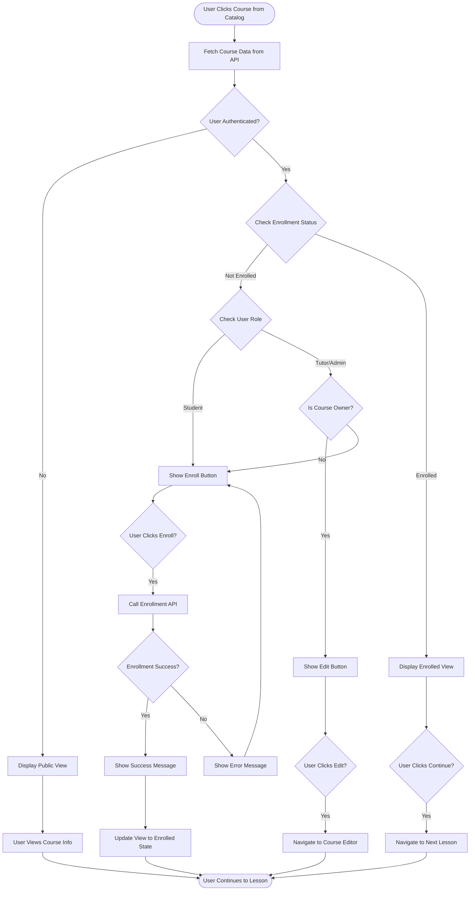
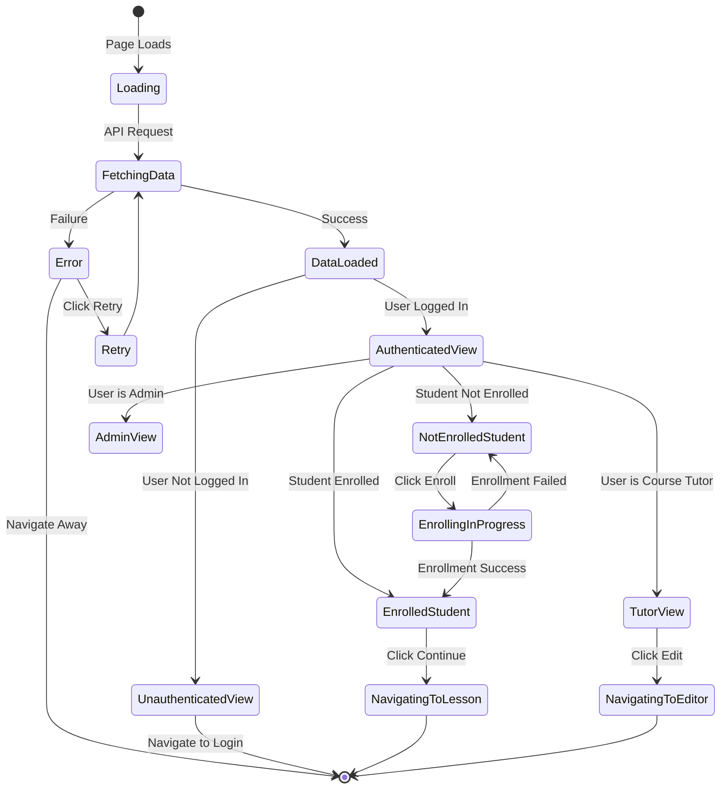

# Course Detail Page Design

## Overview

This design establishes the course detail page that displays comprehensive course information when users click on a course from the catalog. The page serves both unauthenticated visitors and authenticated users, providing different interaction capabilities based on their authentication and enrollment status.

## Business Requirements

### User Stories

**As a prospective student**, I want to:

- View complete course information before enrolling
- Understand what I will learn and the course structure
- See the instructor's background
- Read reviews from other students
- Easily enroll if interested

**As an enrolled student**, I want to:

- Access the course lessons directly
- Track my progress in the course
- Continue where I left off

**As a tutor**, I want to:

- Edit my own course details
- See how my course is presented to students
- Access course management tools

**As an administrator**, I want to:

- View any course details
- Moderate course content if necessary

## Functional Requirements

### Page Sections

The course detail page is structured into the following key sections:

#### 1. Hero Section

Displays primary course information in a visually prominent area at the top of the page.

**Content Elements:**

- Course title (large, prominent heading)
- Course subtitle (supporting headline)
- Course thumbnail image (with alt text for accessibility)
- Tutor information (name, profile picture, brief bio link)
- Key metadata badges (education level, difficulty, language)
- Average rating with star display
- Total enrollment count
- Pricing information (price or "FREE" badge)
- Primary call-to-action button (context-dependent)

**Interaction States:**

- Unauthenticated users see "Enroll Now" or "View Details"
- Authenticated students (not enrolled) see "Enroll in Course"
- Enrolled students see "Continue Learning" or "Go to Course"
- Course tutor sees "Edit Course" button
- Administrators see "Moderate" options

#### 2. Course Overview Section

Presents detailed course information in organized subsections.

**Content Elements:**

- Full course description
- Prerequisites (if any)
- Target audience description
- Estimated time to complete
- Learning outcomes (bullet list of what students will learn)
- Tags for quick topic identification

#### 3. Curriculum Section

Displays the structured lesson plan with expandable/collapsible organization.

**Content Elements:**

- Lessons grouped in sequential order
- Each lesson shows:
  - Lesson title
  - Estimated duration
  - Lesson number in sequence
  - Quiz indicator (if quiz exists)
  - Lock/unlock status (for enrolled students based on progress)
  - Completion status (for enrolled students)

**Behavior:**

- Unauthenticated users see full curriculum but cannot access lessons
- Enrolled students can click to navigate to accessible lessons
- Lessons may be locked based on prerequisite completion (future enhancement)

#### 4. Instructor Section

Showcases the tutor's credentials and expertise.

**Content Elements:**

- Instructor profile picture
- Full name
- Complete bio
- Total courses created
- Total students taught
- Average rating across all courses
- Link to instructor profile or other courses

#### 5. Reviews Section

Displays student feedback and ratings.

**Content Elements:**

- Overall rating summary (average score, total reviews)
- Rating distribution chart (5-star to 1-star breakdown)
- Recent reviews (5 most recent)
- Each review shows:
  - Reviewer name
  - Rating (stars)
  - Review text
  - Date posted
- "Load More Reviews" button if more than 5 exist

**Future Enhancement:**

- Review filtering and sorting options
- Verified enrollment badge on reviews
- Helpful/not helpful voting

#### 6. Enrollment Action Section

Provides clear enrollment pathway (sticky or bottom-anchored on scroll).

**Content Elements:**

- Course price or FREE indicator
- Enrollment button
- Additional information (refund policy, access duration, certificate availability)

**Behavior:**

- For free courses: immediate enrollment on button click
- For paid courses: redirect to payment flow (future integration)

### Permission-Based Features

#### Tutor Permissions

When the logged-in user is the course tutor:

- Display "Edit Course" button in hero section
- Show course management options (edit, delete, publish/unpublish)
- Access to enrollment analytics
- Ability to view student list

#### Admin Permissions

When the logged-in user is an administrator:

- Display moderation controls
- Ability to publish/unpublish course
- Access to all course management functions
- View audit logs

#### Student Permissions (Not Enrolled)

- View all course information
- Cannot access lesson content
- Can enroll in the course

#### Student Permissions (Enrolled)

- View all course information
- Can navigate to lesson content
- See progress tracking
- Access to "Continue Learning" action

## Data Requirements

### API Endpoint Utilization

The page consumes the existing backend endpoint:

**Endpoint:** GET /api/courses/:id

**Authentication:** Optional (via optionalAuth middleware)

**Response Structure:**
The endpoint returns comprehensive course data including:

- Course metadata (title, description, pricing, etc.)
- Tutor information (name, bio, profile picture)
- Lessons array (ordered by sequence, with quiz counts)
- Reviews array (5 most recent)
- Enrollment count
- Enrollment status (if user is authenticated)

### Dynamic Data Display

**For Unauthenticated Users:**

- Fetch course data without user-specific information
- Show enrollment count
- Display "Sign in to enroll" message

**For Authenticated Users:**

- Fetch course data with enrollment status
- Display personalized call-to-action
- Show progress if enrolled
- Enable role-based features

### State Management Needs

**Component State:**

- Course data object
- Loading state
- Error state
- User authentication status
- User enrollment status
- Active section (for navigation/scrolling)

**Derived States:**

- Is user the course tutor
- Is user an administrator
- Is user enrolled
- Can user enroll (authentication + not already enrolled)
- Total lesson count
- Total quiz count
- Estimated total duration

## User Interface Specifications

### Layout Structure

**Desktop Layout:**

- Two-column layout for main content
  - Left column (70%): Hero, Overview, Curriculum, Reviews
  - Right column (30%): Sticky enrollment card, Instructor card
- Full-width sections alternate with contained sections for visual rhythm
- Maximum content width: 1200px

**Tablet Layout:**

- Single column layout
- Enrollment card appears after hero section
- Instructor card appears after overview
- Curriculum and reviews flow naturally

**Mobile Layout:**

- Fully responsive single column
- Sticky bottom enrollment bar (for quick access)
- Collapsible sections to reduce scrolling
- Touch-friendly interaction targets (min 44px)

### Visual Design Principles

**Hierarchy:**

- Clear visual distinction between section types
- Consistent heading sizes across sections
- Use of white space to separate content blocks

**Typography:**

- Course title: Large, bold, attention-grabbing
- Section headings: Medium, consistent sizing
- Body text: Readable, sufficient line height
- Metadata badges: Small, distinct, color-coded

**Color Usage:**

- Primary action buttons: Brand primary color
- Metadata badges: Semantic colors (difficulty levels, education levels)
- FREE badge: Green accent
- Rating stars: Gold/yellow
- Status indicators: Success green, warning yellow, info blue

**Imagery:**

- Course thumbnail: Prominent, high-quality display
- Instructor photo: Circular avatar
- Fallback placeholders for missing images
- Responsive image loading (srcset for different screen sizes)

### Interactive Elements

**Enrollment Button:**

- State variations:
  - Default: "Enroll in Course"
  - Enrolled: "Go to Course" or "Continue Learning"
  - Tutor: "Edit Course"
  - Loading: Spinner with "Processing..."
  - Disabled: Grayed out with explanatory tooltip
- Hover and active states
- Loading state during enrollment process
- Success feedback animation

**Curriculum Accordion:**

- Expand/collapse lesson details
- Smooth animation transitions
- Visual indicator of expand/collapse state
- Keyboard accessible (Enter/Space to toggle)

**Review Cards:**

- "Show More" expansion for long reviews
- Star rating display (filled/unfilled stars)
- Responsive grid layout

**Navigation Links:**

- Instructor profile link
- Lesson navigation (for enrolled students)
- Related courses (future enhancement)

### Accessibility Considerations

**Semantic HTML:**

- Proper heading hierarchy (h1 for title, h2 for sections, h3 for subsections)
- Landmark regions (header, main, aside, footer)
- Descriptive link text

**Keyboard Navigation:**

- All interactive elements accessible via Tab
- Logical tab order
- Focus indicators visible and clear
- Escape key to close modals/expanded sections

**Screen Reader Support:**

- Alt text for all images
- ARIA labels for icon-only buttons
- ARIA live regions for dynamic content updates
- Descriptive button labels

**Visual Accessibility:**

- Sufficient color contrast (WCAG AA minimum)
- Text resizable without layout breaking
- No information conveyed by color alone
- Focus indicators meet contrast requirements

## User Flows

### Flow 1: Unauthenticated User Views Course

1. User navigates from course catalog by clicking a course card
2. System fetches course data without authentication
3. Page renders with full course information
4. User reads course details, curriculum, reviews
5. User clicks "Enroll Now" button
6. System redirects to login page with return URL
7. After login, user returns to course detail page
8. User can now enroll in the course

### Flow 2: Authenticated Student Enrolls in Free Course

1. User navigates to course detail page (already logged in)
2. System fetches course data with enrollment status
3. Page renders showing "Enroll in Course" button
4. User reviews course information
5. User clicks "Enroll in Course" button
6. System calls enrollment API endpoint
7. Frontend displays loading state on button
8. API creates enrollment and progress records
9. Page updates to show "Go to Course" button
10. Success notification appears
11. User can navigate to first lesson

### Flow 3: Enrolled Student Continues Course

1. User navigates to course detail page
2. System fetches course data showing enrollment status
3. Page renders with "Continue Learning" button
4. Curriculum shows progress indicators
5. User clicks "Continue Learning"
6. System navigates to next incomplete lesson
7. User proceeds with learning

### Flow 4: Tutor Edits Own Course

1. Tutor navigates to their course detail page
2. System recognizes tutor as course owner
3. Page renders with "Edit Course" button
4. Tutor clicks "Edit Course"
5. System navigates to course editor page
6. Tutor makes modifications
7. Tutor saves changes
8. System updates course data
9. Tutor is redirected back to course detail page
10. Updated information is displayed

### Flow 5: Admin Moderates Course

1. Admin navigates to any course detail page
2. System recognizes admin role
3. Page renders with moderation controls
4. Admin reviews course content
5. Admin can publish, unpublish, or flag course
6. System records moderation action
7. Course status updates accordingly
8. Admin sees confirmation of action

## Navigation Requirements

### Page Entry Points

- Course catalog (primary entry point)
- Direct URL access (bookmarked or shared links)
- Tutor dashboard course list
- Student enrolled courses list
- Admin course moderation panel
- Search results
- Related courses (future)

### Exit Points

- Lesson navigation (enrolled students)
- Course editor (tutors)
- Enrollment confirmation (after enrolling)
- Login page (unauthenticated users attempting to enroll)
- Tutor profile page
- Course catalog (breadcrumb navigation)

### URL Structure

The route follows the pattern: `/courses/:id`

Where `:id` is the unique course identifier (UUID)

**Example:** `/courses/abc123-def456-ghi789`

**Considerations:**

- Course ID-based routing (current implementation)
- Future enhancement: Slug-based URLs for SEO (e.g., `/courses/introduction-to-mathematics`)

## Error Handling

### Error Scenarios

#### Course Not Found

**Trigger:** Invalid course ID or deleted course

**User Experience:**

- Display friendly "Course not found" message
- Suggest navigating to course catalog
- Show related courses (if available)
- Provide search functionality

**Technical Response:**

- Handle 404 from API
- Render error state component
- Log error for monitoring

#### Network Error

**Trigger:** API request fails due to connectivity issues

**User Experience:**

- Display "Unable to load course" message
- Provide "Retry" button
- Show cached data if available (progressive enhancement)

**Technical Response:**

- Catch network errors
- Implement retry logic with exponential backoff
- Show error state after retry limit

#### Enrollment Error

**Trigger:** Enrollment API call fails

**User Experience:**

- Display specific error message (e.g., "Already enrolled", "Course full")
- Provide actionable next steps
- Contact support link for persistent issues

**Technical Response:**

- Parse error response from API
- Display user-friendly message based on error code
- Maintain enrollment button in ready state (not disabled)

#### Permission Denied

**Trigger:** Unauthorized access to restricted actions

**User Experience:**

- Display "Permission denied" message
- Redirect to appropriate page (login or home)
- Explain why access was denied

**Technical Response:**

- Handle 403 errors
- Clear invalid authentication tokens
- Redirect to login if session expired

#### Server Error

**Trigger:** API returns 500-level error

**User Experience:**

- Display generic "Something went wrong" message
- Provide retry option
- Show error ID for support reference

**Technical Response:**

- Log full error details
- Capture error context (user ID, course ID, timestamp)
- Report to error monitoring service

### Loading States

**Initial Page Load:**

- Skeleton screens for main content areas
- Shimmer effect on loading placeholders
- Preserve layout to prevent content jumping

**Enrollment Action:**

- Button shows spinner
- Button text changes to "Enrolling..."
- Disable button to prevent double submission
- Show progress for multi-step enrollment (paid courses)

**Lazy-Loaded Content:**

- Reviews load on demand
- Additional lesson details load on expansion
- Placeholder content while loading

## Performance Considerations

### Optimization Strategies

**Image Optimization:**

- Serve appropriately sized images for different devices
- Use modern formats (WebP with JPEG fallback)
- Lazy load images below the fold
- Compress thumbnail without quality loss

**Code Splitting:**

- Load review components only when section is visible
- Dynamic imports for heavy components
- Separate bundle for enrolled student features

**Data Fetching:**

- Single API call to fetch all course data
- Cache course data for session duration
- Implement stale-while-revalidate pattern
- Prefetch data for linked lessons

**Rendering Performance:**

- Virtualize long lesson lists (if more than 50 lessons)
- Memoize expensive computed values
- Avoid unnecessary re-renders

**Perceived Performance:**

- Show skeleton UI immediately
- Progressive content rendering
- Optimistic UI updates for enrollment
- Instant navigation feedback

### Caching Strategy

**Client-Side Caching:**

- Store course data in component state
- Persist enrollment status in auth store
- Cache API responses for 5 minutes
- Invalidate cache on course update

**Browser Caching:**

- Set appropriate cache headers for images
- Version CSS/JS bundles for cache busting
- Leverage service workers for offline support (future)

## Security Considerations

### Authentication Requirements

**Public Access:**

- Course detail viewing does not require authentication
- All course information visible to public
- Enrollment requires authentication

**Protected Actions:**

- Enrollment requires valid authentication token
- Course editing requires tutor ownership verification
- Moderation requires admin role
- API validates permissions on backend

### Data Protection

**User Privacy:**

- Student enrollment status only visible to student, tutor, and admin
- Personal information not exposed in public course data
- Email addresses protected

**Input Validation:**

- Sanitize course ID parameter
- Validate all user inputs before API calls
- Prevent XSS in user-generated content (reviews)

**API Security:**

- Use HTTPS for all API communications
- Include authentication tokens in secure headers
- Implement rate limiting on enrollment endpoint
- CSRF protection for state-changing operations

## Integration Points

### Backend APIs

**Primary Endpoint:**

- GET /api/courses/:id (fetch course details)

**Secondary Endpoints:**

- POST /api/courses/:id/enroll (enroll in course)
- PUT /api/courses/:id (update course - tutors only)
- GET /api/lessons/course/:courseId (fetch lessons - future granular loading)

### Component Dependencies

**Layout Components:**

- MainLayout (provides navigation and footer)

**Shared Components:**

- Rating display component (star ratings)
- Badge component (difficulty, level, status)
- Button component (enrollment CTA)
- Card component (instructor card, lesson cards)
- Avatar component (instructor profile picture)
- Modal component (enrollment confirmation, error messages)

**State Management:**

- authStore (user authentication state)
- themeStore (theme preferences)

**Routing:**

- React Router (navigation to lessons, course editor)

### External Services (Future)

**Payment Integration:**

- Payment gateway for paid courses
- Transaction verification

**Video Hosting:**

- Embedded video player for intro videos
- Thumbnail generation

**Analytics:**

- Page view tracking
- Enrollment conversion tracking
- User engagement metrics

## Content Management Capabilities

### Tutor Editing Workflow

When a tutor accesses their own course detail page, they should have the ability to edit course information.

**Editable Fields:**

- Course title, subtitle, description
- Thumbnail image (upload new or update)
- Pricing information
- Prerequisites
- Learning outcomes
- Target audience
- Tags
- Education level, difficulty, subject category
- Estimated hours

**Edit Access:**

- "Edit Course" button in hero section
- Direct navigation to course editor
- Course editor should prepopulate with current course data
- Changes persist via PUT /api/courses/:id endpoint

**Publishing Workflow:**

- Draft courses not visible in public catalog
- Tutor can publish course when ready
- Published courses visible to all users
- Unpublishing reverts to draft state

**Validation Rules:**

- Required fields must be filled
- Title minimum/maximum length
- Price must be valid decimal
- Image URL must be valid format
- Estimated hours must be positive integer

### Content Moderation

**Admin Capabilities:**

- View any course regardless of status
- Publish or unpublish courses
- Reject courses with reasons
- Lock courses (prevent editing)

**Moderation Actions:**

- Triggered from course detail page admin controls
- Actions logged in audit trail
- Tutor notified of moderation actions via email
- Rejection reason displayed to tutor

## Responsive Behavior Table

| Viewport            | Layout                    | Enrollment Card        | Navigation          | Curriculum Display                          |
| ------------------- | ------------------------- | ---------------------- | ------------------- | ------------------------------------------- |
| Mobile (<768px)     | Single column, full width | Sticky bottom bar      | Hamburger menu      | Collapsed by default, expand to view        |
| Tablet (768-1024px) | Single column, contained  | Fixed position in flow | Top navigation bar  | Partially expanded, first 3 lessons visible |
| Desktop (>1024px)   | Two-column layout         | Sticky sidebar card    | Full navigation bar | Fully expanded, scrollable list             |

## User Experience Enhancements

### Visual Feedback

**Enrollment Success:**

- Button transforms with success checkmark animation
- Confetti or celebration animation (subtle)
- Success toast notification
- Page updates to show enrolled state

**Error States:**

- Inline error messages
- Toast notifications for system errors
- Color-coded alerts (red for errors, yellow for warnings)

**Loading Indicators:**

- Skeleton screens maintain layout
- Spinner for button actions
- Progress bars for multi-step processes

### Engagement Features

**Social Proof:**

- Display enrollment count prominently
- Show recent enrollments ("5 students enrolled today")
- Highlight popular courses badge

**Scarcity/Urgency (Future):**

- Limited-time pricing
- Enrollment deadlines
- Seat availability (for live sessions)

**Trust Signals:**

- Verified instructor badge
- Platform quality badge for high-rated courses
- Money-back guarantee (for paid courses)

## Testing Considerations

### Functional Testing Scenarios

**Navigation Testing:**

- Verify course detail page loads from catalog click
- Confirm direct URL access works
- Test breadcrumb navigation
- Validate deep linking to sections

**Permission Testing:**

- Test unauthenticated user view
- Test authenticated student (not enrolled) view
- Test enrolled student view
- Test tutor view (own course)
- Test admin view
- Verify edit button only appears for tutor/admin

**Enrollment Testing:**

- Test free course enrollment flow
- Verify duplicate enrollment prevention
- Test enrollment button state changes
- Validate enrollment success notification
- Confirm navigation to course after enrollment

**Data Display Testing:**

- Verify all course data renders correctly
- Test with missing optional fields (subtitle, prerequisites)
- Validate fallback images display
- Test with various data lengths (long descriptions, many lessons)

**Error Handling Testing:**

- Test invalid course ID
- Simulate network errors
- Test API error responses
- Verify error messages display correctly
- Test retry mechanisms

### Accessibility Testing

**Keyboard Navigation:**

- Tab through all interactive elements
- Verify focus indicators
- Test accordion expand/collapse via keyboard
- Ensure skip links work

**Screen Reader:**

- Verify proper heading structure
- Test image alt text
- Validate ARIA labels
- Ensure dynamic content announces

**Visual Testing:**

- Test color contrast ratios
- Verify layout at 200% zoom
- Test with different font sizes
- Validate focus indicators visibility

### Performance Testing

**Load Time:**

- Measure time to first contentful paint
- Verify largest contentful paint under 2.5s
- Test on 3G network simulation
- Validate image loading performance

**Interaction:**

- Measure enrollment button response time
- Test accordion animation smoothness
- Verify scroll performance with many lessons

### Cross-Browser Testing

**Browsers:**

- Chrome (latest)
- Firefox (latest)
- Safari (latest)
- Edge (latest)
- Mobile Safari (iOS)
- Chrome Mobile (Android)

**Responsive Testing:**

- Test on various device sizes
- Verify layout adapts correctly
- Validate touch interactions on mobile
- Test sticky elements behavior

## Future Enhancements

### Phase 2 Features

**Course Preview:**

- Watch introductory video inline
- Preview first lesson without enrollment
- Sample quiz questions

**Social Features:**

- Share course on social media
- Save course to wishlist
- Compare with similar courses

**Advanced Filtering:**

- Filter reviews by rating
- Sort reviews by date or helpfulness
- Search within course content

**Personalization:**

- Recommend similar courses
- Show "Students also enrolled in"
- Personalized learning path suggestions

**Enhanced Analytics:**

- Course completion rate display
- Average time to complete
- Student success metrics

### Technical Improvements

**SEO Optimization:**

- Implement slug-based URLs
- Add structured data markup (JSON-LD)
- Generate dynamic meta tags
- Implement Open Graph tags for social sharing

**Offline Support:**

- Service worker caching
- Offline course information access
- Queue enrollment actions when offline

**Progressive Web App:**

- Add to home screen capability
- Push notifications for course updates
- Background sync for enrollment

**Advanced Caching:**

- Implement Redis caching on backend
- CDN for static assets
- Edge caching for course data

## Success Metrics

### Key Performance Indicators

**Engagement:**

- Page view duration (target: >2 minutes)
- Scroll depth (target: 80% reach curriculum section)
- Enrollment conversion rate (target: 15% for free courses)

**Performance:**

- Page load time (target: <2 seconds)
- Time to interactive (target: <3 seconds)
- Core Web Vitals passing rate (target: >90%)

**Usability:**

- Bounce rate (target: <40%)
- Click-through rate on enrollment button (target: >25%)
- Error rate (target: <2%)

**Business:**

- Course enrollment count increase
- Student retention after viewing
- Tutor course edit completion rate

### Analytics Tracking Events

**Page Events:**

- Course detail page view
- Course ID, title, tutor ID
- User authentication status

**Interaction Events:**

- Enrollment button click
- Curriculum section expand
- Review load more click
- Instructor profile click
- Edit course button click (tutors)

**Conversion Events:**

- Successful course enrollment
- Failed enrollment attempt
- Navigation to first lesson

**Engagement Events:**

- Scroll depth milestones (25%, 50%, 75%, 100%)
- Time on page thresholds (30s, 1min, 2min)
- Video play (intro video)

## Internationalization Considerations

The platform supports multiple languages through the i18n configuration.

### Translatable Content

**Static UI Elements:**

- Button labels ("Enroll Now", "Edit Course")
- Section headings ("Course Overview", "Curriculum")
- Navigation labels
- Error messages
- Success notifications

**Dynamic Content:**

- Course data stored in user-selected language
- Fallback to English if translation unavailable
- Date/time formatting based on locale

### Implementation Approach

**Translation Keys:**

- Use descriptive, hierarchical keys
- Example: `courseDetail.enrollment.button.enroll`
- Namespace by feature area

**Language Switching:**

- User language preference from authStore
- Language selector in header (existing component)
- Persist language selection

**Number Formatting:**

- Price display with currency symbols
- Duration formatting (hours/minutes)
- Enrollment count formatting (1,234 vs 1.234)

## Workflow Diagram

## Component Architecture

```mermaid
graph TB
    CourseDetailPage[Course Detail Page Component]

    CourseDetailPage --> HeroSection[Hero Section]
    CourseDetailPage --> OverviewSection[Overview Section]
    CourseDetailPage --> CurriculumSection[Curriculum Section]
    CourseDetailPage --> InstructorCard[Instructor Card]
    CourseDetailPage --> ReviewsSection[Reviews Section]
    CourseDetailPage --> EnrollmentCard[Enrollment Card]

    HeroSection --> CourseThumbnail[Course Thumbnail]
    HeroSection --> TutorAvatar[Tutor Avatar]
    HeroSection --> MetadataBadges[Metadata Badges]
    HeroSection --> RatingDisplay[Rating Display]
    HeroSection --> PriceDisplay[Price Display]
    HeroSection --> EnrollButton[Enroll Button]

    OverviewSection --> DescriptionText[Description]
    OverviewSection --> LearningOutcomes[Learning Outcomes List]
    OverviewSection --> PrerequisitesText[Prerequisites]
    OverviewSection --> TagsList[Tags]

    CurriculumSection --> LessonAccordion[Lesson Accordion]
    LessonAccordion --> LessonItem[Lesson Item]
    LessonItem --> LessonTitle[Lesson Title]
    LessonItem --> LessonDuration[Duration]
    LessonItem --> QuizIndicator[Quiz Indicator]
    LessonItem --> ProgressIndicator[Progress Indicator]

    InstructorCard --> InstructorAvatar[Instructor Avatar]
    InstructorCard --> InstructorInfo[Instructor Info]
    InstructorCard --> InstructorStats[Instructor Stats]

    ReviewsSection --> RatingSummary[Rating Summary]
    ReviewsSection --> ReviewCard[Review Card]
    ReviewCard --> ReviewerInfo[Reviewer Info]
    ReviewCard --> ReviewRating[Review Rating]
    ReviewCard --> ReviewText[Review Text]

    EnrollmentCard --> PriceInfo[Price Information]
    EnrollmentCard --> EnrollCTA[Enrollment CTA Button]
    EnrollmentCard --> CourseFeatures[Course Features List]

    style CourseDetailPage fill:#4f46e5,color:#fff
    style HeroSection fill:#818cf8
    style OverviewSection fill:#818cf8
    style CurriculumSection fill:#818cf8
    style InstructorCard fill:#818cf8
    style ReviewsSection fill:#818cf8
    style EnrollmentCard fill:#818cf8
```

## State Management Diagram

