# Student Feature Creation Design

## Overview

This design specifies the missing student-facing features for the EduConnect learning platform. The system already has a database schema, authentication, and session invitation system in place. This document focuses exclusively on implementing the remaining student functionalities prioritized for MVP and Nice-to-have categories.

## Scope

### In Scope (Missing Features to Build)

- Browse & Enroll with search and filtering
- Course Player with video, notes, and navigation
- Quiz-taking experience with feedback
- Enhanced Progress Dashboard
- Gamification display and mechanics
- Streaks and Leaderboard
- Notes and Bookmarks system
- Assignment submission and feedback
- Tutoring session booking flow
- Live session video room integration
- Q&A and Ask Tutor functionality
- Payment integration
- Enhanced profile management

### Out of Scope

- Session invitation system (already implemented)
- Basic authentication and authorization (already exists)
- Database schema modifications (schema is complete)
- Admin and Tutor dashboards (separate concerns)

## Architecture Context

### Current State

- **Backend**: Node.js with Express, Prisma ORM, PostgreSQL database
- **Frontend**: React with Vite, Zustand for state management, React Router
- **Database**: Comprehensive schema with all required models already defined
- **Authentication**: JWT-based auth with role-based access control
- **Existing Routes**: Stub endpoints for courses, quizzes, progress, gamification, notifications

### Integration Points

- All new features integrate with existing User, Course, Lesson, Quiz, Enrollment, Progress, Badge, and TutoringSession models
- Authentication middleware already guards protected routes
- Notification system infrastructure exists

## Feature Specifications

### 1. Browse & Enroll (MVP)

#### Purpose

Enable students to discover courses through search, filtering, and enrollment actions.

#### Functional Requirements

**Course Catalog Display**

- Display all published courses with thumbnail, title, tutor name, price, difficulty, and education level
- Show enrollment count and average rating per course
- Support pagination for large course lists

**Search and Filter**

- Search by course title or description text
- Filter by subject category, education level, difficulty, and pricing model
- Filter by language preference
- Combine multiple filters simultaneously

**Course Detail View**

- Display comprehensive course information: description, prerequisites, estimated hours, syllabus with lessons
- Show tutor profile summary
- Display course reviews and ratings
- Present enrollment button with pricing information

**Enrollment Flow**

- Free courses: immediate enrollment upon confirmation
- Paid courses: redirect to payment flow before enrollment
- Prevent duplicate enrollments
- Create enrollment record with ACTIVE status
- Initialize progress tracking for all course lessons
- Send enrollment confirmation notification

#### Data Flow

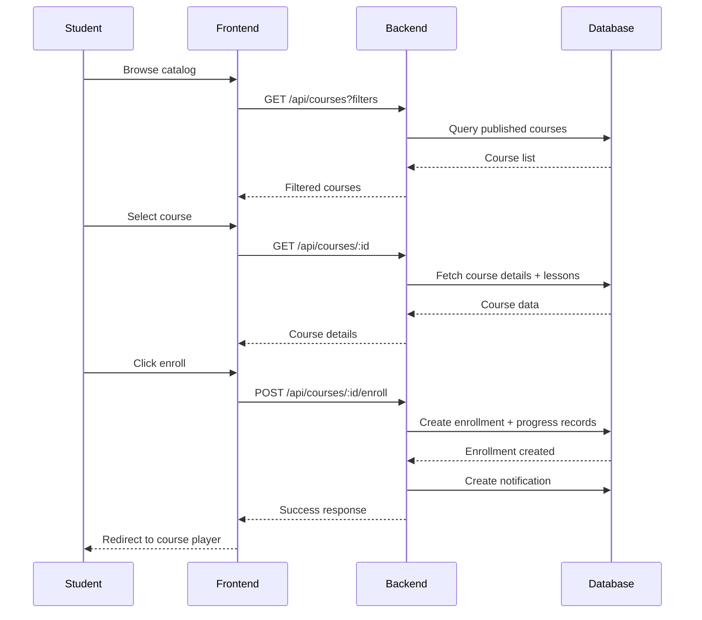

#### API Contracts

| Endpoint                | Method | Purpose            | Request                                                                                                | Response                                    |
| ----------------------- | ------ | ------------------ | ------------------------------------------------------------------------------------------------------ | ------------------------------------------- |
| /api/courses            | GET    | List courses       | Query params: search, subjectCategory, educationLevel, difficulty, pricingModel, language, page, limit | Array of course objects with tutor info     |
| /api/courses/:id        | GET    | Get course details | Course ID in path                                                                                      | Full course object with lessons and reviews |
| /api/courses/:id/enroll | POST   | Enroll student     | Course ID in path                                                                                      | Enrollment object with enrollment ID        |

---

### 2. Course Player (MVP)

#### Purpose

Provide an immersive lesson viewing experience with video playback, content display, and progress tracking.

#### Functional Requirements

**Lesson Navigation**

- Display sidebar with complete lesson list showing sequence order
- Indicate completion status per lesson with visual markers
- Enable direct navigation to any lesson
- Provide next/previous navigation buttons
- Highlight current lesson

**Video Player**

- Embed video using URL from lesson record
- Track and resume video position from last viewing
- Save video position every 10 seconds during playback
- Auto-advance to next lesson option when video completes

**Content Display**

- Render lesson notes content with rich text formatting
- Display learning objectives prominently
- Show estimated duration
- Link to downloadable attachments if available

**Progress Tracking**

- "Mark as Complete" button to manually mark lesson completion
- Auto-mark as complete when video reaches 95% watched
- Update enrollment progress percentage after completion
- Track last accessed timestamp

**Quiz Integration**

- Display quiz button if lesson has associated quiz
- Launch quiz modal or navigate to quiz interface
- Block lesson completion until quiz is passed (configurable per course)

#### Data Flow

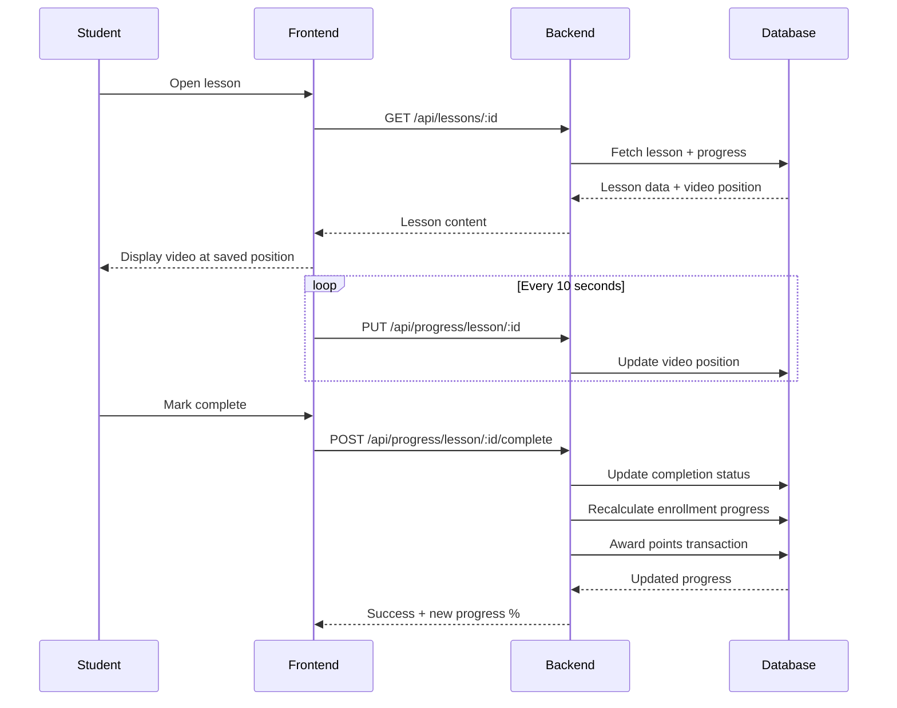

#### API Contracts

| Endpoint                          | Method | Purpose                          | Request                    | Response                              |
| --------------------------------- | ------ | -------------------------------- | -------------------------- | ------------------------------------- |
| /api/lessons/:id                  | GET    | Get lesson details               | Lesson ID in path          | Lesson object with progress           |
| /api/progress/lesson/:id          | PUT    | Update video position            | Body: videoPositionSeconds | Progress object                       |
| /api/progress/lesson/:id/complete | POST   | Mark lesson complete             | Lesson ID in path          | Updated progress + points earned      |
| /api/enrollments/:enrollmentId    | GET    | Get enrollment with all progress | Enrollment ID              | Enrollment with lesson progress array |

---

### 3. Quizzes (MVP)

#### Purpose

Enable students to test their knowledge with interactive quizzes and receive immediate feedback.

#### Functional Requirements

**Quiz Start**

- Display quiz title, instructions, time limit, passing percentage, and max attempts
- Show attempt history if retakes exist
- Check if student has remaining attempts
- Start timer when quiz begins

**Question Presentation**

- Display questions according to sequence order or shuffled if configured
- Support question types: MULTIPLE_CHOICE, TRUE_FALSE, SHORT_ANSWER
- Shuffle answer options if configured
- Display question images if provided
- Show point value per question

**Answer Submission**

- Allow students to select answers and modify before submission
- For short answers, provide text input field
- Track time spent on quiz
- Submit all answers together or per-question based on configuration

**Feedback and Results**

- If immediate feedback enabled, show correct/incorrect after each question
- Display explanation text when provided
- Calculate score percentage and total points earned
- Show pass/fail status based on passing percentage threshold
- Display correct answers (configurable)
- Allow retake if within max attempts limit

**Grading Logic**

- For multiple choice and true/false, auto-grade against correct answer
- For short answer, support exact match or manual tutor grading
- Award points for each correct answer
- Sum points to calculate percentage score
- Mark quiz attempt as passed if score meets passing threshold

#### Data Flow

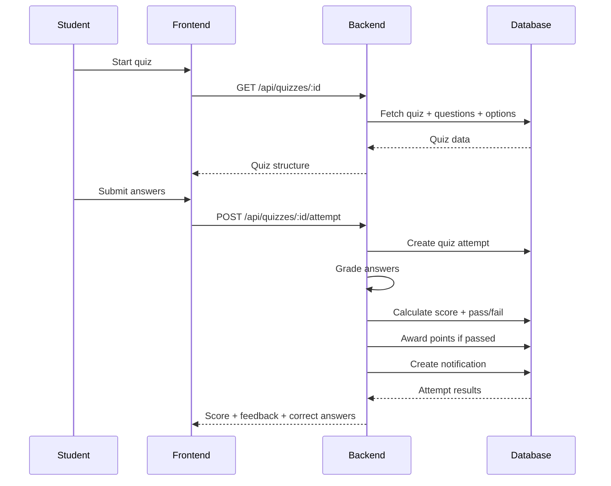

#### API Contracts

| Endpoint                      | Method | Purpose             | Request             | Response                               |
| ----------------------------- | ------ | ------------------- | ------------------- | -------------------------------------- |
| /api/quizzes/:lessonId        | GET    | Get lesson quiz     | Lesson ID           | Quiz with questions and options        |
| /api/quizzes/:quizId/attempt  | POST   | Submit quiz attempt | Body: answers array | Graded attempt with score and feedback |
| /api/quizzes/:quizId/attempts | GET    | Get attempt history | Quiz ID             | Array of past attempts                 |

---

### 4. Progress & Dashboard (MVP)

#### Purpose

Provide students with a comprehensive view of their learning journey, achievements, and recommendations.

#### Functional Requirements

**Dashboard Overview**

- Welcome message with student name
- Quick stats: total courses enrolled, courses completed, total points, current streak
- Recent activity feed showing latest lesson completions, quiz results, badges earned

**Enrolled Courses Section**

- List all active enrollments with course thumbnail and title
- Display progress percentage per course
- Show last accessed date
- Provide "Resume" button to continue from last lesson
- Sort by recently accessed

**Quiz History**

- Display all quiz attempts across all courses
- Show quiz title, course, date, score percentage, pass/fail status
- Filter by course and date range
- Allow re-access to view detailed results

**Suggested Next Lesson**

- Identify incomplete lessons in active enrollments
- Recommend next lesson based on sequence order
- Prioritize courses with recent activity
- Display lesson title and estimated duration

**Completion Statistics**

- Calculate overall completion rate across all enrollments
- Show number of lessons completed versus total
- Display total quizzes passed
- Visualize progress with charts or progress bars

#### Data Flow

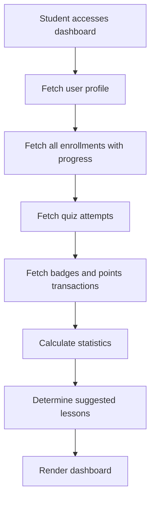

#### API Contracts

| Endpoint                    | Method | Purpose                      | Request              | Response                     |
| --------------------------- | ------ | ---------------------------- | -------------------- | ---------------------------- |
| /api/progress/my-progress   | GET    | Get student progress summary | None                 | Enrollments, progress, stats |
| /api/quizzes/my-attempts    | GET    | Get all quiz attempts        | Query: limit, offset | Quiz attempts array          |
| /api/enrollments/:id/resume | GET    | Get next lesson to resume    | Enrollment ID        | Next incomplete lesson       |

---

### 5. Gamification (MVP)

#### Purpose

Motivate students through points, badges, and achievement tracking.

#### Functional Requirements

**Points System**

- Award points for lesson completion (configurable amount, e.g., 10 points)
- Award points for quiz pass (based on quiz score, e.g., 50 points for 100%)
- Award bonus points for streaks and special achievements
- Display total points on dashboard and profile

**Badge System**

- Pre-defined badges with criteria:
  - "First Steps": Complete first lesson
  - "Course Conqueror": Complete first full course
  - "Quiz Master": Pass 5 quizzes with 80% or higher
  - "Seven Day Scholar": Maintain 7-day learning streak
  - "Century Club": Earn 100 total points
- Automatically check and award badges when criteria met
- Display earned badges on profile and dashboard
- Show locked badges with progress toward unlocking

**Badge Awarding Logic**

- Trigger badge check after lesson completion, quiz pass, or streak update
- Query existing user badges to avoid duplicates
- Evaluate badge criteria against user activity
- Create UserBadge record if criteria met
- Send badge earned notification

**Points Display**

- Show total points prominently
- Provide points transaction history with timestamp and activity type
- Allow filtering transactions by activity type

#### Data Flow

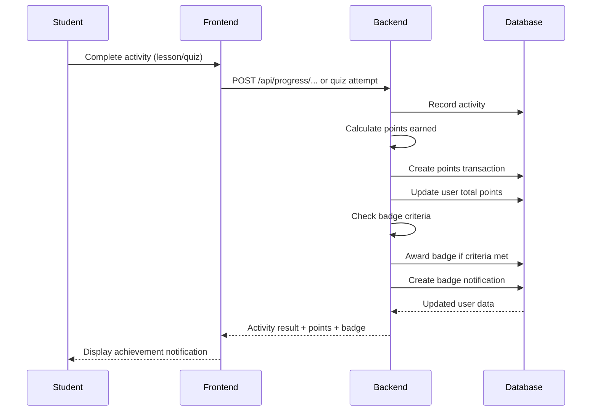

#### API Contracts

| Endpoint                           | Method | Purpose                           | Request              | Response                               |
| ---------------------------------- | ------ | --------------------------------- | -------------------- | -------------------------------------- |
| /api/gamification/badges           | GET    | Get user badges                   | None                 | Array of earned badges with dates      |
| /api/gamification/badges/available | GET    | Get all badges with unlock status | None                 | All badges with progress toward unlock |
| /api/gamification/points           | GET    | Get points history                | Query: limit, offset | Points transactions array              |

---

### 6. Streaks & Leaderboard (Nice)

#### Purpose

Encourage daily engagement and friendly competition among students.

#### Functional Requirements

**Daily Streak Tracking**

- Increment current streak when student completes at least one lesson or quiz in a day
- Track last activity date to detect streak breaks
- Reset current streak to 0 if no activity for more than 1 day (accounting for streak freezes)
- Update longest streak if current streak exceeds it
- Award streak freeze tokens (2 available by default)

**Streak Freeze Mechanism**

- Allow student to use freeze token to preserve streak during 1-day inactivity
- Deduct freeze from available count
- Increment freezes used counter
- Display freeze availability on dashboard

**Leaderboard**

- Global leaderboard: top students by total points across entire platform
- Class/Course leaderboard: top students within specific course enrollment
- Time-based leaderboards: weekly, monthly, all-time
- Display rank, student name, points, and current streak
- Privacy toggle to opt-in or opt-out of leaderboard visibility

**Privacy Settings**

- User preference to show or hide from leaderboards
- Default to visible with option to change in profile settings
- Leaderboards respect privacy choice when rendering

#### Data Flow

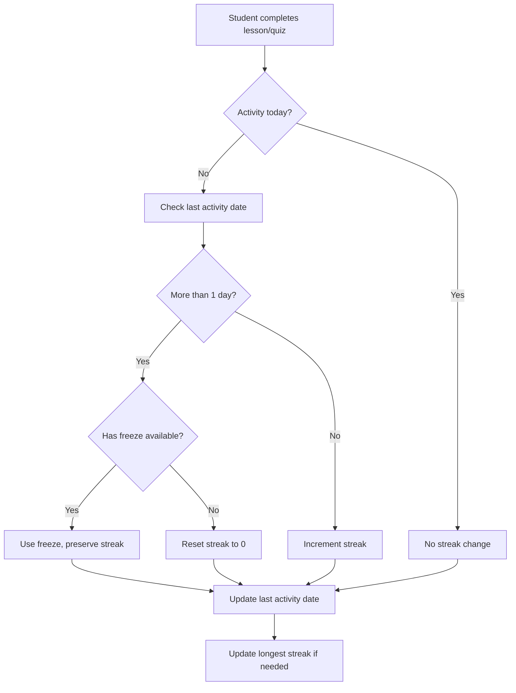

#### API Contracts

| Endpoint                         | Method | Purpose                 | Request                                     | Response                                   |
| -------------------------------- | ------ | ----------------------- | ------------------------------------------- | ------------------------------------------ |
| /api/gamification/leaderboard    | GET    | Get leaderboard         | Query: scope (global/course), period, limit | Ranked student list                        |
| /api/gamification/streaks        | GET    | Get user streak info    | None                                        | Current streak, longest, freezes available |
| /api/gamification/streaks/freeze | POST   | Use streak freeze       | None                                        | Updated streak data                        |
| /api/users/profile/privacy       | PUT    | Update privacy settings | Body: leaderboardVisible                    | Updated user preferences                   |

---

### 7. Notes & Bookmarks (Nice)

#### Purpose

Allow students to annotate lessons and save important moments for future reference.

#### Functional Requirements

**Video Timestamps**

- Enable students to save specific video timestamps with notes
- Display timestamp markers on video progress bar
- Click timestamp to jump to saved position
- Edit or delete saved timestamps

**Lesson Notes**

- Provide rich text editor to take notes during lesson viewing
- Auto-save notes periodically
- Link notes to specific lesson in Progress record
- Display notes in sidebar or expandable panel

**Bookmarking**

- Toggle bookmark flag on any lesson
- Filter lessons by bookmarked status
- Display bookmark count on dashboard
- Quick access to all bookmarked lessons

**Export Functionality**

- Export all notes for a course as PDF or plain text
- Include lesson titles, timestamps, and note content
- Provide download button on course or progress page

#### Data Storage

**Progress Model Extensions**

- Use existing `notes` field in Progress model for lesson notes (text)
- Use `bookmarked` boolean field for bookmark flag
- Store video timestamps as JSON array within notes or separate field if schema extended

**Note Structure Example**

```
{
  "lessonNotes": "Summary of key concepts...",
  "timestamps": [
    {"time": 120, "note": "Important definition"},
    {"time": 300, "note": "Example to remember"}
  ]
}
```

#### API Contracts

| Endpoint                              | Method | Purpose             | Request          | Response                |
| ------------------------------------- | ------ | ------------------- | ---------------- | ----------------------- |
| /api/progress/lesson/:id/notes        | PUT    | Save lesson notes   | Body: notes text | Updated progress        |
| /api/progress/lesson/:id/bookmark     | POST   | Toggle bookmark     | None             | Updated bookmark status |
| /api/progress/lesson/:id/timestamps   | POST   | Save timestamp note | Body: time, note | Updated timestamps      |
| /api/progress/course/:courseId/export | GET    | Export course notes | Course ID        | PDF or text file        |

---

### 8. Assignments/Uploads (Nice)

#### Purpose

Enable students to submit work for tutor review and receive graded feedback.

#### Functional Requirements

**Assignment Creation (Tutor Side)**

- Tutors create assignment linked to lesson
- Define assignment title, instructions, due date, max points
- Specify accepted file types (PDF, images, code files)
- Configure rubric criteria for grading

**Assignment Submission (Student Side)**

- View assignment details and instructions
- Upload files (single or multiple based on configuration)
- Support drag-and-drop file upload
- Submit before deadline
- View submission confirmation

**Grading and Feedback (Tutor Side)**

- Tutors view submitted assignments
- Download submitted files
- Assign score based on rubric
- Provide text feedback
- Mark as graded and save

**Student View After Grading**

- View assigned score and feedback
- Download original submission for reference
- Receive notification when graded

#### Data Model Requirements

**New Assignment Model**

- id, lessonId, title, instructions, dueDate, maxPoints, fileTypesAllowed, rubricCriteria

**New Submission Model**

- id, assignmentId, userId, submittedAt, fileUrls, score, feedback, gradedAt, status

#### File Handling

- Use existing file upload infrastructure (multer)
- Store files in `server/uploads/assignments/` directory
- Serve files via `/uploads` static route
- Limit file size (e.g., 10MB per file)

#### API Contracts

| Endpoint                         | Method | Purpose                | Request                 | Response                 |
| -------------------------------- | ------ | ---------------------- | ----------------------- | ------------------------ |
| /api/assignments/:lessonId       | GET    | Get lesson assignments | Lesson ID               | Assignment details       |
| /api/assignments/:id/submit      | POST   | Submit assignment      | Body: files (multipart) | Submission record        |
| /api/assignments/my-submissions  | GET    | Get user submissions   | Query: status filter    | Submissions array        |
| /api/assignments/submissions/:id | GET    | Get submission details | Submission ID           | Submission with feedback |

---

### 9. Tutoring Booking (MVP)

#### Purpose

Allow students to discover and book available tutoring sessions.

#### Functional Requirements

**Session Discovery**

- Display list of scheduled tutoring sessions with status SCHEDULED
- Filter by subject, education level, session type, date range
- Show tutor name, session time, duration, max participants, current bookings, price per student
- Indicate if session is full or has available slots

**Booking Flow**

- Select session from list
- Confirm booking details (time, price, tutor)
- For paid sessions, redirect to payment before confirming
- For free sessions, create booking immediately
- Check availability before creating booking (max participants limit)
- Send booking confirmation notification to student
- Send notification to tutor about new booking

**My Bookings View**

- List all student's bookings with status (CONFIRMED, CANCELLED, COMPLETED)
- Show session details and countdown to start time
- Provide cancel option (with cancellation policy)
- Display join session button when session is about to start

**Cancellation**

- Allow cancellation up to configurable hours before session (e.g., 24 hours)
- Update booking status to CANCELLED
- Notify tutor of cancellation
- Process refund if applicable

#### Data Flow

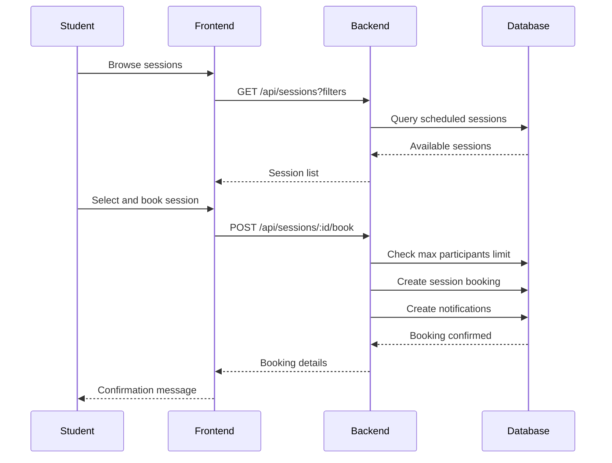

#### API Contracts

| Endpoint                          | Method | Purpose                 | Request        | Response                           |
| --------------------------------- | ------ | ----------------------- | -------------- | ---------------------------------- |
| /api/sessions                     | GET    | List available sessions | Query: filters | Sessions array with booking counts |
| /api/sessions/:id/book            | POST   | Book session            | Session ID     | Booking record                     |
| /api/sessions/my-bookings         | GET    | Get student bookings    | None           | Bookings array                     |
| /api/sessions/bookings/:id/cancel | POST   | Cancel booking          | Booking ID     | Updated booking status             |

---

### 10. Live Session (MVP)

#### Purpose

Provide real-time video conferencing and chat for tutoring sessions.

#### Functional Requirements

**Session Access**

- Generate unique video room ID when session is created
- Provide join session button 5 minutes before scheduled start time
- Verify student has confirmed booking before allowing entry
- Redirect to video room interface

**Video Room Integration**

- Integrate third-party video SDK (e.g., Daily.co, Agora, Zoom SDK, or WebRTC)
- Display tutor and all student participants
- Support audio and video controls (mute, camera toggle)
- Show participant list with names
- Enable screen sharing for tutor

**In-Session Chat**

- Real-time text chat visible to all participants
- Display sender name with each message
- Persist chat messages for post-session review

**Session Timer**

- Display elapsed time and remaining time based on scheduled duration
- Notify participants when session is ending soon (5 minutes before)
- Auto-end session when time expires (tutor can extend)

**Post-Session Features**

- Mark session status as COMPLETED when ended
- Save session summary notes (tutor provides)
- Optionally record session and store recording URL
- Send post-session summary to all participants
- Allow students to rate and review session

#### Technical Approach

**Video Provider Integration**

- Use Daily.co API for simplicity: create room, generate tokens, embed iframe
- Alternative: Agora SDK for more control, requires client-side SDK integration
- Store video room ID in TutoringSession model

**Real-Time Chat**

- Use Socket.io for WebSocket-based chat
- Emit chat messages to room identified by session ID
- Store messages in database for history

#### Data Flow

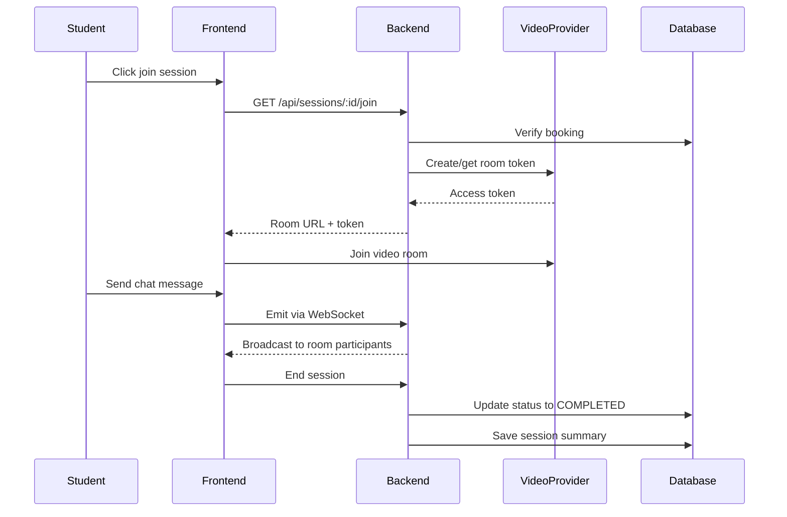

#### API Contracts

| Endpoint               | Method | Purpose               | Request             | Response                 |
| ---------------------- | ------ | --------------------- | ------------------- | ------------------------ |
| /api/sessions/:id/join | GET    | Get video room access | Session ID          | Video room URL and token |
| /api/sessions/:id/end  | POST   | End session           | Body: summary notes | Updated session status   |
| /api/sessions/:id/chat | GET    | Get chat history      | Session ID          | Chat messages array      |

#### WebSocket Events

| Event         | Direction        | Payload                      | Purpose                |
| ------------- | ---------------- | ---------------------------- | ---------------------- |
| join-session  | Client -> Server | sessionId, userId            | Join session room      |
| chat-message  | Client -> Server | sessionId, message, userName | Send chat message      |
| chat-message  | Server -> Client | message, userName, timestamp | Broadcast chat message |
| session-ended | Server -> Client | sessionId                    | Notify session end     |

---

### 11. Q&A / Ask Tutor (Nice)

#### Purpose

Enable asynchronous communication between students and tutors for lesson-specific questions.

#### Functional Requirements

**Ask Question**

- Students post questions on specific lesson page
- Question includes text content and optional image attachments
- Associate question with lesson and student user
- Notify tutor of new question

**Answer Question**

- Tutors view questions on their course/lesson management page
- Tutors or other students can post answers
- Multiple answers allowed per question
- Include text and optional image in answers

**Community Interaction**

- Allow students to upvote helpful answers
- Tutor can pin the best answer to top
- Mark question as resolved when answered satisfactorily
- Display resolved status badge

**Convert to FAQ**

- Tutors can convert popular questions and answers to FAQ section
- FAQ displayed prominently on course or lesson page
- Helps future students find answers quickly

#### Data Model Requirements

**New Question Model**

- id, lessonId, userId, questionText, imageUrl, createdAt, resolved, pinned

**New Answer Model**

- id, questionId, userId, answerText, imageUrl, createdAt, upvotes, isPinned

#### API Contracts

| Endpoint                   | Method | Purpose              | Request                             | Response               |
| -------------------------- | ------ | -------------------- | ----------------------------------- | ---------------------- |
| /api/questions/lesson/:id  | GET    | Get lesson questions | Lesson ID                           | Questions with answers |
| /api/questions             | POST   | Post question        | Body: lessonId, questionText, image | Question record        |
| /api/questions/:id/answer  | POST   | Post answer          | Body: answerText, image             | Answer record          |
| /api/questions/:id/resolve | PUT    | Mark resolved        | Question ID                         | Updated question       |
| /api/questions/:id/pin     | PUT    | Pin answer           | Answer ID                           | Updated answer         |

---

### 12. Payments (Nice)

#### Purpose

Enable students to purchase courses and sessions through integrated payment gateway.

#### Functional Requirements

**Payment Flow for Courses**

- Display course price on detail page
- Click purchase redirects to checkout page
- Collect payment information via Stripe Checkout
- Upon successful payment, create transaction record and enrollment
- Send payment receipt via email

**Payment Flow for Sessions**

- Display session price per student
- Booking paid session redirects to payment
- Complete payment before booking is confirmed
- Create transaction and booking upon success

**Subscription Support**

- Allow subscription-based access to multiple courses
- Define subscription plans with pricing
- Use Stripe Subscriptions for recurring billing
- Grant access to subscription-tier courses upon active subscription

**Transaction History**

- Students view all past transactions with date, amount, type, status
- Download invoices and receipts as PDF
- Filter by transaction type and date range

**Refund Handling**

- Process refunds for cancelled sessions (within policy window)
- Create REFUND transaction type
- Update original transaction status to REFUNDED
- Notify student of refund processing

#### Stripe Integration Approach

**Backend Integration**

- Use Stripe Node.js SDK
- Create Checkout Session for one-time payments
- Create Subscription for recurring payments
- Handle webhook events for payment confirmation
- Store payment reference IDs in Transaction model

**Frontend Integration**

- Redirect to Stripe Checkout hosted page
- Handle success and cancel redirect URLs
- Display payment status messages

#### API Contracts

| Endpoint                      | Method | Purpose                | Request                           | Response               |
| ----------------------------- | ------ | ---------------------- | --------------------------------- | ---------------------- |
| /api/payments/create-checkout | POST   | Create payment session | Body: courseId or sessionId, type | Stripe checkout URL    |
| /api/payments/webhook         | POST   | Stripe webhook handler | Stripe event payload              | Success acknowledgment |
| /api/payments/transactions    | GET    | Get user transactions  | Query: filters                    | Transactions array     |
| /api/payments/invoice/:id     | GET    | Get invoice PDF        | Transaction ID                    | PDF file               |

---

### 13. Accessibility & Language (MVP)

#### Purpose

Ensure platform is usable by diverse students with varying needs and language preferences.

#### Functional Requirements

**Font Size Control**

- Provide settings to choose font size: SMALL, MEDIUM, LARGE, EXTRA_LARGE
- Store preference in User model `fontSize` field
- Apply font size globally across application
- Render UI with CSS classes based on preference

**Theme Preference**

- Support LIGHT, DARK, and HIGH_CONTRAST themes
- Store in User model `themePreference` field
- Persist theme choice and apply on login
- Provide theme toggle in settings or header

**Language Toggle**

- Support English and Chinese languages
- Store in User model `preferredLanguage` field
- Use i18n library (e.g., react-i18next) for translation
- Translate UI strings, labels, and static content
- Dynamic content (course descriptions) respect language field in Course model

**Keyboard Navigation**

- Ensure all interactive elements are keyboard accessible
- Provide skip-to-content links
- Support tab navigation through lessons and quizzes

**Screen Reader Compatibility**

- Use semantic HTML elements (header, nav, main, section)
- Provide alt text for images and icons
- Label form inputs properly
- Announce dynamic content changes with ARIA live regions

#### Implementation Approach

**Theme Application**

- Define CSS variables for theme colors
- Toggle theme class on root element based on user preference
- Example: `<html class="theme-dark">` or `<html class="theme-high-contrast">`

**Font Size Application**

- Define CSS classes for font sizes: `.font-small`, `.font-medium`, `.font-large`, `.font-xl`
- Apply class to body element based on user preference

**Language Switching**

- Load translation files for English and Chinese
- Use i18n context to provide current language
- Fetch user language preference on login and set i18n locale

#### API Contracts

| Endpoint               | Method | Purpose            | Request                         | Response                |
| ---------------------- | ------ | ------------------ | ------------------------------- | ----------------------- |
| /api/users/preferences | PUT    | Update preferences | Body: fontSize, theme, language | Updated user object     |
| /api/users/preferences | GET    | Get preferences    | None                            | User preferences object |

---

### 14. Profile Management (MVP)

#### Purpose

Allow students to manage their personal information, preferences, and public profile.

#### Functional Requirements

**Profile Information**

- Display and edit: first name, last name, email (read-only), phone, date of birth, bio
- Upload and update profile picture
- Display total points, current streak, longest streak
- Show earned badges

**Privacy Settings**

- Toggle leaderboard visibility (show or hide from leaderboards)
- Manage email notification preferences
- Control profile visibility to other students

**Email Notification Preferences**

- Enable/disable session invitations, reminders, quiz results, badge earned, system announcements
- Configure email frequency: immediate, daily digest, weekly digest
- Store preferences in EmailNotificationPreferences model (already exists)

**Account Settings**

- Change password functionality
- Update timezone preference
- Manage preferred subjects and education level

#### API Contracts

| Endpoint                    | Method | Purpose                | Request                        | Response            |
| --------------------------- | ------ | ---------------------- | ------------------------------ | ------------------- |
| /api/users/profile          | GET    | Get user profile       | None                           | User profile object |
| /api/users/profile          | PUT    | Update profile         | Body: profile fields           | Updated user object |
| /api/users/profile/picture  | POST   | Upload profile picture | File upload                    | Image URL           |
| /api/users/profile/password | PUT    | Change password        | Body: oldPassword, newPassword | Success message     |

---

## Cross-Cutting Concerns

### Notification Strategy

**Trigger Events and Notification Types**

| Event                  | Notification Type | Recipients        | Delivery       |
| ---------------------- | ----------------- | ----------------- | -------------- |
| Course enrollment      | ENROLLMENT        | Student           | In-app + Email |
| Quiz graded            | QUIZ_RESULT       | Student           | In-app + Email |
| Badge earned           | BADGE_EARNED      | Student           | In-app + Email |
| Session booked         | SESSION_BOOKED    | Student + Tutor   | In-app + Email |
| Assignment graded      | Custom            | Student           | In-app + Email |
| New question on lesson | Custom            | Tutor             | In-app         |
| Question answered      | Custom            | Student who asked | In-app         |

**Notification Delivery**

- Create Notification record in database for in-app display
- Send email using existing email service infrastructure
- Respect user email notification preferences
- Mark notifications as read when viewed

### Error Handling

**Common Error Scenarios**

| Scenario                                     | HTTP Status | Response Message                | User Action               |
| -------------------------------------------- | ----------- | ------------------------------- | ------------------------- |
| Attempt to enroll in already enrolled course | 400         | Already enrolled in this course | Redirect to course player |
| Exceed max quiz attempts                     | 403         | Maximum attempts reached        | Show attempt history      |
| Book full session                            | 400         | Session is fully booked         | Show alternative sessions |
| Payment failure                              | 402         | Payment processing failed       | Retry payment             |
| Unauthorized access                          | 401         | Authentication required         | Redirect to login         |
| Forbidden action                             | 403         | Insufficient permissions        | Show error message        |

**Error Response Structure**

```
{
  "success": false,
  "error": {
    "code": "ENROLLMENT_EXISTS",
    "message": "User-friendly error message",
    "details": "Technical details for debugging"
  }
}
```

### Performance Considerations

**Optimization Strategies**

- **Pagination**: Apply to course catalog, leaderboard, quiz history (default 20 items per page)
- **Caching**: Cache published courses list, leaderboard data (Redis integration recommended)
- **Lazy Loading**: Load video only when lesson is accessed, load quiz questions on demand
- **Database Indexing**: Utilize existing indexes on courseId, userId, status fields
- **Video Delivery**: Use CDN for video hosting to reduce server load
- **Concurrent Requests**: Batch API calls when loading dashboard data

### Security Measures

**Authorization Checks**

- Verify student is enrolled before allowing lesson access
- Check booking exists before allowing session join
- Validate user owns progress record before updating
- Ensure quiz attempt belongs to user before showing results

**Data Validation**

- Sanitize user input for notes, questions, answers to prevent XSS
- Validate file uploads for type and size limits
- Check video position is within lesson duration before saving

**Payment Security**

- Use Stripe's hosted checkout to avoid handling sensitive card data
- Verify webhook signatures to ensure events are from Stripe
- Store minimal payment information, rely on Stripe for PCI compliance

## User Workflows

### Workflow 1: Discover and Enroll in Course

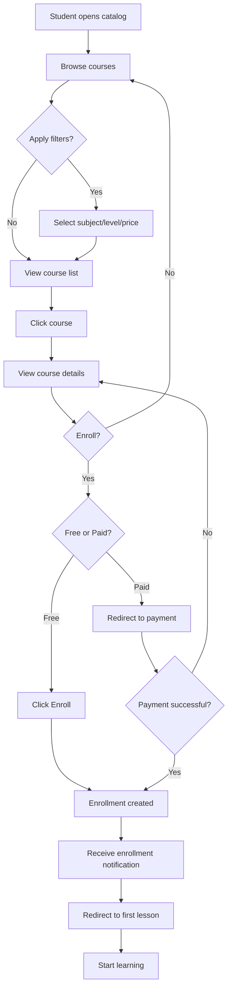

### Workflow 2: Complete Lesson and Earn Points

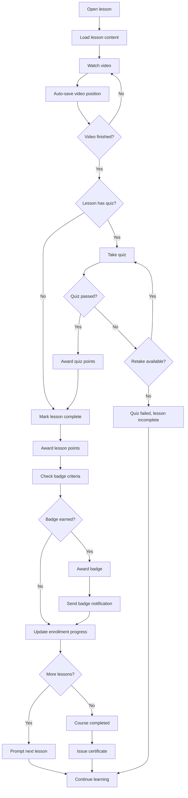

### Workflow 3: Book and Join Tutoring Session

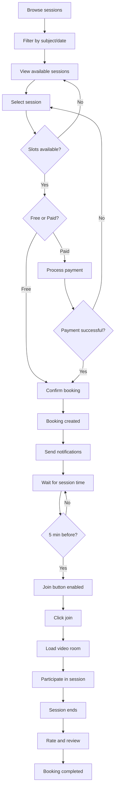

## Data Model Summary

### Key Entities and Relationships

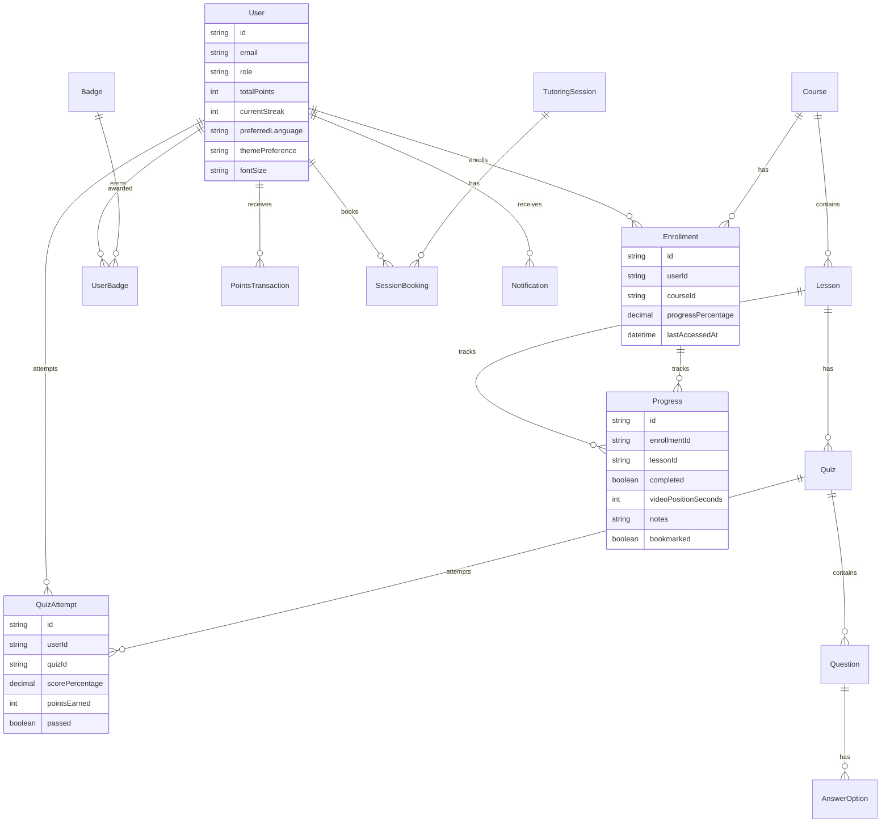

### Data Validation Rules

| Field                         | Validation                              | Error Message              |
| ----------------------------- | --------------------------------------- | -------------------------- |
| Enrollment.userId + courseId  | Unique together                         | Already enrolled in course |
| Progress.videoPositionSeconds | >= 0 and <= lesson duration             | Invalid video position     |
| QuizAttempt.scorePercentage   | 0-100                                   | Invalid score percentage   |
| SessionBooking.sessionId      | Session not full                        | Session fully booked       |
| User.email                    | Valid email format                      | Invalid email address      |
| User.fontSize                 | Enum: SMALL, MEDIUM, LARGE, EXTRA_LARGE | Invalid font size          |

## Frontend Component Structure

### Page Components

| Page             | Route              | Purpose          | Key Components                                        |
| ---------------- | ------------------ | ---------------- | ----------------------------------------------------- |
| CourseCatalog    | /courses           | Browse courses   | CourseCard, FilterPanel, SearchBar                    |
| CourseDetail     | /courses/:id       | View course info | CourseHeader, LessonList, EnrollButton                |
| CourseLesson     | /lessons/:id       | View lesson      | VideoPlayer, LessonNotes, QuizButton, ProgressTracker |
| MyProgress       | /student/progress  | Track progress   | ProgressChart, QuizHistory, BadgeDisplay              |
| StudentDashboard | /student/dashboard | Overview         | EnrolledCourses, RecentActivity, StreakDisplay        |
| LiveSessions     | /student/sessions  | Browse sessions  | SessionList, SessionCard, BookingModal                |
| VideoRoom        | /sessions/:id/room | Join session     | VideoFrame, ChatPanel, ParticipantList                |
| Profile          | /profile           | Manage profile   | ProfileForm, BadgeGallery, PrivacySettings            |

### Reusable Components

| Component        | Purpose                   | Props                                       |
| ---------------- | ------------------------- | ------------------------------------------- |
| CourseCard       | Display course summary    | course object, onEnroll callback            |
| LessonListItem   | Display lesson in list    | lesson object, completed status, onClick    |
| VideoPlayer      | Embed video with controls | videoUrl, currentPosition, onPositionUpdate |
| QuizQuestion     | Render quiz question      | question object, onAnswer callback          |
| BadgeBadge       | Display badge icon        | badge object, earned status                 |
| ProgressBar      | Show progress percentage  | percentage, label                           |
| NotificationBell | Show notification count   | count, onClick                              |
| LanguageToggle   | Switch language           | currentLanguage, onChange                   |
| ThemeToggle      | Switch theme              | currentTheme, onChange                      |

## API Endpoint Summary

### Student Feature Endpoints

| Domain        | Method | Endpoint                           | Auth     | Purpose                 |
| ------------- | ------ | ---------------------------------- | -------- | ----------------------- |
| Courses       | GET    | /api/courses                       | Optional | List courses            |
| Courses       | GET    | /api/courses/:id                   | Optional | Get course details      |
| Courses       | POST   | /api/courses/:id/enroll            | Required | Enroll in course        |
| Lessons       | GET    | /api/lessons/:id                   | Required | Get lesson details      |
| Progress      | PUT    | /api/progress/lesson/:id           | Required | Update video position   |
| Progress      | POST   | /api/progress/lesson/:id/complete  | Required | Mark lesson complete    |
| Progress      | GET    | /api/progress/my-progress          | Required | Get student progress    |
| Progress      | PUT    | /api/progress/lesson/:id/notes     | Required | Save lesson notes       |
| Progress      | POST   | /api/progress/lesson/:id/bookmark  | Required | Toggle bookmark         |
| Quizzes       | GET    | /api/quizzes/:lessonId             | Required | Get lesson quiz         |
| Quizzes       | POST   | /api/quizzes/:quizId/attempt       | Required | Submit quiz attempt     |
| Quizzes       | GET    | /api/quizzes/:quizId/attempts      | Required | Get attempt history     |
| Gamification  | GET    | /api/gamification/badges           | Required | Get user badges         |
| Gamification  | GET    | /api/gamification/badges/available | Required | Get all badges          |
| Gamification  | GET    | /api/gamification/points           | Required | Get points history      |
| Gamification  | GET    | /api/gamification/leaderboard      | Required | Get leaderboard         |
| Gamification  | GET    | /api/gamification/streaks          | Required | Get streak info         |
| Gamification  | POST   | /api/gamification/streaks/freeze   | Required | Use streak freeze       |
| Sessions      | GET    | /api/sessions                      | Required | List available sessions |
| Sessions      | POST   | /api/sessions/:id/book             | Required | Book session            |
| Sessions      | GET    | /api/sessions/my-bookings          | Required | Get student bookings    |
| Sessions      | POST   | /api/sessions/bookings/:id/cancel  | Required | Cancel booking          |
| Sessions      | GET    | /api/sessions/:id/join             | Required | Get video room access   |
| Sessions      | POST   | /api/sessions/:id/end              | Required | End session             |
| Sessions      | GET    | /api/sessions/:id/chat             | Required | Get chat history        |
| Questions     | GET    | /api/questions/lesson/:id          | Required | Get lesson questions    |
| Questions     | POST   | /api/questions                     | Required | Post question           |
| Questions     | POST   | /api/questions/:id/answer          | Required | Post answer             |
| Payments      | POST   | /api/payments/create-checkout      | Required | Create payment session  |
| Payments      | GET    | /api/payments/transactions         | Required | Get transactions        |
| Users         | GET    | /api/users/profile                 | Required | Get user profile        |
| Users         | PUT    | /api/users/profile                 | Required | Update profile          |
| Users         | POST   | /api/users/profile/picture         | Required | Upload profile picture  |
| Users         | PUT    | /api/users/preferences             | Required | Update preferences      |
| Notifications | GET    | /api/notifications                 | Required | Get notifications       |
| Notifications | PUT    | /api/notifications/:id/read        | Required | Mark as read            |

## Testing Strategy

### Critical User Journeys to Test

1. **Enrollment Flow**

   - Browse catalog → filter courses → view details → enroll in free course → verify enrollment created
   - Browse catalog → enroll in paid course → complete payment → verify enrollment and transaction

2. **Learning Flow**

   - Open lesson → watch video → video position saved → mark complete → verify points awarded → check badge criteria → next lesson

3. **Quiz Flow**

   - Take quiz → submit answers → receive score → pass quiz → verify points awarded → retake if failed

4. **Booking Flow**

   - Browse sessions → book free session → verify booking created → join session → verify video room access

5. **Gamification Flow**
   - Complete lesson → earn points → complete 7 days → earn streak badge → view leaderboard

### Test Scenarios per Feature

| Feature        | Test Scenario                 | Expected Result                          |
| -------------- | ----------------------------- | ---------------------------------------- |
| Enroll         | Enroll in enrolled course     | Error: already enrolled                  |
| Quiz           | Exceed max attempts           | Error: max attempts reached              |
| Progress       | Mark lesson complete twice    | Idempotent, no duplicate points          |
| Booking        | Book full session             | Error: session full                      |
| Streak         | Miss day without freeze       | Streak resets to 0                       |
| Streak         | Miss day with freeze          | Freeze used, streak preserved            |
| Payment        | Payment fails                 | Transaction status FAILED, no enrollment |
| Video Position | Save position beyond duration | Validation error                         |

## Implementation Priorities

### MVP Phase (Build First)

**Priority 1: Core Learning Experience**

1. Browse & Enroll (Course catalog, filters, enrollment)
2. Course Player (Video player, lesson notes, mark complete)
3. Quizzes (Quiz taking, grading, feedback)
4. Progress tracking (Lesson completion, enrollment progress)

**Priority 2: Engagement and Motivation** 5. Gamification basics (Points for lessons and quizzes, 2-3 core badges) 6. Enhanced Student Dashboard (Enrolled courses, progress stats, suggested lessons)

**Priority 3: Tutoring** 7. Tutoring Booking (Session discovery, booking confirmation) 8. Live Session (Basic video room, chat, session timer)

**Priority 4: Polish** 9. Notifications (In-app notifications for key events) 10. Accessibility (Font size, theme, language toggle) 11. Profile Management (Edit profile, upload picture, preferences)

### Nice-to-Have Phase (Build Later)

**Priority 5: Advanced Engagement** 12. Streaks & Leaderboard 13. Notes & Bookmarks with export

**Priority 6: Collaboration** 14. Q&A / Ask Tutor 15. Assignments & Uploads with grading

**Priority 7: Monetization** 16. Payments (Stripe integration for courses and sessions)

## Assumptions and Constraints

### Assumptions

- Students have stable internet for video streaming and live sessions
- Video content is already hosted and accessible via URLs
- Stripe account is available and configured for payments
- Email service is configured for sending notifications
- Third-party video SDK (e.g., Daily.co) account is available for live sessions

### Constraints

- No real-time collaborative editing of notes
- Assignment grading for short answers is manual by tutors (no AI auto-grading)
- Leaderboard updates daily, not real-time
- Maximum file upload size for assignments is 10MB
- Session recordings are optional and require additional storage

### Technical Dependencies

- React 18+ for frontend
- Node.js 16+ for backend
- PostgreSQL 13+ for database
- Prisma 4+ for ORM
- Stripe API for payments
- Daily.co or Agora for video rooms
- Socket.io for real-time chat
- React-i18next for internationalization

## Open Questions

1. **Video Hosting**: Are videos hosted on platform storage or external service (YouTube, Vimeo)?
2. **Badge Criteria**: Should badge criteria be configurable by admin or hardcoded?
3. **Leaderboard Privacy**: Should leaderboard opt-in be default or opt-out?
4. **Session Recordings**: Are all sessions recorded by default or only on request?
5. **Assignment Rubrics**: Should rubrics be standardized or customizable per assignment?
6. **Notification Frequency**: Should digest notifications be sent at specific time of day?
7. **Refund Policy**: What is the cancellation window for session refunds (24 hours, 48 hours)?
8. **Quiz Retake Limits**: Should retakes be unlimited or capped per quiz?

---

**End of Design Document**
