# EduConnect - Learning Platform Design Document

## 1. Project Overview

### 1.1 Purpose

EduConnect is a comprehensive learning platform that combines self-paced courses, live tutoring, interactive assessments, and gamification to create an engaging educational experience. The platform serves students across primary, secondary, and university levels, while providing tools for tutors to create and deliver content and administrators to manage the ecosystem.

### 1.2 Target Users

- **Students**: Learners from primary, secondary, and university levels seeking self-paced learning and live tutoring support
- **Tutors**: Educators and subject matter experts who create courses, deliver lessons, and conduct live tutoring sessions
- **Administrators**: Platform managers responsible for user management, content approval, and analytics oversight

### 1.3 Deployment Strategy

Web application with responsive design for desktop, tablet, and mobile browsers, complemented by native mobile applications (iOS and Android) for enhanced mobile experience and offline capabilities.

### 1.4 Scale Considerations

Designed to support thousands of concurrent users with room for growth, balancing performance, cost-efficiency, and scalability.

## 2. Core Functional Requirements

### 2.1 User Authentication and Authorization

#### 2.1.1 User Registration and Login

- Multi-method registration: email/password, social authentication (Google, Facebook)
- Email verification for new accounts
- Secure password requirements with complexity validation
- Multi-factor authentication option for enhanced security
- Password recovery via email with time-limited reset tokens
- Session management with configurable timeout periods

#### 2.1.2 Role-Based Access Control

Three distinct user roles with hierarchical permissions:

| Role          | Primary Capabilities                                                                                 |
| ------------- | ---------------------------------------------------------------------------------------------------- |
| Student       | Enroll in courses, access lessons, take quizzes, book tutoring sessions, track progress              |
| Tutor         | Create and manage courses, create lessons and quizzes, conduct live sessions, view student analytics |
| Administrator | Manage all users, approve/reject courses, access platform analytics, configure system settings       |

### 2.2 Course and Content Management

#### 2.2.1 Course Structure

Hierarchical organization of educational content:

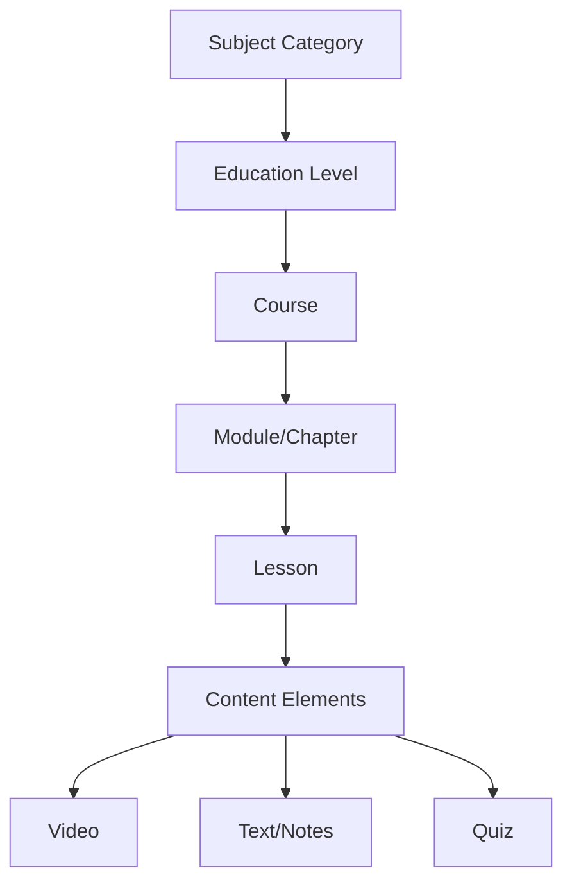

#### 2.2.2 Course Attributes

- Title and detailed description
- Subject category (Mathematics, Science, Languages, Arts, etc.)
- Education level (Primary, Secondary, University)
- Difficulty rating
- Estimated completion time
- Prerequisites (if any)
- Course thumbnail and promotional imagery
- Pricing model (free, one-time purchase, subscription)
- Tutor information
- Course status (draft, pending approval, published, archived)

#### 2.2.3 Lesson Components

Each lesson contains:

- Lesson title and learning objectives
- Sequential position within the course
- Instructional video content with playback controls
- Supplementary text notes and downloadable resources
- Embedded assessment quiz
- Estimated duration
- Completion tracking mechanism

#### 2.2.4 Content Creation Workflow

Tutors follow a structured process:

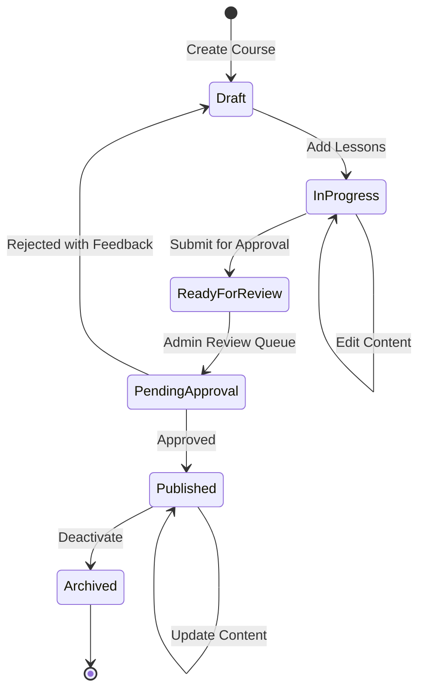

### 2.3 Assessment and Quiz System

#### 2.3.1 Quiz Types and Question Formats

- Multiple choice (single correct answer)
- Multiple select (multiple correct answers)
- True/False
- Fill in the blank
- Short answer (manual or automated grading)

#### 2.3.2 Quiz Configuration

- Number of questions per quiz
- Time limit (optional)
- Passing threshold percentage
- Number of retry attempts allowed
- Immediate feedback vs. end-of-quiz feedback
- Question randomization
- Answer shuffling

#### 2.3.3 Quiz Workflow

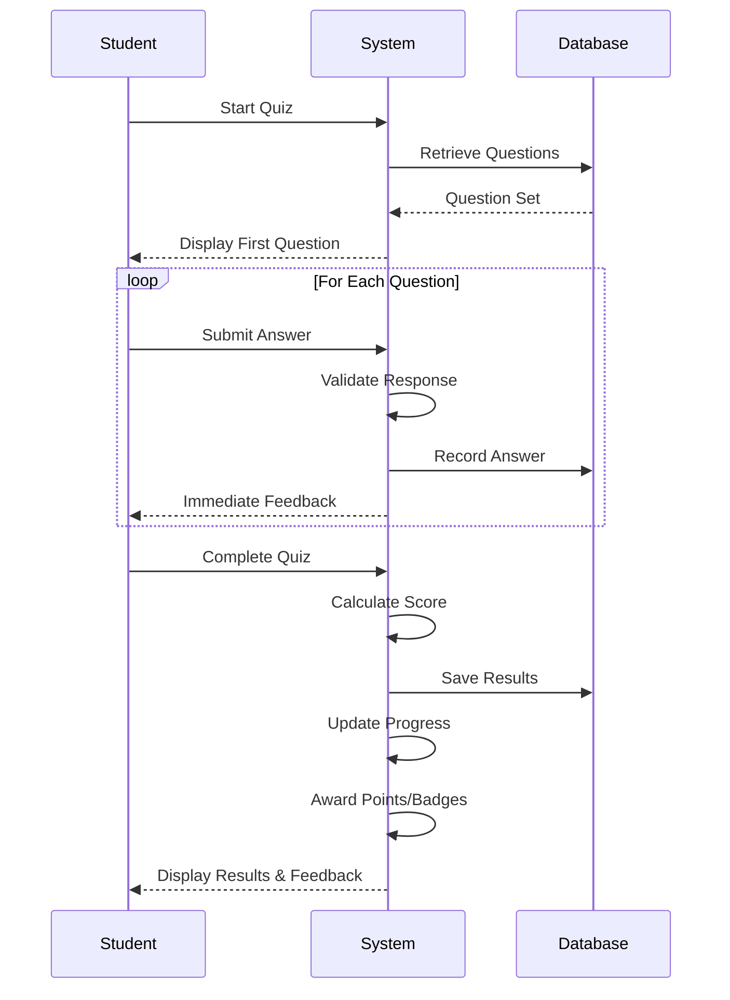

#### 2.3.4 Grading and Feedback

- Automatic scoring for objective questions
- Detailed explanation for each answer (correct/incorrect)
- Score persistence and history tracking
- Performance analytics per topic area
- Retry mechanism with learning recommendations

### 2.4 Live Tutoring System

#### 2.4.1 Session Types

- One-on-one tutoring: Single student with single tutor
- Group sessions: Multiple students with single tutor
- Office hours: Open drop-in sessions scheduled by tutors

#### 2.4.2 Scheduling Mechanism

Tutors define availability:

- Weekly recurring time slots
- One-time special sessions
- Duration per session (30 min, 60 min, 90 min)
- Maximum participants for group sessions
- Pricing per session type

Students interact with scheduling:

- Browse available tutors and time slots
- Filter by subject, level, rating, and price
- Book sessions in advance
- Receive confirmation and calendar integration
- Reminders sent before session start

#### 2.4.3 Live Session Features

Integrated real-time communication platform:

| Feature              | Purpose                                                                                 |
| -------------------- | --------------------------------------------------------------------------------------- |
| Video conferencing   | Face-to-face interaction using WebRTC technology via third-party service (Agora/Twilio) |
| Audio controls       | Mute/unmute, volume adjustment, audio quality settings                                  |
| Text chat            | Written communication, link sharing, emoji support                                      |
| Screen sharing       | Tutor demonstrates concepts, student shares work                                        |
| Virtual whiteboard   | Collaborative drawing and annotation tools                                              |
| File sharing         | Exchange documents, images, and resources                                               |
| Recording            | Optional session recording for review (with consent)                                    |
| Participant controls | Raise hand, reactions, participant list                                                 |

#### 2.4.4 Session Lifecycle

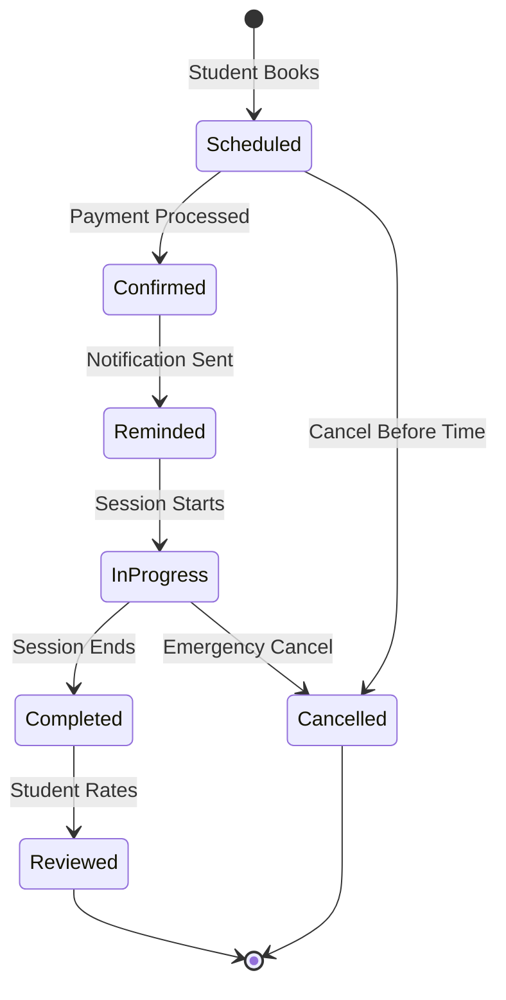

### 2.5 Gamification and Motivation System

#### 2.5.1 Points System

Students earn points through various activities:

| Activity                    | Points Awarded                 |
| --------------------------- | ------------------------------ |
| Complete a lesson           | 10-50 (based on difficulty)    |
| Pass a quiz (first attempt) | 20-100 (based on score %)      |
| Perfect quiz score          | Bonus 50 points                |
| Daily login                 | 5 points                       |
| Complete a full course      | 200-500 (based on course size) |
| Attend live session         | 30 points                      |
| Help in community (future)  | 10-20 points                   |

#### 2.5.2 Badge System

Achievement badges awarded for milestones:

- First lesson completed
- First quiz passed
- 7-day streak maintained
- 30-day streak maintained
- Course completion badges (subject-specific)
- Mastery badges (100% in all course quizzes)
- Participation badges (attend 10 live sessions)
- Level-up badges (accumulated points thresholds)

#### 2.5.3 Streak Tracking

- Daily activity streaks encourage consistent learning
- Streak counter displayed prominently on dashboard
- Streak freeze feature (1-2 per month) to maintain streak during absence
- Weekly and monthly streak milestones
- Leaderboard integration (optional, privacy-respecting)

#### 2.5.4 Progress Visualization

Student dashboard displays:

- Total points accumulated
- Current level and progress to next level
- Active streaks and freeze availability
- Badge collection gallery
- Course completion percentages
- Recent activity timeline
- Recommended next steps based on learning path

### 2.6 Student Dashboard and Progress Tracking

#### 2.6.1 Dashboard Components

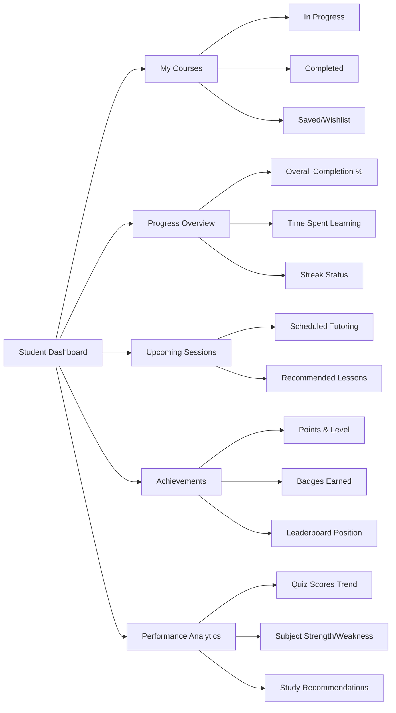

#### 2.6.2 Progress Persistence

- Automatic save of lesson position (video timestamp, page scroll)
- Quiz attempt history with scores
- Bookmarking and note-taking within lessons
- Resume functionality from last active point
- Cross-device synchronization for seamless continuation
- Offline progress tracking (native apps) with sync when online

### 2.7 Tutor Dashboard and Management Tools

#### 2.7.1 Tutor Dashboard Overview

Centralized workspace for content creators and instructors:

| Section            | Functionality                                                    |
| ------------------ | ---------------------------------------------------------------- |
| My Courses         | List of created courses with status, enrollment count, revenue   |
| Create/Edit Course | Course builder interface with drag-drop lesson organization      |
| Lesson Builder     | Rich text editor, video uploader, quiz creator                   |
| Schedule Manager   | Calendar view of availability and booked sessions                |
| Student Analytics  | Enrollment trends, completion rates, quiz performance per course |
| Session History    | Past tutoring sessions with ratings and feedback                 |
| Earnings           | Revenue tracking, payout schedule, transaction history           |
| Profile            | Tutor bio, qualifications, subjects taught, ratings              |

#### 2.7.2 Course Creation Interface

Intuitive tools for non-technical tutors:

- Template-based course structure
- Drag-and-drop lesson sequencing
- Video upload with format conversion and compression
- Rich text editor for notes with formatting, images, embedded media
- Quiz builder with question bank management
- Preview mode to test learner experience
- Version control for content updates

#### 2.7.3 Student Performance Monitoring

Tutors access insights about their students:

- Course-level completion statistics
- Individual student progress tracking
- Quiz performance breakdown by topic
- Engagement metrics (time spent, login frequency)
- Identification of struggling students for outreach

### 2.8 Administrator Dashboard and Controls

#### 2.8.1 User Management

Administrative tools for platform oversight:

- View all users with filtering (role, status, registration date)
- User search by name, email, ID
- Account status management (active, suspended, banned)
- Role assignment and modification
- Bulk operations (export, notifications)
- User activity logs and audit trails

#### 2.8.2 Content Moderation

Course approval workflow:

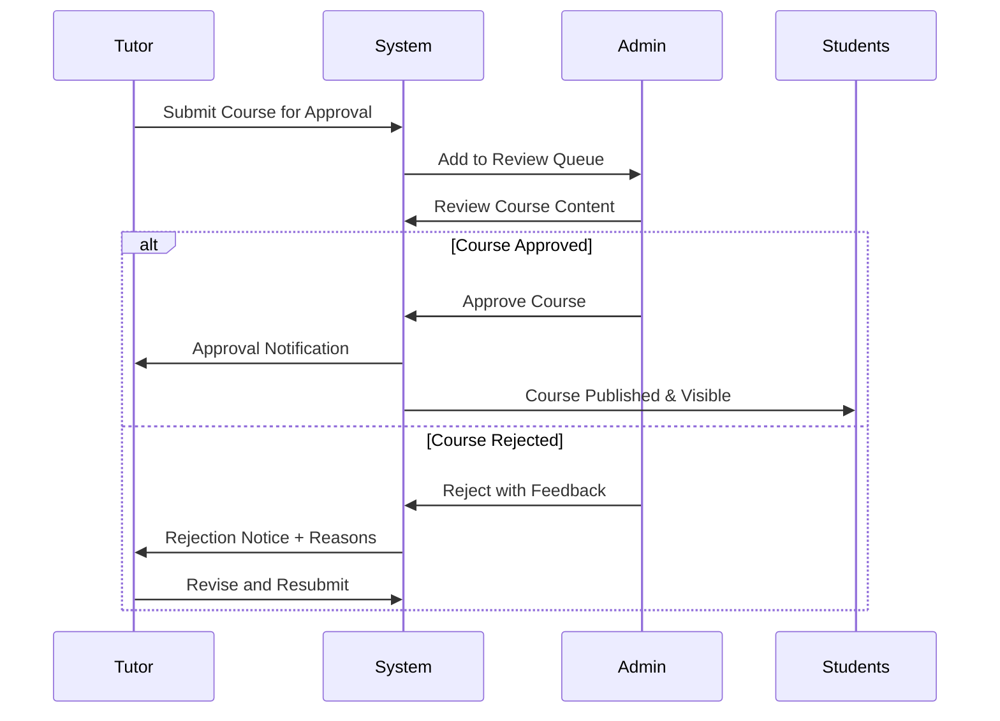

#### 2.8.3 Platform Analytics

High-level metrics for business intelligence:

- Total users by role and growth trends
- Course catalog statistics (total courses, by subject, by level)
- Enrollment metrics (total enrollments, popular courses)
- Revenue analytics (total, by course, by tutor, trends)
- Engagement metrics (daily active users, session duration, completion rates)
- Geographic distribution of users
- Platform health indicators (uptime, error rates, performance)

#### 2.8.4 System Configuration

Administrative controls for platform settings:

- Feature toggles (enable/disable gamification, live sessions, payments)
- Platform-wide announcements and notifications
- Email template management
- Payment gateway configuration
- Content policies and guidelines
- Pricing structures and commission rates
- Accessibility settings defaults

### 2.9 Payment and Monetization

#### 2.9.1 Payment Models

Flexible monetization options:

| Model             | Description                        | Use Case                                |
| ----------------- | ---------------------------------- | --------------------------------------- |
| Free              | No charge                          | Promotional courses, basic content      |
| One-time Purchase | Single payment for lifetime access | Individual courses                      |
| Subscription      | Recurring monthly/annual fee       | Access to course bundles or all content |
| Pay-per-Session   | Charge per live tutoring session   | Live tutoring bookings                  |
| Freemium          | Basic free + premium paid features | Mixed content strategy                  |

#### 2.9.2 Payment Processing

Integration approach (to be configured later):

- Payment gateway abstraction layer for flexibility
- Support for major providers (Stripe, PayPal, regional alternatives)
- Secure payment data handling (PCI DSS compliance considerations)
- Multiple currency support
- Refund processing workflow
- Transaction history and receipts
- Invoice generation for institutional buyers

#### 2.9.3 Revenue Distribution

Platform commission model:

- Configurable platform fee percentage (e.g., 15-30%)
- Tutor earnings calculated after platform commission
- Payout schedule (weekly, bi-weekly, monthly)
- Minimum payout threshold
- Payment method options for tutors (bank transfer, PayPal, etc.)
- Earnings dashboard and reporting

### 2.10 Accessibility and Personalization

#### 2.10.1 Theme Support

User interface customization:

- Light mode (default)
- Dark mode toggle with persistent preference
- High contrast mode for visual impairments
- Theme applies across all pages and native apps

#### 2.10.2 Font and Display Options

Visual accessibility features:

- Adjustable font size (small, medium, large, extra large)
- Font family options (standard, dyslexia-friendly)
- Line spacing adjustment
- Text-to-speech for lesson content
- Closed captions for all video content

#### 2.10.3 Multilingual Support

Internationalization strategy:

- User interface language selection
- Initial language support (to be prioritized based on target markets)
- Language preference persistence
- Right-to-left (RTL) layout support for applicable languages
- Course content can be in different languages (metadata-tagged)
- Translation management system for UI strings

#### 2.10.4 Additional Accessibility

- Keyboard navigation support throughout application
- Screen reader compatibility (ARIA labels, semantic HTML)
- Focus indicators for interactive elements
- Alternative text for all images and icons
- Accessible form validation and error messaging
- Responsive design for various screen sizes and devices

## 3. System Architecture

### 3.1 High-Level Architecture

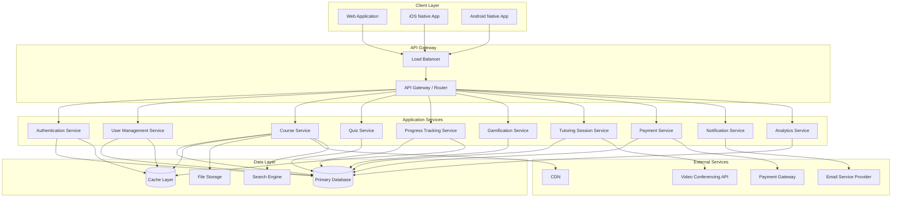

### 3.2 Service Responsibilities

#### 3.2.1 Authentication Service

- User registration and login processing
- Session token generation and validation
- Password hashing and verification
- Multi-factor authentication handling
- OAuth integration for social login
- Password reset token management

#### 3.2.2 User Management Service

- User profile CRUD operations
- Role and permission management
- User preference storage and retrieval
- Account status management
- User search and filtering

#### 3.2.3 Course Service

- Course creation, modification, deletion
- Lesson management within courses
- Course catalog browsing and search
- Enrollment processing
- Course approval workflow
- Content versioning

#### 3.2.4 Quiz Service

- Quiz creation and configuration
- Question bank management
- Quiz delivery and answer submission
- Automatic grading for objective questions
- Result calculation and storage
- Performance analytics generation

#### 3.2.5 Progress Tracking Service

- Lesson completion status updates
- Resume point persistence
- Overall course progress calculation
- Learning history timeline
- Cross-device synchronization

#### 3.2.6 Gamification Service

- Points calculation and awarding
- Badge achievement evaluation
- Streak tracking and maintenance
- Leaderboard generation
- Level progression logic

#### 3.2.7 Tutoring Session Service

- Tutor availability management
- Session booking and scheduling
- Session lifecycle management
- Integration with video conferencing API
- Session recording management
- Rating and review collection

#### 3.2.8 Payment Service

- Payment processing coordination with gateway
- Transaction record keeping
- Refund processing
- Revenue calculation and distribution
- Invoice and receipt generation
- Subscription management

#### 3.2.9 Notification Service

- Email notifications (verification, reminders, updates)
- In-app notifications
- Push notifications for mobile apps
- Notification preference management
- Notification scheduling and queuing

#### 3.2.10 Analytics Service

- Data aggregation from various services
- Metrics calculation (enrollments, completions, revenue)
- Report generation for different user roles
- Trend analysis
- Export functionality for detailed data

### 3.3 Data Architecture

#### 3.3.1 Primary Database

Relational database for structured data:

- User accounts and profiles
- Courses, lessons, and quizzes
- Enrollments and progress records
- Quiz attempts and results
- Tutoring sessions and bookings
- Transactions and payment records
- Gamification data (points, badges, streaks)
- System configuration

Characteristics:

- ACID compliance for transactional integrity
- Normalized schema for data consistency
- Indexed for performance on common queries
- Regular backup and disaster recovery procedures

#### 3.3.2 Cache Layer

In-memory caching for performance:

- Session data for quick authentication
- Frequently accessed course catalog
- User profile information
- Leaderboard rankings
- Active user progress states
- API response caching with TTL

#### 3.3.3 File Storage

Object storage for media and documents:

- Video lesson files
- Course thumbnails and promotional images
- User profile pictures
- Quiz images and attachments
- Downloadable resources
- Session recordings

Characteristics:

- Scalable blob storage
- CDN integration for global delivery
- Access control and signed URLs
- Automatic format conversion for videos
- Backup and redundancy

#### 3.3.4 Search Engine

Full-text search capabilities:

- Course catalog search by title, description, keywords
- Tutor search by name, subject, ratings
- User search for administrators
- Autocomplete suggestions
- Faceted filtering (subject, level, price range)

### 3.4 Security Architecture

#### 3.4.1 Authentication and Authorization

- JWT-based token authentication for API requests
- Refresh token rotation for extended sessions
- Role-based access control enforcement at service level
- API endpoint protection based on user permissions
- Rate limiting to prevent abuse

#### 3.4.2 Data Protection

- Encryption at rest for sensitive data (passwords, payment info)
- Encryption in transit using TLS/HTTPS
- Data anonymization for analytics
- PII handling with privacy considerations
- Secure file upload validation and scanning

#### 3.4.3 Application Security

- Input validation and sanitization
- SQL injection prevention through parameterized queries
- Cross-site scripting (XSS) protection
- Cross-site request forgery (CSRF) tokens
- Content security policy headers
- Regular security audits and penetration testing

### 3.5 Integration Architecture

#### 3.5.1 Video Conferencing Integration

Third-party service (Agora or Twilio) integration:

- API-based session creation and management
- Token generation for secure room access
- Webhook handling for session events
- Recording storage integration
- Usage tracking for billing

#### 3.5.2 Payment Gateway Integration

Abstracted payment processing:

- Gateway-agnostic service layer
- Webhook listeners for payment confirmations
- Idempotency for transaction safety
- Retry logic for failed transactions
- Reconciliation processes

#### 3.5.3 Email Service Integration

Transactional email delivery:

- Template-based email generation
- Delivery via third-party SMTP service (SendGrid, AWS SES)
- Bounce and complaint handling
- Unsubscribe management
- Delivery tracking and analytics

## 4. Data Models

### 4.1 Core Entity Relationships

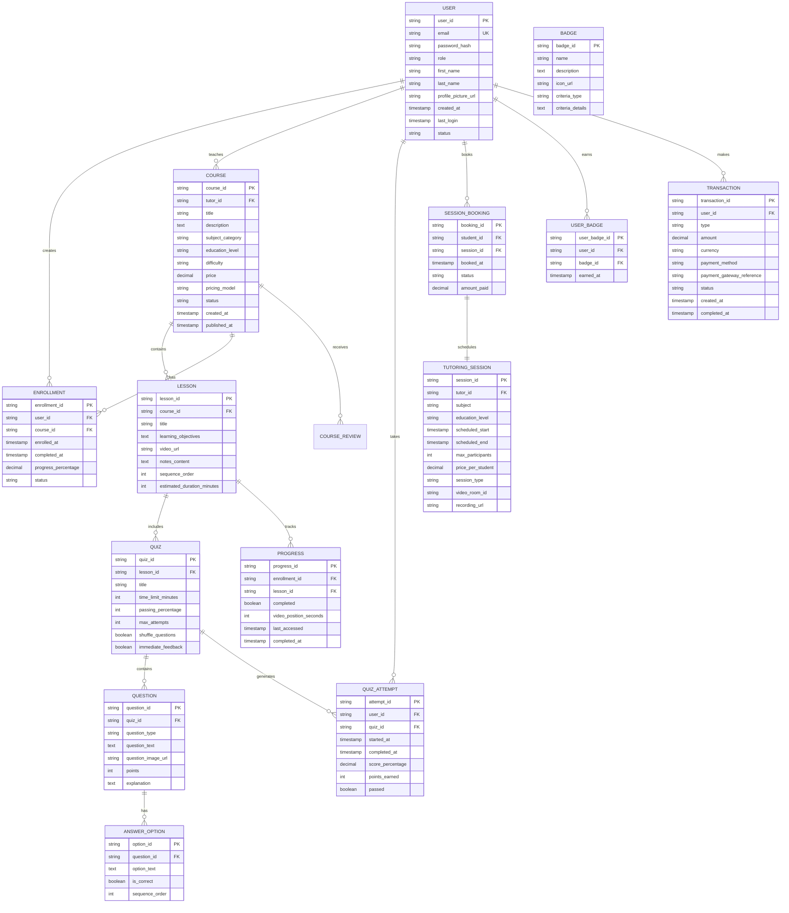

### 4.2 User Profile Attributes

| Attribute           | Type      | Description         | Constraints                         |
| ------------------- | --------- | ------------------- | ----------------------------------- |
| user_id             | UUID      | Unique identifier   | Primary key, auto-generated         |
| email               | String    | User email address  | Unique, required, validated format  |
| password_hash       | String    | Hashed password     | Required, never exposed             |
| role                | Enum      | User role           | student, tutor, admin               |
| first_name          | String    | First name          | Required, 1-50 characters           |
| last_name           | String    | Last name           | Required, 1-50 characters           |
| profile_picture_url | String    | Profile image URL   | Optional, validated URL             |
| date_of_birth       | Date      | Birth date          | Optional, used for age verification |
| phone_number        | String    | Contact number      | Optional, validated format          |
| preferred_language  | String    | UI language code    | Default: en, ISO 639-1              |
| theme_preference    | Enum      | UI theme            | light, dark, high_contrast          |
| font_size           | Enum      | Text size           | small, medium, large, extra_large   |
| timezone            | String    | User timezone       | IANA timezone identifier            |
| total_points        | Integer   | Gamification points | Default: 0, non-negative            |
| current_streak      | Integer   | Daily login streak  | Default: 0, non-negative            |
| created_at          | Timestamp | Registration date   | Auto-generated                      |
| last_login          | Timestamp | Last login time     | Updated on login                    |
| status              | Enum      | Account status      | active, suspended, banned           |

### 4.3 Course Data Structure

| Attribute        | Type      | Description              | Constraints                                  |
| ---------------- | --------- | ------------------------ | -------------------------------------------- |
| course_id        | UUID      | Unique identifier        | Primary key, auto-generated                  |
| tutor_id         | UUID      | Creator reference        | Foreign key to USER                          |
| title            | String    | Course title             | Required, 5-200 characters                   |
| description      | Text      | Detailed description     | Required, markdown supported                 |
| subject_category | String    | Subject area             | Required, from predefined list               |
| education_level  | Enum      | Target level             | primary, secondary, university               |
| difficulty       | Enum      | Difficulty rating        | beginner, intermediate, advanced             |
| prerequisites    | Text      | Required prior knowledge | Optional, markdown supported                 |
| thumbnail_url    | String    | Course image             | Required, validated URL                      |
| price            | Decimal   | Course cost              | Non-negative, 2 decimal places               |
| pricing_model    | Enum      | Pricing type             | free, one_time, subscription                 |
| estimated_hours  | Integer   | Completion time estimate | Positive integer                             |
| language         | String    | Content language         | ISO 639-1 code                               |
| status           | Enum      | Publication status       | draft, pending_approval, published, archived |
| created_at       | Timestamp | Creation date            | Auto-generated                               |
| updated_at       | Timestamp | Last modification        | Auto-updated                                 |
| published_at     | Timestamp | Publication date         | Set when approved                            |
| enrollment_count | Integer   | Total enrollments        | Calculated field                             |
| average_rating   | Decimal   | Course rating            | 0-5, calculated from reviews                 |

### 4.4 Quiz and Assessment Structure

| Entity            | Attribute          | Type    | Description                                                            |
| ----------------- | ------------------ | ------- | ---------------------------------------------------------------------- |
| **Quiz**          | quiz_id            | UUID    | Unique identifier                                                      |
|                   | lesson_id          | UUID    | Parent lesson reference                                                |
|                   | title              | String  | Quiz title                                                             |
|                   | instructions       | Text    | Student instructions                                                   |
|                   | time_limit_minutes | Integer | Time allowed (null = unlimited)                                        |
|                   | passing_percentage | Integer | Minimum score to pass (0-100)                                          |
|                   | max_attempts       | Integer | Retry limit (null = unlimited)                                         |
|                   | shuffle_questions  | Boolean | Randomize question order                                               |
|                   | shuffle_answers    | Boolean | Randomize answer options                                               |
|                   | immediate_feedback | Boolean | Show results per question vs. at end                                   |
| **Question**      | question_id        | UUID    | Unique identifier                                                      |
|                   | quiz_id            | UUID    | Parent quiz reference                                                  |
|                   | question_type      | Enum    | multiple_choice, multiple_select, true_false, fill_blank, short_answer |
|                   | question_text      | Text    | Question content                                                       |
|                   | question_image_url | String  | Optional visual aid                                                    |
|                   | points             | Integer | Points for correct answer                                              |
|                   | explanation        | Text    | Feedback explanation                                                   |
|                   | sequence_order     | Integer | Display order                                                          |
| **Answer Option** | option_id          | UUID    | Unique identifier                                                      |
|                   | question_id        | UUID    | Parent question reference                                              |
|                   | option_text        | Text    | Answer choice content                                                  |
|                   | is_correct         | Boolean | Correctness flag                                                       |
|                   | sequence_order     | Integer | Display order                                                          |

### 4.5 Progress and Completion Tracking

| Attribute           | Type      | Description                 | Purpose                    |
| ------------------- | --------- | --------------------------- | -------------------------- |
| enrollment_id       | UUID      | Unique enrollment           | Links student to course    |
| user_id             | UUID      | Student reference           | Foreign key                |
| course_id           | UUID      | Course reference            | Foreign key                |
| enrolled_at         | Timestamp | Enrollment date             | Tracking start point       |
| progress_percentage | Decimal   | Overall completion          | 0-100, calculated          |
| last_accessed       | Timestamp | Recent activity             | Resume point               |
| completed_at        | Timestamp | Completion date             | Null until 100%            |
| status              | Enum      | Enrollment state            | active, completed, dropped |
| certificate_issued  | Boolean   | Certificate generation flag | For completed courses      |

Lesson-level progress:

| Attribute              | Type      | Description                 |
| ---------------------- | --------- | --------------------------- |
| progress_id            | UUID      | Unique identifier           |
| enrollment_id          | UUID      | Parent enrollment           |
| lesson_id              | UUID      | Specific lesson             |
| completed              | Boolean   | Completion flag             |
| video_position_seconds | Integer   | Video playback resume point |
| notes                  | Text      | Student notes for lesson    |
| bookmarked             | Boolean   | Quick access flag           |
| last_accessed          | Timestamp | Recent view                 |
| completed_at           | Timestamp | Completion timestamp        |

### 4.6 Gamification Data Models

Points ledger:

| Attribute             | Type      | Description                         |
| --------------------- | --------- | ----------------------------------- |
| points_transaction_id | UUID      | Unique identifier                   |
| user_id               | UUID      | Student reference                   |
| points_amount         | Integer   | Points gained/lost                  |
| activity_type         | String    | Source of points                    |
| reference_id          | UUID      | Related entity (quiz, lesson, etc.) |
| timestamp             | Timestamp | When awarded                        |
| description           | String    | Human-readable reason               |

Badge definitions:

| Attribute        | Type   | Description                                     |
| ---------------- | ------ | ----------------------------------------------- |
| badge_id         | UUID   | Unique identifier                               |
| name             | String | Badge name                                      |
| description      | Text   | Achievement description                         |
| icon_url         | String | Badge image                                     |
| criteria_type    | Enum   | Trigger type (streak, points, completion, etc.) |
| criteria_details | JSON   | Specific requirements                           |
| rarity           | Enum   | common, rare, epic, legendary                   |

Streak tracking:

| Attribute                | Type    | Description            |
| ------------------------ | ------- | ---------------------- |
| user_id                  | UUID    | Student reference      |
| current_streak           | Integer | Consecutive days       |
| longest_streak           | Integer | Best streak record     |
| last_activity_date       | Date    | Most recent active day |
| streak_freezes_available | Integer | Remaining freeze uses  |
| streak_freezes_used      | Integer | Total freezes consumed |

## 5. User Workflows

### 5.1 Student Learning Journey

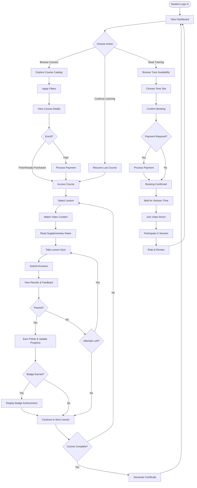

### 5.2 Tutor Course Creation Workflow

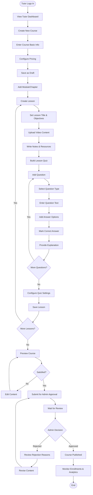

### 5.3 Administrator Approval Process

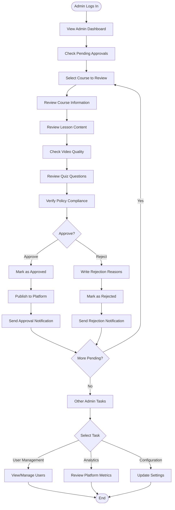

### 5.4 Live Tutoring Session Flow

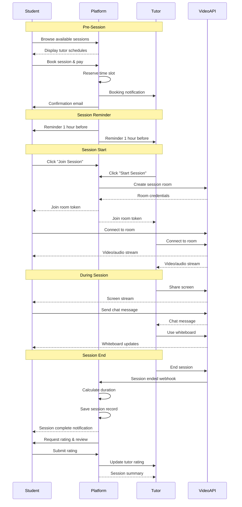

## 6. Non-Functional Requirements

### 6.1 Performance Requirements

| Aspect                | Requirement                           | Measurement                          |
| --------------------- | ------------------------------------- | ------------------------------------ |
| Page Load Time        | Initial page load under 3 seconds     | 90th percentile on 4G connection     |
| API Response Time     | RESTful API responses under 500ms     | 95th percentile for standard queries |
| Video Streaming       | Start playback within 2 seconds       | Buffering time on adaptive bitrate   |
| Concurrent Users      | Support 5,000 concurrent active users | Simultaneous authenticated sessions  |
| Live Session Capacity | 100 concurrent live tutoring sessions | Peak load handling                   |
| Database Query        | Complex queries under 1 second        | Course catalog, analytics queries    |
| Search Response       | Search results under 300ms            | Full-text search with filters        |

### 6.2 Scalability Requirements

Horizontal scalability approach:

- Stateless application services for easy scaling
- Load balancer distribution across multiple instances
- Database read replicas for query distribution
- Microservices can scale independently based on demand
- CDN for static asset delivery worldwide
- Caching layer to reduce database load
- Queue-based processing for background tasks

Growth accommodation:

- Architecture supports 10x user growth without redesign
- Database partitioning strategy for large datasets
- Video storage with automatic archival of old content
- Analytics data warehouse for historical reporting

### 6.3 Availability and Reliability

| Metric              | Target                    | Strategy                                          |
| ------------------- | ------------------------- | ------------------------------------------------- |
| Uptime              | 99.5% availability        | Redundant services, health checks, auto-recovery  |
| Planned Maintenance | Max 4 hours/month         | Scheduled during low-traffic windows              |
| Data Backup         | Daily automated backups   | 30-day retention, tested restore procedures       |
| Disaster Recovery   | RPO: 1 hour, RTO: 4 hours | Geo-redundant backups, documented runbooks        |
| Error Handling      | Graceful degradation      | Fallback mechanisms, user-friendly error messages |

### 6.4 Security Requirements

Authentication and Access:

- Strong password policy enforcement (minimum 8 characters, complexity rules)
- Account lockout after 5 failed login attempts
- Session timeout after 30 minutes of inactivity
- Forced logout on password change
- MFA option for sensitive accounts

Data Security:

- All data in transit encrypted via TLS 1.3
- Sensitive data at rest encrypted (AES-256)
- PII handled according to privacy regulations
- Payment data never stored (tokenization via gateway)
- Audit logging for administrative actions

Application Security:

- Input validation on all user submissions
- Output encoding to prevent XSS
- CSRF protection on state-changing operations
- SQL injection prevention via ORM/parameterized queries
- Regular dependency updates for security patches
- Penetration testing before major releases

### 6.5 Usability Requirements

User Interface:

- Intuitive navigation requiring minimal training
- Consistent design patterns across all pages
- Responsive design for mobile, tablet, desktop
- Touch-friendly controls for mobile devices
- Loading indicators for async operations
- Confirmation dialogs for destructive actions

Accessibility:

- WCAG 2.1 Level AA compliance
- Keyboard navigation for all functionality
- Screen reader compatibility
- Sufficient color contrast ratios
- Resizable text without layout breaking
- Alternative text for all non-decorative images

Help and Documentation:

- Contextual help tooltips for complex features
- User guide and FAQ section
- Video tutorials for common workflows
- In-app onboarding for new users
- Contact support mechanism

### 6.6 Compatibility Requirements

Browser Support:

- Chrome (latest 2 versions)
- Firefox (latest 2 versions)
- Safari (latest 2 versions)
- Edge (latest 2 versions)

Mobile Platforms:

- iOS 13 and above
- Android 8.0 (Oreo) and above

Device Support:

- Smartphones (minimum 360px width)
- Tablets (7-inch and larger)
- Desktops and laptops
- Touch and non-touch interfaces

### 6.7 Maintainability Requirements

Code Quality:

- Modular architecture with clear service boundaries
- Comprehensive code documentation
- Coding standards enforcement via linters
- Version control with meaningful commit messages
- Automated testing (unit, integration, E2E)

Monitoring and Logging:

- Centralized logging system
- Application performance monitoring (APM)
- Error tracking and alerting
- User activity analytics
- System health dashboards

Deployment:

- Automated CI/CD pipelines
- Environment parity (dev, staging, production)
- Blue-green or canary deployment strategies
- Rollback capability for failed deployments
- Database migration version control

### 6.8 Localization and Internationalization

Language Support:

- Initial support for English (en-US)
- Framework for adding additional languages
- Externalized UI strings in resource files
- Date, time, and number formatting per locale
- Currency display based on user preference

Regional Considerations:

- Timezone handling for scheduling and timestamps
- Right-to-left (RTL) layout support for Arabic, Hebrew
- Character encoding support (UTF-8)
- Locale-specific content variations

## 7. Technical Considerations

### 7.1 Technology Stack Recommendations

While implementation details are outside the scope of this design, the following categories should be considered:

**Client Layer:**

- Web: Modern JavaScript framework with component-based architecture
- iOS: Native development environment for optimal performance
- Android: Native development with Material Design principles
- State management for complex UI interactions
- Offline capability for mobile apps

**API Layer:**

- RESTful API design with resource-oriented endpoints
- JSON for data interchange
- API versioning strategy
- OpenAPI/Swagger documentation
- GraphQL consideration for complex data fetching needs

**Backend Services:**

- Service-oriented architecture or microservices
- Language with strong async I/O support
- ORM for database abstraction
- Message queue for async processing
- Scheduled job framework for periodic tasks

**Data Storage:**

- Relational database for transactional data
- Redis or similar for caching
- S3-compatible object storage for media
- Elasticsearch or similar for search
- Analytics database for reporting

**Infrastructure:**

- Cloud platform (AWS, Azure, GCP) for scalability
- Container orchestration for service deployment
- CDN for static asset delivery
- Monitoring and logging services
- Automated backup solutions

### 7.2 Third-Party Service Requirements

| Category           | Purpose                | Required Capabilities                                                      |
| ------------------ | ---------------------- | -------------------------------------------------------------------------- |
| Video Conferencing | Live tutoring sessions | WebRTC support, recording, 100+ concurrent rooms, screen share, whiteboard |
| Email Service      | Transactional emails   | Template support, delivery tracking, high deliverability, webhook events   |
| Payment Gateway    | Transaction processing | Multiple currencies (future), refunds, subscription management, compliance |
| Video Hosting      | Lesson video delivery  | Transcoding, adaptive streaming, analytics, access control                 |
| SMS (Optional)     | Notifications          | Global coverage, delivery receipts, cost-effective                         |
| Analytics          | Usage tracking         | Event tracking, user flows, funnel analysis, privacy-compliant             |
| Error Tracking     | Bug monitoring         | Real-time alerts, stack traces, breadcrumbs, integrations                  |

### 7.3 Development Environment Setup

Development infrastructure needs:

- Local development environment with database, cache, file storage
- Seed data for testing all user roles and scenarios
- API mocking for third-party services during development
- Automated testing framework with CI integration
- Staging environment mirroring production configuration
- Code review and collaboration tools

### 7.4 Deployment Strategy

Environment progression:

- Development: Developer local machines and shared dev server
- Staging: Pre-production testing with production-like data
- Production: Live user environment with monitoring

Deployment approach:

- Automated deployment pipeline triggered by version control
- Database migration automation with rollback capability
- Feature flags for gradual rollout of new functionality
- Health checks before traffic routing to new instances
- Automated rollback on deployment failure

### 7.5 Testing Strategy

Testing levels:

| Level               | Scope                               | Responsibility                  |
| ------------------- | ----------------------------------- | ------------------------------- |
| Unit Tests          | Individual functions and methods    | Developers during development   |
| Integration Tests   | Service interactions, API endpoints | Developers and QA               |
| End-to-End Tests    | Complete user workflows             | QA team                         |
| Performance Tests   | Load, stress, endurance testing     | DevOps and QA                   |
| Security Tests      | Vulnerability scanning, penetration | Security team                   |
| Accessibility Tests | WCAG compliance                     | QA and accessibility specialist |
| User Acceptance     | Real user scenarios                 | Product team and beta users     |

Continuous testing:

- Automated test execution on every code commit
- Test coverage monitoring with minimum thresholds
- Regression test suite for critical paths
- Browser compatibility testing automation
- Mobile device testing on real devices and emulators

### 7.6 Data Migration and Seeding

Initial data requirements:

- Subject category taxonomy
- Education level definitions
- Badge library with criteria
- Default system configuration
- Sample courses for testing
- Admin user creation

Future migration considerations:

- User data import from existing systems (if applicable)
- Course content migration tools
- Enrollment history preservation
- Progress data import validation

### 7.7 Monitoring and Observability

Key metrics to track:

**Business Metrics:**

- Daily/monthly active users
- Course enrollments and completions
- Live session bookings and completions
- Revenue and transaction volume
- User retention and churn

**Technical Metrics:**

- API response times and error rates
- Database query performance
- Cache hit/miss ratios
- Storage usage and growth
- Concurrent user count

**User Experience Metrics:**

- Page load times
- Video playback quality
- Session join success rate
- Form completion rates
- User error encounters

Alerting thresholds:

- Critical: System down, payment failures, data corruption
- Warning: High error rates, slow responses, approaching capacity
- Informational: Deployment events, configuration changes

### 7.8 Backup and Disaster Recovery

Backup strategy:

- Daily full database backups with 30-day retention
- Transaction log backups every 15 minutes
- File storage replication across regions
- Configuration backups before changes
- Backup integrity testing monthly

Disaster recovery procedures:

- Documented recovery runbooks for various failure scenarios
- Regular disaster recovery drills
- Geo-redundant backups in different regions
- Recovery time objective (RTO): 4 hours
- Recovery point objective (RPO): 1 hour

Data retention policy:

- Active user data: Retained while account active
- Deleted account data: Anonymized after 30 days
- Financial records: Retained per regulatory requirements (typically 7 years)
- Audit logs: Retained for 1 year
- Analytics data: Aggregated and retained indefinitely

## 8. Future Enhancements

### 8.1 Phase 1 Extensions

Features to consider after initial launch:

- **Social Learning**: Discussion forums, study groups, peer-to-peer messaging
- **Advanced Analytics**: Learning insights, personalized recommendations, predictive analytics
- **Mobile Offline Mode**: Download lessons for offline viewing, sync when online
- **Certificates and Credentials**: Formal certification, digital badges, transcript generation
- **Content Marketplace**: Allow third-party tutors to sell courses, revenue sharing model

### 8.2 Phase 2 Enhancements

Long-term roadmap possibilities:

- **AI-Powered Features**: Adaptive learning paths, intelligent tutoring assistant, automated essay grading
- **Live Classroom**: Large-scale webinar support, breakout rooms, polling and Q&A
- **Corporate Training**: B2B offerings, organization accounts, learning management for enterprises
- **Content Creation Tools**: Interactive simulations, assessment authoring tools, video editing integration
- **Advanced Gamification**: Competitive tournaments, team challenges, virtual currency

### 8.3 Integration Opportunities

External integrations to expand functionality:

- Calendar integration (Google Calendar, Outlook) for session scheduling
- Learning management system (LMS) interoperability for institutional use
- Student information system (SIS) integration for schools
- Single sign-on (SSO) for enterprise customers
- Third-party content library integration

### 8.4 Scalability Enhancements

As platform grows:

- Content delivery network (CDN) optimization for global reach
- Multi-region deployment for reduced latency
- Advanced caching strategies for popular content
- Database sharding for horizontal data scaling
- Microservices decomposition for independent scaling

## 9. Success Metrics

### 9.1 Key Performance Indicators

**User Engagement:**

- Daily Active Users (DAU) and Monthly Active Users (MAU)
- Average session duration
- Lessons completed per user per month
- Quiz completion rate
- Live session attendance rate

**Learning Outcomes:**

- Course completion rate
- Average quiz scores
- Improvement in scores over time
- Student satisfaction ratings
- Tutor effectiveness ratings

**Business Metrics:**

- Revenue growth (monthly recurring, one-time)
- Customer acquisition cost (CAC)
- Customer lifetime value (LTV)
- Conversion rate (free to paid)
- Churn rate

**Platform Health:**

- System uptime percentage
- Average API response time
- Error rate
- Support ticket volume and resolution time
- Net Promoter Score (NPS)

### 9.2 Launch Criteria

Minimum viable product (MVP) readiness:

- All core user workflows functional and tested
- Security audit passed
- Performance benchmarks met
- Accessibility standards achieved
- Documentation complete (user guides, API docs)
- Support processes established
- Legal and compliance requirements satisfied
- Monitoring and alerting operational

### 9.3 Post-Launch Evaluation

Initial 30-day metrics to monitor:

- User registration and activation rate
- Feature adoption (courses, quizzes, live sessions)
- Technical issues and bug reports
- User feedback and satisfaction surveys
- Performance under real-world load
- Payment processing success rate

Continuous improvement:

- Weekly review of key metrics
- Monthly user feedback analysis
- Quarterly feature prioritization based on data
- A/B testing for UI and feature variations
- Iterative enhancement based on usage patterns

## 10. Compliance and Legal Considerations

### 10.1 Data Privacy

- User consent for data collection and processing
- Privacy policy clearly communicated
- User rights: access, correction, deletion of personal data
- Data minimization principle (collect only necessary data)
- Third-party data sharing transparency

### 10.2 Content Policies

- Tutor content submission guidelines
- Prohibited content categories (illegal, harmful, offensive)
- Intellectual property rights verification
- Copyright infringement reporting mechanism
- Content moderation workflow

### 10.3 Terms of Service

- User agreement acceptance during registration
- Platform usage rules and restrictions
- Dispute resolution procedures
- Liability limitations
- Service level expectations

### 10.4 Payment and Refunds

- Clear pricing display before purchase
- Refund policy for courses and sessions
- Transaction security and fraud prevention
- Tax calculation and reporting (jurisdiction-dependent)
- Revenue sharing terms for tutors

### 10.5 Age and Consent

- Age verification for users under 13 (if applicable)
- Parental consent mechanisms for minors
- Child safety features and content filtering
- Compliance with children's online privacy laws

### 10.6 Accessibility Compliance

- Adherence to accessibility standards (WCAG 2.1 AA)
- Regular accessibility audits
- Accommodations for users with disabilities
- Alternative formats for content when needed

---

## Document Version Control

| Version | Date    | Author           | Changes                          |
| ------- | ------- | ---------------- | -------------------------------- | --- | --------- | ------ | -------- | --------- |
| 1.0     | Initial | System Architect | Initial design document creation |     | --------- | ------ | -------- | --------- |
