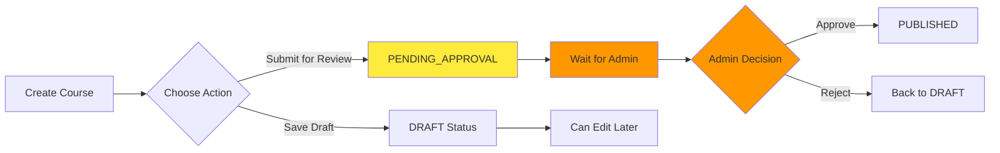
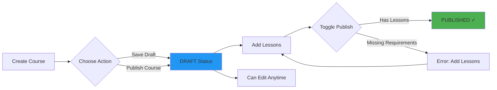

# Visual Guide: Course Creation Workflow Changes

## User Interface Changes

### Before Implementation

**Final Step of Course Creation Wizard:**

```
┌─────────────────────────────────────────────────────────┐
│  Step 4: Pricing & SEO                                  │
│                                                          │
│  [Course pricing and SEO fields...]                     │
│                                                          │
│  ┌────────────────────────────────────────────────────┐ │
│  │  Actions:                                          │ │
│  │  ┌──────────┐  ┌───────────────┐                 │ │
│  │  │  Cancel  │  │  ← Previous   │                 │ │
│  │  └──────────┘  └───────────────┘                 │ │
│  │                                                    │ │
│  │  FOR ADMINS ONLY:                                │ │
│  │  ┌─────────────┐  ┌──────────────────┐          │ │
│  │  │ Save Draft  │  │  Publish Course  │          │ │
│  │  └─────────────┘  └──────────────────┘          │ │
│  │                                                    │ │
│  │  FOR TUTORS:                                      │ │
│  │  ┌─────────────┐  ┌──────────────────────┐      │ │
│  │  │ Save Draft  │  │  Submit for Review   │      │ │
│  │  └─────────────┘  └──────────────────────┘      │ │
│  └────────────────────────────────────────────────────┘ │
└─────────────────────────────────────────────────────────┘

Status on submission:
- Save Draft → Course status: DRAFT
- Submit for Review → Course status: PENDING_APPROVAL
- Publish Course (admin only) → Course status: PUBLISHED
```

### After Implementation

**Final Step of Course Creation Wizard:**

```
┌─────────────────────────────────────────────────────────┐
│  Step 4: Pricing & SEO                                  │
│                                                          │
│  [Course pricing and SEO fields...]                     │
│                                                          │
│  ┌────────────────────────────────────────────────────┐ │
│  │  Actions:                                          │ │
│  │  ┌──────────┐  ┌───────────────┐                 │ │
│  │  │  Cancel  │  │  ← Previous   │                 │ │
│  │  └──────────┘  └───────────────┘                 │ │
│  │                                                    │ │
│  │  FOR ALL TUTORS:                                  │ │
│  │  ┌─────────────┐  ┌──────────────────┐          │ │
│  │  │ Save Draft  │  │  Publish Course  │          │ │
│  │  └─────────────┘  └──────────────────┘          │ │
│  └────────────────────────────────────────────────────┘ │
└─────────────────────────────────────────────────────────┘

Status on submission:
- Save Draft → Course status: DRAFT ✓
- Publish Course → Course status: DRAFT ✓
  (Actual publication happens through toggle publish 
   in course management after adding lessons)
```

## Workflow Comparison

### Before: Approval-Required Workflow



**Issues:**
- Tutors must wait for admin approval
- PENDING_APPROVAL status creates workflow bottleneck
- Different buttons for admins vs tutors
- Inconsistent user experience

### After: Instant Publication Workflow



**Benefits:**
- No waiting for admin approval
- Same buttons for all tutors
- Clear path to publication
- Instant publish once requirements met

## Code Changes Summary

### CourseCreationWizard.jsx

**Change 1: Status Assignment**

```javascript
// BEFORE
const submissionData = {
  // ... other fields
  status: saveType === 'submit' ? 'PENDING_APPROVAL' : 'DRAFT',
};

// AFTER
const submissionData = {
  // ... other fields
  status: 'DRAFT', // Always save as DRAFT, regardless of saveType
};
```

**Change 2: Button Rendering**

```javascript
// BEFORE
{user?.role === 'ADMIN' ? (
  <button onClick={() => {...}}>Publish Course</button>
) : (
  <button onClick={() => handleSubmit('submit')}>Submit for Review</button>
)}

// AFTER
<button onClick={() => handleSubmit('draft')}>Save Draft</button>
<button onClick={() => handleSubmit('publish')}>Publish Course</button>
```

## Backend Behavior (No Changes)

The backend already implements the correct behavior:

```javascript
// server/src/controllers/tutor.controller.js

const createCourse = async (req, res) => {
  // ... validation logic
  
  const course = await prisma.course.create({
    data: {
      // ... other fields
      status: 'DRAFT', // ✓ Always DRAFT on creation
    },
  });
  
  // Notification created
  await prisma.notification.create({
    data: {
      type: 'SYSTEM_ANNOUNCEMENT',
      title: 'Course Draft Saved',
      message: `Your course "${course.title}" has been saved as a draft. Add lessons to continue building.`,
    },
  });
};
```

## Publication Requirements Validation

### When Publishing (Toggle Publish Button)

```javascript
// server/src/controllers/tutor.controller.js

const togglePublishStatus = async (req, res) => {
  // Check if course has lessons
  if (course._count.lessons === 0) {
    return res.status(400).json({
      error: 'Cannot publish course. Please add at least one lesson first.',
    });
  }
  
  // Check required metadata
  if (!course.title || !course.description || !course.subjectCategory) {
    return res.status(400).json({
      error: 'Cannot publish course. All required metadata must be filled.',
    });
  }
  
  // Publish and award gamification points/badges
  // ... publication logic
};
```

## User Journey Example

### Scenario: Tutor Creates and Publishes Course

**Step 1: Create Course**
```
Tutor completes wizard steps 1-4
Clicks "Publish Course"
→ Course created with DRAFT status
→ Success modal shown
```

**Step 2: Add Content**
```
From success modal, clicks "Add Lessons"
→ Navigates to lesson builder
Creates first lesson
→ Lesson saved
```

**Step 3: Publish Course**
```
Navigates to course management
Clicks "Toggle Publish" button
→ Backend validates requirements
→ Requirements met (has lessons)
→ Course status changes to PUBLISHED
→ Notification created
→ Gamification points awarded (20 points)
→ First Course badge awarded (if first course)
```

## Success Modal (Unchanged)

After course creation, the success modal presents:

```
┌──────────────────────────────────────────┐
│  ✓ Course Created Successfully!          │
│                                          │
│  Your course "Course Title" has been     │
│  created. What would you like to do next?│
│                                          │
│  ┌────────────────────────────────────┐ │
│  │  📚 Add Lessons                     │ │
│  │  Begin building your curriculum     │ │
│  └────────────────────────────────────┘ │
│                                          │
│  ┌────────────────────────────────────┐ │
│  │  ❓ Create Quiz Bank                │ │
│  │  Set up assessment questions        │ │
│  └────────────────────────────────────┘ │
│                                          │
│  ┌────────────────────────────────────┐ │
│  │  👁️ Preview as Student              │ │
│  │  View course from student view      │ │
│  └────────────────────────────────────┘ │
│                                          │
│  [Back to Dashboard]  [Add Lessons]     │
└──────────────────────────────────────────┘
```

## Testing Checklist

- [ ] **Test 1**: Click "Save Draft" - course saved as DRAFT
- [ ] **Test 2**: Click "Publish Course" - course saved as DRAFT
- [ ] **Test 3**: Try to publish without lessons - error shown
- [ ] **Test 4**: Add lesson, then publish - course published successfully
- [ ] **Test 5**: Verify notification created
- [ ] **Test 6**: Verify gamification points awarded
- [ ] **Test 7**: Verify first course badge awarded (if first course)
- [ ] **Test 8**: Both tutor and admin see same buttons
- [ ] **Test 9**: Success modal navigation works
- [ ] **Test 10**: Can edit draft course and re-save

## Migration Notes

### No Database Migration Required

The CourseStatus enum already includes all necessary values:

```prisma
enum CourseStatus {
  DRAFT           // ✓ Used for new courses
  PENDING_APPROVAL // ⚠️ Kept for backward compatibility
  PUBLISHED       // ✓ Used after toggle publish
  ARCHIVED        // ✓ Used for archived courses
}
```

### Existing Data

- Courses with PENDING_APPROVAL status remain unchanged
- Admins can still manually review/approve existing pending courses
- New courses simply bypass the approval workflow

---

**Implementation Complete** ✅  
**Files Modified**: 1 (CourseCreationWizard.jsx)  
**Lines Changed**: +9 added, -23 removed  
**Risk Level**: Low  
**Testing Required**: Manual testing recommended
